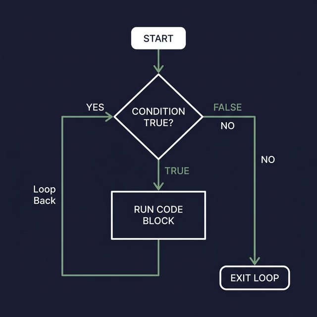

## 15. الـ Loops المستمرة (While Loop)

حلقة `while` ببتستخدم عشان تنفذ كود معين **طول ما** الشرط اللي إنت كاتبه صح (True). أول ما الشرط يبقى غلط (False)، اللوب بتقف فوراً.

### الصيغة العامة (Syntax):
```bash
while [ condition ]
do
    # الأوامر اللي هتتنفذ طول ما الشرط صح
    
    # (مثال: لازم نغير في قيمة الـ Variable جوه عشان اللوب متكملش للأبد)
    ((var--))  
done
```

> **معلومة:** لو عايز تعمل لوب شغالة للأبد (Infinite loop)، ببنستخدم `while :` أو `while true`.
```bash
while :
do
    # الأوامر دي هتتنفذ للأبد
done
```

---

### أمثلة Process

#### مثال 1: عداد تنازلي (Countdown)
إزاي نعمل عداد بيبدأ من 5 وينزل لـ 1 وبعدين يطبع رسالة؟
```bash
count=5

# طول ما الـ count أكبر من صفر، نفذ الكود:
while [ $count -gt 0 ]
do
    echo "العداد دلوقتي: $count"
    ((count--))  # هنا بننقص واحد من العداد في كل لفة
done
echo "انطلاق!"
```

**النتيجة:**
```
العداد دلوقتي: 5
العداد دلوقتي: 4
العداد دلوقتي: 3
العداد دلوقتي: 2
العداد دلوقتي: 1
انطلاق!
```

#### مثال 2: لوب لا نهائية (Infinite loop)
اللوب دي بتفضل شغالة على طول لحد ما المستخدم يقفلها بإيده باستخدام اختصار `Ctrl+C` من الكيبورد.
```bash
while true
do
    echo "اللوب دي مش هتقف أبداً!"
    sleep 1  # أمر بيوقف الإسكربت ثانية واحدة عشان منعملش ضغط على الجهاز
done
```

**النتيجة:**
```
اللوب دي مش هتقف أبداً!
اللوب دي مش هتقف أبداً!
اللوب دي مش هتقف أبداً!
...
```



