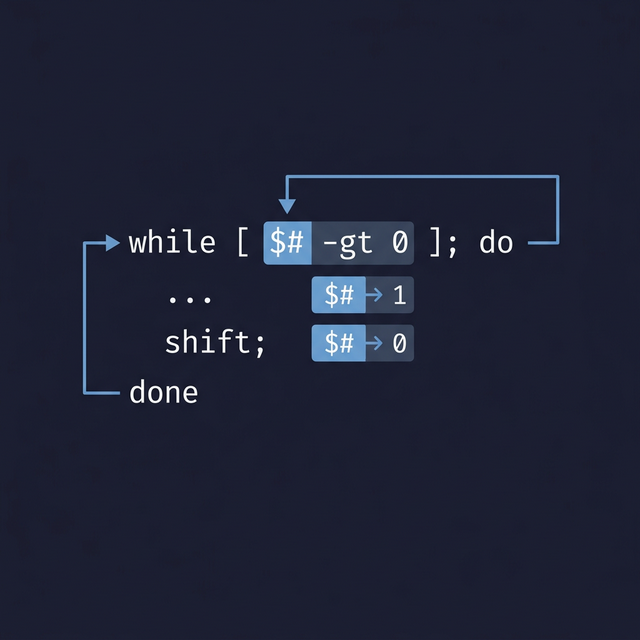

## 16. أمر التشفيت (`shift` Command)

أمر `shift` بيستخدم جوه الإسكربتات عشان يحرك الـ Parameters (Positional parameters) خطوة لـ الشمال. بمعنى تاني: بيمسح أول Variable، وبيخلي الـ Variables اللي بعده تاخد مكانه.

### إزاي بيشتغل؟

لو إنت بعت للإسكربت 5 كلمات وأنت بتشغله:
```
الكلمات (Arguments):    تفاحة   موزة   فراولة   مانجا   بطيخ
أرقام الـ Variables (IDs):  $1      $2     $3       $4      $5
```

بعد ما بتستخدم أمر `shift` مرة واحدة:
```
الكلمات المتبقية:       موزة   فراولة   مانجا   بطيخ
الأرقام الجديدة:        $1     $2       $3      $4
```
*(زي ما إنت شايف، "تفاحة" اتمسحت، ورقم `$1` بقى بيشاور على "موزة").*

> تقدر كمان تنط أكتر من خطوة في نفس الوقت لو كتبت `shift n` (مثلاً `shift 2` هيمسح أول كلمتين).

---

### الاستخدام (Usage):
```bash
shift [n]
```
- لو مكتبتش رقم `n`، الأمر هيفترض إنك عايز تشفت خطوة واحدة بس.
- أمر `shift` مفيد جداً / قوي لو بتعمل `while` لوب عشان تقرأ الكلمات اللي اليوزر بعتها للإسكربت واحدة واحدة، وفي كل لفة تمسح الكلمة اللي قريتها وتجهز اللي بعدها.
- لو حاولت تعمل `shift` لعدد أكبر من الكلمات الموجودة، باقي الـ Variables هتبقى فاضية.

---

### أمثلة Process

#### مثال 1: شيفت بسيط بخطوة واحدة
```bash
#!/bin/bash
echo "قبل الـ shift الـ Variables هي: $1 $2 $3"
shift
echo "بعد الـ shift الـ Variables بقت: $1 $2 $3"
```

**لو شغلنا الإسكربت:**
```bash
./script.sh apple banana cherry
```
**النتيجة هتكون:**
```
قبل الـ shift الـ Variables هي: apple banana cherry
بعد الـ shift الـ Variables بقت: banana cherry
```
*(لاحظ إن الكلمة التالتة بقت فاضية لإن مفيش الكلمة الرابعة اللي كانت هتاخد مكانها).*

#### مثال 2: شيفت بخطوتين (`shift 2`)
```bash
#!/bin/bash
echo "قبل الـ shift بـ 2: $1 $2 $3 $4"
shift 2
echo "بعد الـ shift بـ 2: $1 $2"
```

**لو شغلنا الإسكربت:**
```bash
./script.sh one two three four
```
**النتيجة هتكون:**
```
قبل الـ shift بـ 2: one two three four
بعد الـ shift بـ 2: three four
```

---

### إإمتى بتستخدمه فعلياً؟
- لما تكون بتلف على كل الـ Arguments اللي مبعوتة من واجهة Command Line باستخدام اللوب.
- عشان ترمي الـ Arguments اللي إنت خلاص استخدمتها وخلصتها (زي مفاتيح التشغيل `-v` أو `-h`) وتركز بس في الباقي.



