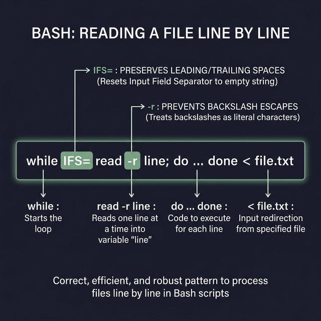

## 17. قراءة الملفات في باش (Reading Files)

عشان تقرأ ملف كبير سطر بسطر (بدل ما تطبعه كله مرة واحدة بأمر `cat` ويزحم التيرمينال)، الطريقة الاحترافية والمفضلة في الباش هي استخدام لوب `while` مع أمر `read`.

### الصيغة الأساسية (Basic Syntax)

```bash
while read line
do
    # الأوامر اللي هتتنفذ على كل سطر وهو جوه الـ Variable $line
done < input.file.txt
```

### شرح الاختيارات المهمة (Options)

عشان القراءة تكون دقيقة وميتمش تجاهل أي مسافات أو حروف خاصة، دايماً ببنستخدم الصيغة دي:
```bash
while IFS= read -r line
```
- **`IFS=`**: الـ (Internal Field Separator) ده اللي بيعرف التيرمينال إزاي تفصل بين الكلمات. لما بنخليه فاضي `IFS=`، بنضمن إن لو السطر بيبدأ أو بينتهي بمسافات هيتم قراءتها زي إيه هي (Preserve whitespace).
- **`read -r`**: حرف `r` (Raw) بيمنع التيرمينال إنها تترجم علامة الباك سلاش `\` وتعتبرها إخفاء (Escape character)، بيخليها تقرأ السطر حرفياً.
- **`<`**: ببنستخدم العلامة دي تحت خالص عشان ندي الملف للـ `while` لوب تشربه سطر بسطر.
- **`line`**: ده اسم الـ Variable اللي هيتخزن فيه السطر في كل لفة. (ممكن تسميه أي اسم تاني زي `row` أو `text`).

> **معلومة إضافية:** لو الملف بتاعك متقسم عواميد (زي ملفات الـ CSV)، ممكن تكتب أكتر من Variable مع أمر `read`. مثلاً `read name age` هتخلي المتكلم الأول في كل سطر يتحط في `name` والباقي في `age`.

---

### مثال عملي ثابت

لو افترضنا إن عندنا ملف اسمه `input.file.txt` مكتوب جواه التلات سطور دول:
```
Hello, World!
    This is a test.
\Line with a \ backslash.
```

**الإسكربت اللي هيقرأ التلات سطور:**
```bash
while IFS= read -r line
do
    echo "تم قراءة السطر: $line"
done < input.file.txt
```

**النتيجة زي إيه هي بالمسافات وعلامات الباك سلاش:**
```
تم قراءة السطر: Hello, World!
تم قراءة السطر:     This is a test.
تم قراءة السطر: \Line with a \ backslash.
```

---

### أهم النصايح (Notes)
- دائماً استخدم `-r` مع `read` لو مش عايز الباش يلعب في شكل الحروف الخاصة.
- استخدام `IFS=` بيمنع الكلمات إنها تتقصقص لو بينها مسافات.
- دائماً حط الـ Variable `$line` جوه دابل كوتس `"$line"` وأنت بتطبعه بأمر `echo` عشان تحافظ على مسافاته وتتجنب أي أخطاء في العرض.



