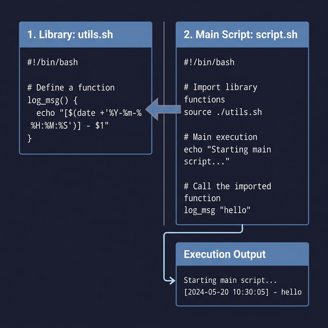

## 20. أمر التضمين (`source` Command)

أمر `source` (واللي ممكن نختصره بنقطة `.`) هو أمر قوي جداً / قوي ببنستخدمه عشان نشغل كود من إسكربت جوه إسكربت تاني. 
فكرته مش إنه بيشغل الإسكربت كبرنامج منفصل، لأ، ده "بيسحب" أو "بيستورد" الإسكربت التاني وكأسنه اتكتب جوه الإسكربت الحالي بالظبط. ده بيخليك تقدر تشارك الـ Functions، الـ Variables، والإعدادات بين إسكربتات كتير بدل ما تكرر الكود.

---

### إزاي ببنستخدمه؟ (Example Structure)

نفترض إننا قسمنا شغلنا على ملفين:

#### الملف الأول `src1.sh` (ده ملف فيه Functions ومتغيرات بس)
```bash
#!/bin/bash
f1() {
    echo "دي Function جاية من ملف src1.sh"
}

MY_VAR="ده Variable جاي من ملف src1.sh"
```

#### الملف التاني `src2.sh` (ده اللي هيشتغل فعلياً)
```bash
#!/bin/bash

# هنا بنسحب الملف الأول
source ./src1.sh

# دلوقتي نقدر ننادي الـ Function ديوكإنها مكتوبة فوقينا علطول
f1
echo "$MY_VAR"
```

---

### طريقة التنفيذ والنتيجة:

أول حاجة، لازم الإسكربتات تكون واخده Permissions التنفيذ (متنساش):
```bash
chmod +x src1.sh src2.sh
```

لو شغلنا الإسكربت التاني:
```bash
./src2.sh
```

**النتيجة:**
```
دي Function جاية من ملف src1.sh
ده Variable جاي من ملف src1.sh
```

---

### نقطة مهمة جداً / قوي (Key Points)
- أمر `source ./src1.sh` أو اختصاره `. ./src1.sh` بيشتغل جوه الـ **Current Shell** (النفس الشاشة الحالية). عشان كدا الـ Variables بتفضل عايشة معاك جوه الإسكربت التاني.
- **إيه الفرق لو شغلناه بأمر `bash ./src1.sh` بدلاً من `source`؟**
  لو استبدلتها، الباش هيفتح تيرمينال جديدة فرعية (Sub-shell) يشغل فيها `src1.sh`، ويقفلها، ويرجعلك لـ `src2.sh`. وبكدا كل الـ Variables والدوال هتضيع مع التيرمينال الفرعية اللي قفلت ومفيش حاجة هتتشاف جوه `src2.sh`.

---

### إإمتى بنستخدمه؟ (Use Cases)
1. **لو بتعمل مكتبة Functions (Library):** تكتب كل الـ Functions المهمة اللي بتستعملها في ملف واحد، وتسحبه في أي إسكربت جديد.
2. **ملفات الإعدادات (Config files):** لو عندك Variables أو Paths ثابتة، حطها في ملف إعدادات واستخدم امر `source` عشان تقرأها في إسكربتاتك.
3. مع Functions التهيئة البيئية (زي ملف الـ `.bashrc` اللي لو عدلته لازم تعمله `source ~/.bashrc` عشان التعديلات تسمّع فوراً).



