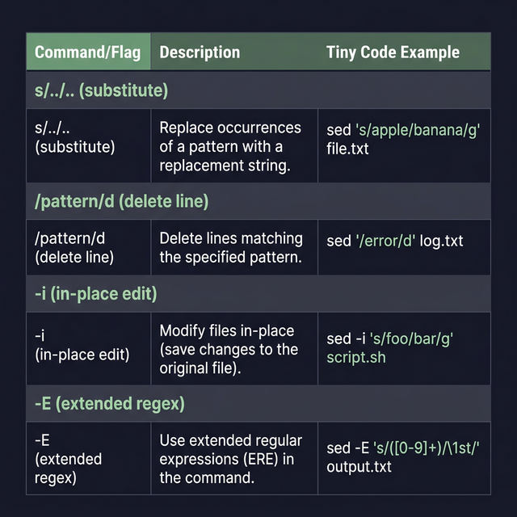

## 21. أداة التعديل السحرية (SED: Stream Editor)

أداة `sed` بمثابة محرر نصوص بس بدون واجهة مستخدم (Non-interactive). يعني مبتفتحش الملف وتقعد تمسح وتكتب بإيدك زي برنامج الوورد، إنت بتدي للـ `sed` سطر أوامر وهو بيعدل ويقصويلزق ويبدل الكلام جوه الملف في لمح البصر.

> **معلومة أساسية:** أداة `sed` بطبيعتها مبتعدلش في الملف الأصلي عشان تحميك من الأخطاء، هي بتطبع النتيجة على الشاشة بس. (عشان تعدل في الملف بجد هبنستخدم اختيار `-i`).

---

### الصيغة العامة (Syntax)
```bash
$ sed [option] 'commands' input_file
```

---

### 1. الاستبدال الأساسي (Basic Substitution)

أشهر استخدام للـ `sed` هو أمر الاستبدال اللي بيبدأ بحرف `s` (Substitute).
صيغته دايماً بتكون كدا: `'s/الكلمة القديمة/الكلمة الجديدة/'`

- **استبدال أول كلمة تقابلك في كل سطر:**
   ```bash
   sed 's/old/new/' input.txt
   ```
   *(لو السطر فيه "old world old"، هيغير أول واحدة بس تبقى "new world old").*

- **استبدال الكلمة التانية بالظبط في كل سطر:**
   ```bash
   sed 's/old/new/2' input.txt
   ```

- **استبدال كل الكلمات في كل السطور (Global):**
   بنضيف حرف `g` في الآخر.
   ```bash
   sed 's/old/new/g' input.txt
   ```

---

### 2. التحديد والتوجيه (Addressing)
لو مش عايز تعدل في الملف كله، وعايز تعدل في سطور معينة بس:

- **تعديل في السطر الأول بس:**
   ```bash
   sed '1 s/old/new/g' input.txt
   ```

- **تعديل في نطاق معين (من السطر التاني للتالت):**
   ```bash
   sed '2,3 s/old/new/g' input.txt
   ```

- **تعديل من السطر التاني لحد آخر الملف (`$` معناها آخر سطر):**
   ```bash
   sed '2,$ s/old/new/g' input.txt
   ```

---

### 3. استخدام الـ Regular Expressions (Regex) (Regular Expressions)
تقدر تخلي الـ `sed` يدور بذكاء:

- **استبدال الكلمة لو كانت في "أول السطر" بس (`^`):**
   ```bash
   sed 's/^old/new/' input.txt
   ```

- **استبدال الكلمة لو كانت في "آخر السطر" بس (`$`):**
   ```bash
   sed 's/old$/new/' input.txt
   ```

---

### 4. حركات وأوامر قوية (SED Operators)

- **أمر الطباعة (`p`):** بيطبع السطور اللي اتعدلت تحت بعضها (جنب الطباعة العادية).
   ```bash
   sed 's/old/new/p' input.txt
   ```

- **الطباعة الصامتة (`-n` المشتركة مع `p`):** ده بيمنع `sed` من إنه يطبع أي حاجة من الملف (كتم الصوت)، وبيطبع بس الكلمة اللي لقاها وعدلها.
   ```bash
   sed -n 's/old/new/p' input.txt
   ```

- **أمر المسح (`d` - Delete):** لو عايز تمسح سطر كامل لو لقيت فيه كلمة معينة:
   ```bash
   sed '/old/d' input.txt
   ```
   *أمثلة تانية للمسح:*
   ```bash
   sed '2,3d' input.txt   # مسح السطر التاني والتالت
   sed '/^$/d' input.txt  # مسح كل السطور الفاضية في الملف (مهم جداً / قوي للفلترة)
   ```

- **تنفيذ أكتر من أمر في نفس اللحظة (`-e`):**
   ```bash
   sed -e 's/old/new/g' -e 's/world/planet/g' input.txt
   ```

- **التعديل الفعلي جوه الملف (`-i` - In-place):**
   الـ option ده هو اللي بيحفظ التعديلات جوه الملف الأصلي علطول.
   ```bash
   sed -i 's/old/new/g' input.txt
   ```

- **استدعاء أوامر `sed` من ملف خارجي (`-f`):**
   لو عندك أوامر معقدة متخزنة في ملف `commands.sed`:
   ```bash
   sed -f commands.sed input.txt
   ```



