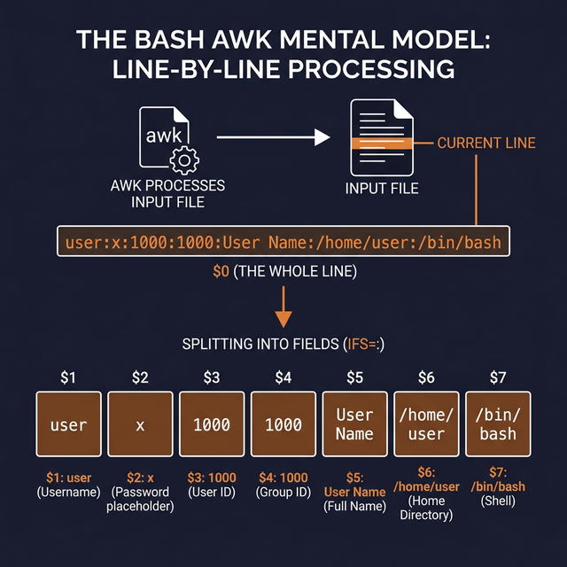
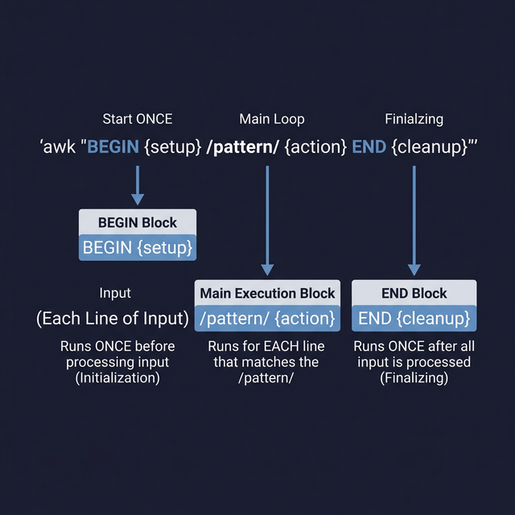

## 22. أداة AWK للتعامل مع النصوص كقواعد بيانات

أداة `awk` هي مش مجرد أداة، دي لغة برمجة مصغرة جوه اللينكس وظيفتها الأساسية هي معالجة النصوص وتحديداً **أعمدة البيانات**. لو عندك ملف فيه جدول (زي ملف الباسوردات `/etc/passwd`)، الأداة دي هتبقى ساحرة.

### الصيغة وطريقة التفكير (AWK Syntax)
AWK بيفسر الملف سطر بسطر (زي اللوب بالظبط). وبيقسم الصياغة لتلات أجزاء:

```bash
awk 'BEGIN {Commands} {Commands} END {Commands}' INPUT_FILE
```
- **`BEGIN {}`**: أوامر بتتنفذ مرة واحدة **قبل** قراءة أي سطر (بنهيئ فيها الـ Variables زي المسافات).
- **`{}`**: الكود الأساسي اللي بيتنفذ على **كل سطر** في الملف. (مثلاً `{print}` بتطبع السطر كله زي أمر `cat`).
- **`END {}`**: أوامر بتتنفذ مرة واحدة في **النهاية** بعد ما الملف كله يخلص (عشان نطبع ملخص أو إجمالي).

---

### Variables الـ AWK السرية (AWK Variables)
عشان تتعلم الـ awk، لازم تحفظ الـ Variables دي:

- **`NR`** (Number of Records): رقم السطر الحالي (1 للسطر الأول، 2 للتاني، الخ).
- **`NF`** (Number of Fields): عدد الكلمات (العواميد) في السطر الحالي.
- **`$0`**: السطر أو الريكورد كاملاً.
- **`$1`, `$2`, ...**: العمود الأول، العمود التاني، وهكذا.
- **`FS`** (Field Separator): الحرف اللي بيقسم العواميد عن بعض في ملفك (الافتراضي هو المسافة).
- **`OFS`** (Output Field Separator): الحرف اللي إنت عاوزه يطبع بيفصل بين العواميد في النتيجة لليوزر.
- **`RS`** و **`ORS`**: فواصل السطور (الافتراضي بتاعهم هو مسافة النزول لسطر جديد `\n`).

> *بيتم كتابة الـ Separators دي دايماً جوه بلوك الـ `BEGIN`.*

---

### أمثلة ممتازة وقوية

#### مثال 1: فلترة الأعمدة (Columns Extraction)
هنجيب آخر 10 سطور من ملف الباسوردات، ونقول لـ awk: الفاصل بين العواميد في الملف ده هو النقطتين فوق بعض `:`، ولما تطبعلي النتيجة افصل بينهم بسهم ` -> `. واطبعلي السطر الأول (اسم المستخدم) والسابع (Path الشيل التيرمينال بتاعه).
```bash
tail -10 /etc/passwd | awk 'BEGIN {FS=":"; OFS=" -> "} {print $1, $7}'
```

ولو عايزين نطبع رقم السطر جنبهم هبنستخدم Variable `NR`:
```bash
awk 'BEGIN {FS=":"; OFS=" -> "} {print NR, $1, $7}' file.txt
```

---

### Processes البحث الذكية (AWK Operations)

- **ندور على كلمة معينة ونطبع سطرها:**
   ```bash
   awk '/word/' INPUT_FILE
   ```
- **ندور على كلمة، ولما نلاقيها نطبع عمود معين بس منها:**
   ```bash
   awk '/word/ {print $1, $3}' INPUT_FILE
   ```
- **البحث الاحترافي ਜੋ عمود معين (عشان نتجنب الغلط):**
   *(هل العمود الأول يحتوي على كلمة 'Sa'؟ لو أه، اطبع كل السطر `$0`)*
   ```bash
   awk '$1 ~ /Sa/ {print $0}' awk5.txt
   # ولو عايزين نعكس ونقول "لا يحتوي"، هنغير العلامة لـ `!~`
   awk '$1 !~ /Sa/ {print $0}' awk5.txt
   ```

- **حساب الأرقام والمنطق:**
   *(اطبعلي السطور اللي قيمة العمود التالت فيها أصغر من 30 ألف)*
   ```bash
   awk '$3 < 30000 {print $0}' awk5.txt
   ```

- **استخدام بلوك الـ BEGIN كآلة حاسبة:**
   ```bash
   awk 'BEGIN {print 5+5}'
   ```

---

### البرمجة جوه الـ AWK (If & For)

أيوا، ممكن تكتب `if` ستيتمنت و `for` لوب كاملين جوه القوسين بتوع `awk` عشان تقارن بيانات وتعدل عليها بحرية.

```bash
# استخدام الـ IF
awk '{
    if (condition) {
         # الكود لو الشرط صح
    } else {
         # الكود لو الشرط غلط
    }
}' INPUT_FILE

# استخدام الـ For Loop
awk '{
    for (variable in collection) {
         # الكود اللي بيلف
    }
}' INPUT_FILE
```

الـ AWK مش مجرد أمر، دي قدرة إنك تقسم وتحلل الداتا الضخمة بذكاء عالي جداً / قوي.



