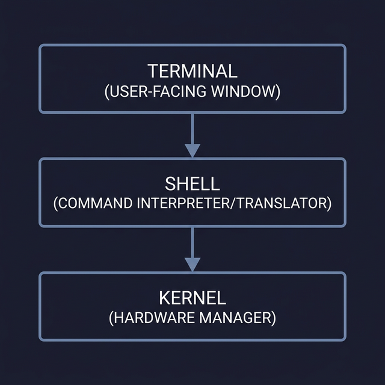
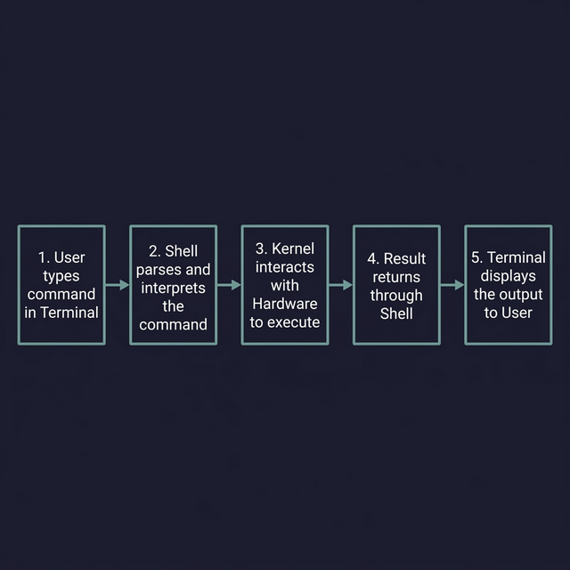

# Understanding the Kernel, Shell, and Terminal

Before you write a single Bash script, you need to understand the **three layers** that make Linux work. Think of it like a chain of command — each layer has a specific job, and they all depend on each other.

---

## 1. The Kernel — The Brain of the OS

The **Kernel** is the core of the operating system. It's the first program that loads when your computer boots, and it never stops running until you shut down.

**What does it actually do?**
- Manages **hardware resources**: CPU time, RAM allocation, disk I/O, network interfaces  
- Manages **processes**: decides which program runs when, how much memory it gets, and when to pause it for another program  
- Provides **system calls**: a controlled API that programs use to request hardware access (e.g., reading a file, sending network data)

```
📝 Key insight: No program — not even the shell — can talk to hardware directly.
   Everything goes through the kernel via system calls.
   This is what makes Linux secure and stable.
```

> **Analogy:** The kernel is like the engine of a car. You never touch it directly, but nothing moves without it.

---

## 2. The Shell — The Translator

The **Shell** sits between you and the kernel. When you type a command like `ls -la`, the shell:

1. **Parses** your command (breaks it into parts)
2. **Interprets** what you want (find the `ls` program, pass it `-la` as an argument)
3. **Translates** it into system calls the kernel understands
4. **Returns** the kernel's response back to you as readable output

**Why is it called a "shell"?**  
Because it wraps around the kernel like a protective shell — you interact with the outer layer, and it handles communication with the core.

**Common shell types:**

| Shell | Full Name | Notes |
|-------|-----------|-------|
| `bash` | Bourne-Again Shell | Default on most Linux distros. What we're learning. |
| `zsh` | Z Shell | Default on macOS. More features than bash. |
| `sh` | Bourne Shell | The original. `bash` is its modern successor. |
| `fish` | Friendly Interactive Shell | User-friendly, but not POSIX-compatible. |

```bash
# ← Check what shell you're currently using:
echo $SHELL        # Shows your default login shell
echo $0            # Shows the shell running RIGHT NOW (might differ)

# ← List all shells installed on your system:
cat /etc/shells
```

> **Analogy:** The shell is like a translator at a foreign embassy. You speak English, the kernel speaks machine code — the shell translates between you.

---

## 3. The Terminal — The Window

The **Terminal** (technically a "terminal emulator") is just the **window** you type in. It has no intelligence of its own — it doesn't understand commands, doesn't execute anything.

**What it actually does:**
- Captures your **keystrokes** and sends them to the shell
- Receives **text output** from the shell and displays it on screen
- Provides visual features: colors, fonts, scrollback, tabs

**Popular terminal emulators:** GNOME Terminal, Kitty, Alacritty, Windows Terminal, iTerm2

> **Analogy:** The terminal is like a phone. It doesn't understand the conversation — it just carries your voice to the other person and their voice back to you.

---

## How They Work Together — The Full Picture

Here's what happens every time you type a command:

```
┌─────────────┐    keystrokes     ┌─────────┐    system calls    ┌──────────┐
│  Terminal    │ ──────────────▶  │  Shell   │ ────────────────▶ │  Kernel  │
│  (Window)   │ ◀──────────────  │  (Bash)  │ ◀──────────────── │  (Core)  │
└─────────────┘    text output    └─────────┘    results         └──────────┘
                                                                       │
                                                                       ▼
                                                                 ┌──────────┐
                                                                 │ Hardware │
                                                                 │ CPU/RAM  │
                                                                 └──────────┘
```

**Step-by-step example** — what happens when you type `ls /home`:
1. **Terminal** captures your keystrokes `l`, `s`, ` `, `/`, `h`, `o`, `m`, `e` and sends them to the shell
2. **Shell (Bash)** receives `ls /home`, finds the `ls` binary at `/usr/bin/ls`, and calls the kernel saying "read the directory `/home` and list its contents"
3. **Kernel** accesses the filesystem on disk, reads the directory entries, and returns the data
4. **Shell** formats the output and sends the text back to the terminal
5. **Terminal** renders the text on your screen



