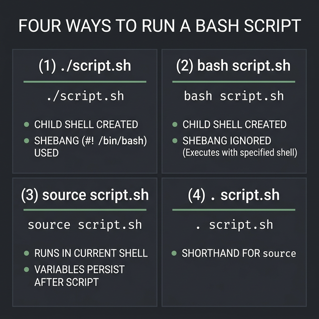
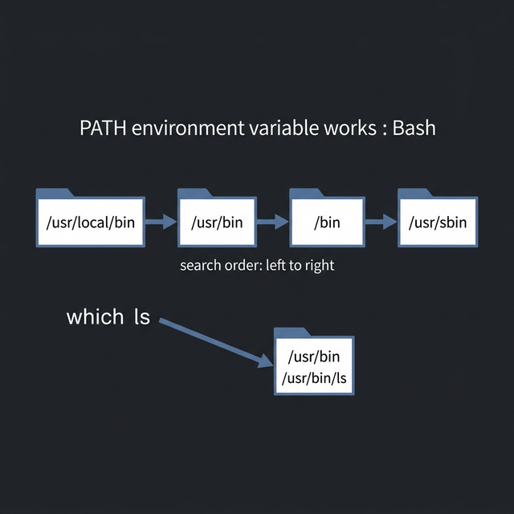

# Scripts, Commands, and Environment Setup

Now that you understand the three layers (Terminal → Shell → Kernel), let's learn how to actually **write and run** Bash scripts — and understand exactly what happens behind the scenes.

---

## What Is a Script?

A script is just a **plain text file** containing a sequence of commands. Instead of typing commands one by one, you write them all in a file and run the file once. Bash reads the file top-to-bottom and executes each line.

```bash
#!/bin/bash
# ← This is called the "shebang" line. It tells the OS which interpreter to use.
# Without it, the OS doesn't know if this file is Bash, Python, or something else.

echo "Hello, World!"    # ← Your first command. Prints text to the screen.
```

> **Why the shebang matters:** If you write `#!/bin/bash` at the top, the OS will ALWAYS use Bash to run this script — even if the user's default shell is `zsh` or `fish`. This makes your script portable.

---

## Before You Write: Check Your Environment

```bash
# ← What shells are available on this system?
cat /etc/shells

# ← What is my default login shell?
echo $SHELL          # e.g., /bin/bash

# ← What shell am I using RIGHT NOW?
echo $0              # e.g., bash (might differ from $SHELL if you switched)

# ← What is the type of a file? (Is it a script? A binary? A directory?)
file myscript.sh     # Output: "Bourne-Again shell script, ASCII text executable"
file /bin/ls         # Output: "ELF 64-bit LSB pie executable" (a compiled binary)
```

---

## Making a Script Executable

When you create a new `.sh` file, Linux does NOT let you run it by default. You need to **grant execute permission** first.

```bash
# ← Step 1: Create your script
echo '#!/bin/bash
echo "Hello from my script!"' > myscript.sh

# ← Step 2: Check its current permissions
ls -l myscript.sh
# Output: -rw-r--r--  ← No 'x' means NO execute permission

# ← Step 3: Add execute permission
chmod +x myscript.sh

# ← Step 4: Verify
ls -l myscript.sh
# Output: -rwxr-xr-x  ← The 'x' means it's now executable!
```

> **Common mistake:** Forgetting `chmod +x`. If you get "Permission denied" when running a script, this is almost always why.

---

## 4 Ways to Run a Script (and Why They're Different)

This is one of the most important concepts in Bash scripting. The way you run a script determines **which shell runs it** and **whether variables persist** after it finishes.

### Method 1: `./script.sh` — Run in a New Child Shell
```bash
./myscript.sh
# ← Creates a CHILD shell process (a subshell)
# ← The shebang line decides which interpreter to use
# ← Variables set inside the script DISAPPEAR when it finishes
# ← Requires execute permission (chmod +x)
```

### Method 2: `bash script.sh` — Explicitly Run with Bash
```bash
bash myscript.sh
# ← Also creates a child shell, but explicitly uses bash
# ← Ignores the shebang line (you're overriding it)
# ← Does NOT require execute permission
# ← Variables still disappear when done
```

### Method 3: `source script.sh` — Run in the CURRENT Shell
```bash
source myscript.sh
# ← Runs the script in YOUR current shell (no child process)
# ← Variables set inside the script PERSIST after it finishes!
# ← This is how .bashrc works — it's "sourced," not "executed"
# ← Shorthand: . myscript.sh (dot, then space, then filename)
```

### Method 4: `. script.sh` — Shorthand for source
```bash
. myscript.sh
# ← Exactly the same as "source myscript.sh"
# ← The dot (.) is a built-in command that means "source"
```

**Why does this matter?** Here's a practical example:
```bash
# --- myscript.sh ---
#!/bin/bash
MY_NAME="Karim"

# --- In your terminal ---
./myscript.sh
echo $MY_NAME        # ← Prints NOTHING. The variable died with the child shell.

source myscript.sh
echo $MY_NAME        # ← Prints "Karim". The variable lives in YOUR shell now.
```



---

## Understanding PATH — How Bash Finds Commands

When you type `ls`, how does Bash know where the `ls` program is? It searches through a list of directories stored in a special variable called `$PATH`.

```bash
# ← View your PATH:
echo $PATH
# Output: /usr/local/bin:/usr/bin:/bin:/usr/sbin:/sbin
# ← These are directories separated by colons (:)
# ← Bash searches LEFT to RIGHT. First match wins.

# ← Where exactly is the "ls" command?
which ls             # Output: /usr/bin/ls
type ls              # Output: ls is /usr/bin/ls (or "ls is aliased to...")
```

**How to add your own scripts to PATH:**
```bash
# ← Temporarily (current session only):
export PATH="$PATH:/home/karim/my_scripts"

# ← Permanently (add this line to ~/.bashrc):
echo 'export PATH="$PATH:/home/karim/my_scripts"' >> ~/.bashrc
source ~/.bashrc     # ← Apply immediately without restarting terminal
```

> **Pro tip:** The order of directories in `$PATH` matters. If you have two programs with the same name, the one found first (leftmost directory) wins.

