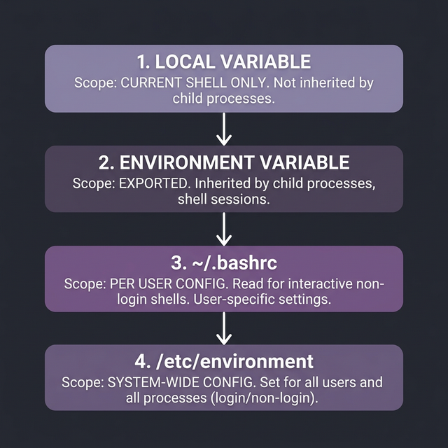
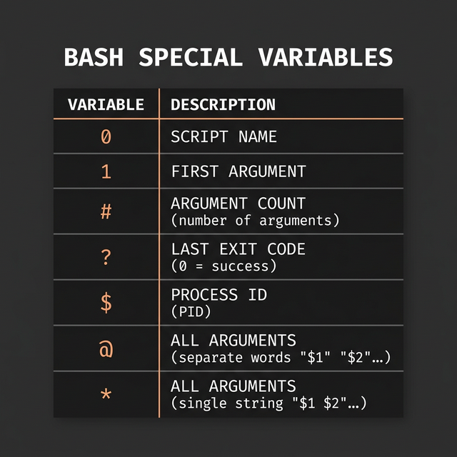

# Variables in Bash

Variables are the foundation of any programming language. In Bash, they work a bit differently than languages like Python or JavaScript — understanding these differences will save you hours of debugging.

---

## Declaring Variables — The Rules

```bash
name="Karim"          # ✅ Correct — no spaces around the equals sign
name = "Karim"        # ❌ WRONG — Bash thinks "name" is a COMMAND with "=" and "Karim" as arguments
name= "Karim"         # ❌ WRONG — sets name to empty string, then tries to run "Karim" as a command
```

> **This is the #1 beginner mistake in Bash.** Memorize it: when assigning variables, **NO SPACES around `=`**.

```bash
# ← Reading a variable — use $ before the name:
echo $name            # Output: Karim
echo ${name}          # Output: Karim (braces are optional but safer — see below)
echo "Hello, $name!"  # Output: Hello, Karim! (double quotes allow variable expansion)
echo 'Hello, $name!'  # Output: Hello, $name! (single quotes treat everything as LITERAL text)
```

> **When to use `${name}` instead of `$name`?** When the variable name bumps against other text:
> ```bash
> fruit="apple"
> echo "$fruits"       # ❌ Bash looks for a variable called "fruits" — finds nothing
> echo "${fruit}s"     # ✅ Output: apples
> ```

---

## Types of Variables by Scope

Understanding **where** a variable lives (its scope) is critical. Bash has 4 levels:

### 1. Local Variables (Current Shell Only)
```bash
my_var="hello"        # ← Only exists in the current shell session
echo $my_var          # Output: hello

bash                  # ← Open a new child shell
echo $my_var          # Output: (empty!) — the variable didn't come with us
exit                  # ← Return to parent shell
echo $my_var          # Output: hello — it's still here in the parent
```

### 2. Environment Variables (Inherited by Child Processes)
```bash
export MY_VAR="hello" # ← The 'export' keyword makes it available to ALL child processes

echo $MY_VAR          # Output: hello
bash                  # ← Open a child shell
echo $MY_VAR          # Output: hello — it inherited the variable!
exit
```

> **Key difference:** `my_var="hello"` creates a local variable. `export my_var="hello"` promotes it to an environment variable that child processes can see.

### 3. Session-Wide Configuration (~/.bashrc)
```bash
# ← Variables in ~/.bashrc load every time you open a new terminal:
echo 'export EDITOR="vim"' >> ~/.bashrc    # ← Permanent for YOUR user
source ~/.bashrc                            # ← Apply now without restarting
```

| File | When It Loads | Scope |
|------|--------------|-------|
| `~/.bashrc` | Every new interactive non-login shell (new terminal tab) | Current user |
| `~/.bash_profile` | Login shells only (SSH, first terminal) | Current user |
| `/etc/profile` | Login shells, for ALL users | System-wide |
| `/etc/environment` | At boot, for ALL users | System-wide |

### 4. System-Wide Variables (/etc/environment)
```bash
# ← Variables here affect EVERY user on the system:
sudo nano /etc/environment
# Add: MY_GLOBAL_VAR="available_everywhere"
```

---

## Built-In Special Variables

Bash comes with several pre-defined variables that you'll use constantly in scripts:

```bash
#!/bin/bash
# ← Run this as: ./script.sh apple banana cherry

echo "Script name: $0"         # ← $0 = The name of the script itself → ./script.sh
echo "First argument: $1"      # ← $1 = First argument passed → apple
echo "Second argument: $2"     # ← $2 = Second argument passed → banana
echo "All arguments (str): $*" # ← $* = All arguments as a SINGLE string → "apple banana cherry"
echo "All arguments (arr): $@" # ← $@ = All arguments as SEPARATE strings → "apple" "banana" "cherry"
echo "Argument count: $#"      # ← $# = Number of arguments → 3
echo "Script PID: $$"          # ← $$ = Process ID of the current script
echo "Last exit code: $?"      # ← $? = Exit status of the LAST command (0 = success)
```

> **The critical difference between `$*` and `$@`:**
> ```bash
> # When quoted, they behave DIFFERENTLY:
> for arg in "$*"; do echo "→ $arg"; done
> # Output: → apple banana cherry    (ONE iteration, all args joined)
> 
> for arg in "$@"; do echo "→ $arg"; done
> # Output: → apple                  (three separate iterations)
> #         → banana
> #         → cherry
> ```
> **Rule of thumb:** Always use `"$@"` when iterating over arguments. It preserves spaces in individual arguments.

---

## Practical: The `readonly` and `unset` Commands

```bash
PI=3.14159
readonly PI           # ← PI is now a constant — cannot be changed or deleted
PI=3.0               # ← ERROR: bash: PI: readonly variable

name="test"
unset name            # ← Deletes the variable completely
echo $name            # Output: (empty)
```




