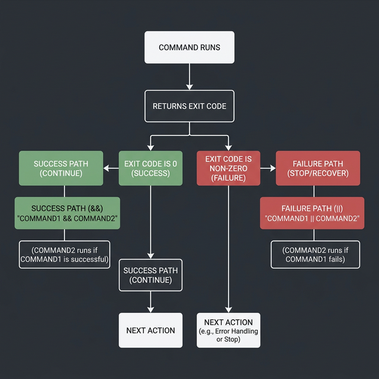
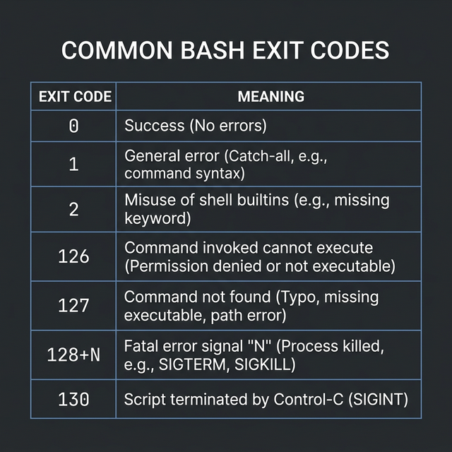

# Exit Status — How Bash Reports Success and Failure

Every single command you run in Bash produces an invisible number when it finishes. This number is called the **exit status** (or **return code**), and it tells you whether the command succeeded or failed.

---

## The Basics

```bash
# ← Run a command that succeeds:
ls /home
echo $?              # ← Output: 0 — this means SUCCESS

# ← Run a command that fails:
ls /nonexistent_directory
echo $?              # ← Output: 2 — this means FAILURE (specifically "No such file")
```

> **The Golden Rule:** `0` = success, **anything else** = failure.  
> This is the OPPOSITE of most programming languages where 0 = false. In Bash, 0 = "all good."

**Why is this important?** Because `if` statements, `&&`, `||`, and every conditional in Bash works by checking exit codes — not by checking text output.

---

## Common Exit Codes

| Code | Meaning | Example |
|------|---------|---------|
| `0` | Success | Command ran perfectly |
| `1` | General error | Catch-all for misc failures |
| `2` | Misuse of shell command | Wrong syntax, missing argument |
| `126` | Permission denied | Script exists but can't execute |
| `127` | Command not found | Typo in command name |
| `128+N` | Killed by signal N | e.g., `130` = killed by Ctrl+C (signal 2) |
| `255` | Exit status out of range | Used `exit 999` (max is 255) |

```bash
# ← See it in action:
command_that_doesnt_exist
echo $?              # ← Output: 127 (command not found)

chmod -x myscript.sh
./myscript.sh
echo $?              # ← Output: 126 (permission denied)
```

---

## Using Exit Codes in Your Scripts

### The `exit` Command
You can explicitly set the exit code when your script finishes:

```bash
#!/bin/bash

if [ -f "/etc/passwd" ]; then
    echo "Password file found."
    exit 0           # ← Tell the caller: everything went fine
else
    echo "ERROR: Password file missing!" >&2   # ← >&2 sends the error to stderr
    exit 1           # ← Tell the caller: something went wrong
fi
```

> **Why `exit` matters:** When other scripts or automation tools call YOUR script, they check `$?` to decide what to do next. A proper exit code is how scripts communicate.

### Chaining Commands with `&&` and `||`

These operators use exit codes under the hood:

```bash
# ← && means "run the next command ONLY IF the previous one succeeded (exit 0)"
mkdir /tmp/test && echo "Directory created successfully"
# If mkdir fails, the echo NEVER runs.

# ← || means "run the next command ONLY IF the previous one FAILED (exit ≠ 0)"
mkdir /tmp/test || echo "Failed to create directory!"
# If mkdir succeeds, the echo NEVER runs.

# ← Combine them for a clean success/failure pattern:
ping -c 1 google.com > /dev/null 2>&1 && echo "Internet is UP" || echo "Internet is DOWN"
```

### Real-World Pattern — Error Handling in Scripts

```bash
#!/bin/bash
# ← A robust script always checks exit codes:

backup_dir="/backups/$(date +%Y-%m-%d)"

mkdir -p "$backup_dir"      # ← Try to create the backup directory
if [ $? -ne 0 ]; then       # ← $? captures mkdir's exit code. -ne means "not equal"
    echo "FATAL: Cannot create backup directory: $backup_dir" >&2
    exit 1
fi

cp -r /important/data/* "$backup_dir/"
if [ $? -ne 0 ]; then
    echo "WARNING: Some files failed to copy" >&2
    exit 2                   # ← Different code for different errors — very useful for debugging
fi

echo "Backup completed: $backup_dir"
exit 0
```

> **Pro tip:** In production scripts, always use different exit codes for different failure modes. It makes troubleshooting 10x faster.



