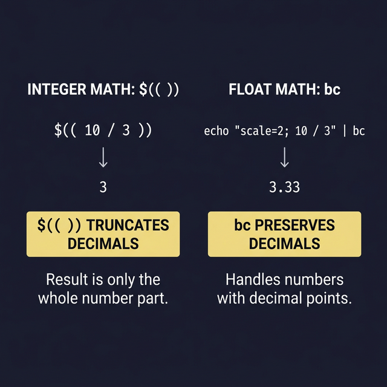

# Arithmetic Operations in Bash

Bash was designed primarily for text processing and system administration — not math. Because of this, doing arithmetic in Bash requires specific syntax that might feel unusual if you're coming from Python or JavaScript. Here are **all four methods**, from most common to least.

---

## Method 1: `$(( ))` — Double Parentheses (Recommended)

This is the **most common and readable** way to do math in Bash:

```bash
a=10
b=3

sum=$(( a + b ))        # ← 13. Note: $ before variable names is OPTIONAL inside (( ))
diff=$(( a - b ))       # ← 7
product=$(( a * b ))    # ← 30
quotient=$(( a / b ))   # ← 3 (integer division — no decimals!)
remainder=$(( a % b ))  # ← 1 (modulo — the remainder after division)
power=$(( a ** 2 ))     # ← 100 (exponentiation — 10 to the power of 2)

echo "Sum: $sum, Remainder: $remainder, Power: $power"
```

> **⚠️ Critical limitation:** `$(( ))` only works with **integers**. No decimals, no floating point.
> ```bash
> echo $(( 10 / 3 ))    # Output: 3 (NOT 3.333... — it truncates!)
> ```

### Increment and Decrement Shortcuts
```bash
count=5
(( count++ ))           # ← count is now 6 (post-increment)
(( count-- ))           # ← count is now 5 again (post-decrement)
(( count += 10 ))       # ← count is now 15 (add and assign)
(( count *= 2 ))        # ← count is now 30 (multiply and assign)
```

---

## Method 2: `let` — Evaluate Arithmetic Expression

`let` does the same thing as `(( ))` but as a command:

```bash
let "sum = 5 + 3"       # ← sum = 8
let "count++"           # ← Increment count
let "result = 10 ** 2"  # ← result = 100
```

> **When to use `let`?** Honestly, `$(( ))` is preferred in modern scripts. `let` exists mainly for backward compatibility.

---

## Method 3: `expr` — External Command (Legacy)

`expr` is an **external program** (not a Bash built-in), so it's slower. It's mostly found in old scripts:

```bash
result=$(expr 5 + 3)     # ← result = 8
# ⚠️ Spaces around operators are REQUIRED with expr
# ⚠️ Multiplication needs escaping because * is a glob character:
result=$(expr 5 \* 3)    # ← result = 15
```

> **Don't use `expr` in new scripts.** It's slow, ugly, and has tricky escaping rules. Use `$(( ))` instead.

---

## Method 4: `bc` — The Calculator (For Decimals!)

When you need **floating-point math** (decimals), `bc` is your only option in Bash:

```bash
# ← Basic usage — pipe an expression to bc:
echo "10 / 3" | bc           # ← Output: 3 (still integer by default!)

# ← Enable decimal precision with scale:
echo "scale=2; 10 / 3" | bc  # ← Output: 3.33 (scale=2 means 2 decimal places)
echo "scale=4; 22 / 7" | bc  # ← Output: 3.1428

# ← Store result in a variable:
pi=$(echo "scale=10; 4*a(1)" | bc -l)   # ← Calculates PI to 10 decimal places!
echo "PI = $pi"              # ← Output: PI = 3.1415926535
```

> **When to use `bc`?** Whenever you need decimal math. It's the ONLY way in pure Bash.

---

## Comparison Operators Inside `(( ))`

Inside double parentheses, you can use **C-style comparison operators** instead of Bash's `-eq`, `-lt`, etc.:

```bash
a=10; b=20

# ← These return exit code 0 (true) or 1 (false):
(( a == b ))  && echo "Equal"     || echo "Not equal"     # ← Not equal
(( a != b ))  && echo "Different" || echo "Same"           # ← Different
(( a < b ))   && echo "a is less" || echo "a is not less"  # ← a is less
(( a > b ))   && echo "a is more" || echo "a is not more"  # ← a is not more
(( a <= b ))  && echo "a ≤ b"     || echo "a > b"          # ← a ≤ b
(( a >= b ))  && echo "a ≥ b"     || echo "a < b"          # ← a < b
```

**When to use which?**

| Context | Syntax | Example |
|---------|--------|---------|
| Inside `[ ]` or `[[ ]]` | `-eq`, `-ne`, `-lt`, `-gt` | `[ $a -eq $b ]` |
| Inside `(( ))` | `==`, `!=`, `<`, `>` | `(( a == b ))` |

> **Rule of thumb:** Use `(( ))` for math and numeric comparisons. Use `[[ ]]` for string comparisons and file tests.



