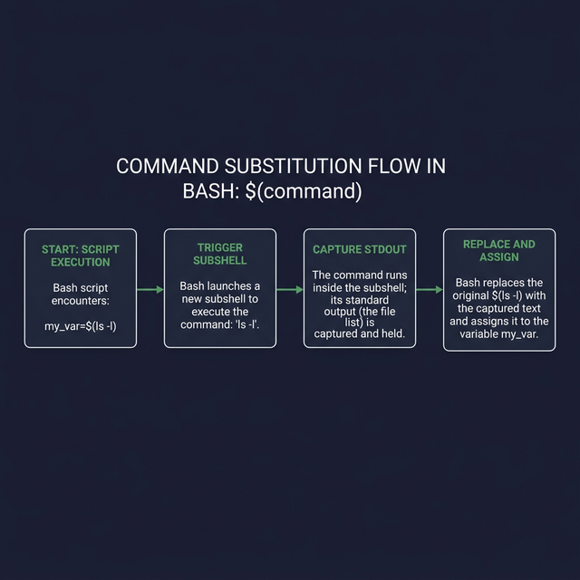

# Command Substitution — Capturing Output Inside Variables

Command substitution is one of the most powerful features in Bash. It lets you **run a command, capture its output, and use that output** as a value — inside a variable, inside another command, or even inside a string.

---

## The Syntax

There are two ways to do command substitution. They do the same thing, but one is better:

```bash
# ← Modern syntax (PREFERRED — always use this):
result=$(command)

# ← Legacy syntax (old scripts — avoid in new code):
result=`command`
```

> **Why is `$()` better than backticks?**
> 1. **Nesting:** `$()` can be nested easily: `$(echo $(date))`. Backticks require escaping: `` `echo \`date\`` ``
> 2. **Readability:** `$()` is visually clearer — you can see where it starts and ends
> 3. **Consistency:** `$()` works the same way everywhere. Backticks have subtle escaping differences

---

## How It Works — Step by Step

```bash
today=$(date)
# Here's what happens:
# 1. Bash sees $(...) and knows: "I need to run what's inside first"
# 2. Bash launches a SUBSHELL and runs the "date" command inside it
# 3. The "date" command outputs something like "Fri Feb 28 13:00:00 EET 2026"
# 4. Bash takes that OUTPUT and substitutes it in place of the $(date)
# 5. So the line effectively becomes: today="Fri Feb 28 13:00:00 EET 2026"

echo "Today is: $today"
```

---

## Practical Examples

### Storing system info in variables
```bash
current_user=$(whoami)              # ← Gets the current username
hostname=$(hostname)                 # ← Gets the machine name
kernel_version=$(uname -r)           # ← Gets the kernel version
disk_usage=$(df -h / | tail -1)      # ← Gets root partition usage
file_count=$(ls /etc | wc -l)        # ← Counts files in /etc

echo "User: $current_user on $hostname running kernel $kernel_version"
```

### Using it inline (without storing in a variable)
```bash
# ← Create a directory named with today's date:
mkdir "backup_$(date +%Y-%m-%d)"
# Creates: backup_2026-02-28

# ← Print how many lines are in a file:
echo "Config has $(wc -l < /etc/passwd) lines"
```

### Nesting — command substitution inside command substitution
```bash
# ← Get the parent directory of the script's location:
parent_dir=$(dirname $(dirname $(realpath $0)))
echo "Two levels up: $parent_dir"

# ← Get the IP address of a hostname:
ip_address=$(dig +short $(hostname) | head -1)
```

### Real-world script: automated log filename
```bash
#!/bin/bash
# ← Creates a log file with a timestamp in the name
LOG_FILE="/var/log/backup_$(date +%Y%m%d_%H%M%S).log"

echo "Starting backup at $(date)" | tee "$LOG_FILE"
# ...backup commands here...
echo "Backup completed at $(date)" | tee -a "$LOG_FILE"
```

> **Common mistake:** Forgetting that command substitution runs in a **subshell**. Variables set inside `$(...)` do NOT affect the parent shell:
> ```bash
> result=$(MY_VAR="set inside"; echo $MY_VAR)
> echo $result       # ← Output: "set inside"
> echo $MY_VAR       # ← Output: (empty!) — MY_VAR died with the subshell
> ```



