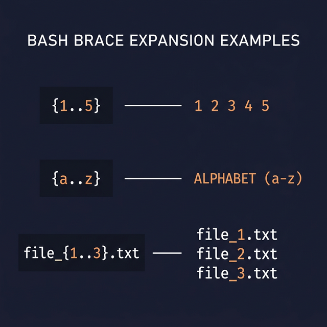

# Reading User Input and Output Formatting

Interactive scripts need to **talk to users** (output) and **listen to users** (input). Bash provides `echo` for talking and `read` for listening — but both have options that most beginners never learn.

---

## Output: The `echo` Command — Beyond the Basics

```bash
echo "Hello, World!"        # ← Basic usage. Prints text + adds a newline at the end.
```

### echo -n (No trailing newline)
```bash
echo -n "Enter your name: "  # ← Cursor stays on the SAME LINE — perfect for prompts
read name                    # ← User types here, right after the colon
```

### echo -e (Enable escape sequences)
```bash
echo -e "Line 1\nLine 2"         # ← \n = newline (go to next line)
# Output:
# Line 1
# Line 2

echo -e "Column1\tColumn2"       # ← \t = tab (align in columns)
# Output:
# Column1    Column2

echo -e "\e[31mRED TEXT\e[0m"    # ← ANSI color codes! \e[31m = red, \e[0m = reset
echo -e "\e[1;32mBOLD GREEN\e[0m"
```

> **Why `echo -e`?** Without `-e`, Bash prints `\n` as literal text instead of a newline. The `-e` flag tells `echo` to interpret these backslash characters as special formatting.

---

## Input: The `read` Command

`read` pauses the script and waits for the user to type something, then stores it in a variable.

```bash
# ← Basic usage:
echo "What is your name?"
read name                    # ← Waits for input, stores it in $name
echo "Hello, $name!"
```

### Useful `read` Options

```bash
# ← -p (prompt): Combine the prompt message and read in one line:
read -p "Enter your age: " age
echo "You are $age years old."

# ← -s (silent): Hide what the user types — perfect for passwords:
read -sp "Enter password: " password
echo ""                      # ← Need this because -s suppresses the newline
echo "Password received (length: ${#password})"

# ← -t (timeout): Give the user N seconds. If they don't type, move on:
read -t 5 -p "Quick! Enter a number (5 sec): " number
if [ $? -ne 0 ]; then       # ← $? will be non-zero if the timer expired
    echo -e "\nToo slow!"
fi

# ← Reading multiple values at once:
read -p "Enter first and last name: " first last
echo "First: $first, Last: $last"
# If user types "John Doe Smith":
#   first = "John"
#   last = "Doe Smith"    ← The LAST variable gets ALL remaining words
```

### Reading into an Array
```bash
read -p "Enter 3 colors: " -a colors
echo "You entered: ${colors[0]}, ${colors[1]}, ${colors[2]}"
```

---

## Brace Expansion — Generating Sequences

This isn't directly about I/O, but it's a powerful Bash feature for generating patterns:

```bash
# ← Generate a sequence of numbers:
echo {1..5}                  # Output: 1 2 3 4 5
echo {01..10}                # Output: 01 02 03 04 05 06 07 08 09 10 (zero-padded!)

# ← Generate a sequence with a step:
echo {0..20..5}              # Output: 0 5 10 15 20

# ← Generate letter sequences:
echo {a..z}                  # Output: a b c d e ... z
echo {A..E}                  # Output: A B C D E

# ← Combine with other text:
echo file_{1..3}.txt         # Output: file_1.txt file_2.txt file_3.txt
echo {web,db,cache}_server   # Output: web_server db_server cache_server

# ← Real-world: create multiple directories at once:
mkdir -p project/{src,tests,docs,config}
# Creates: project/src  project/tests  project/docs  project/config
```

> **This is NOT globbing.** Brace expansion happens BEFORE the command runs. `{1..5}` generates text, while `*` matches existing files.


