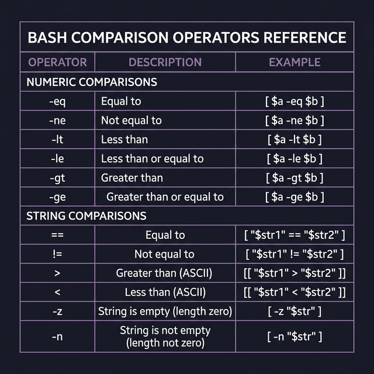
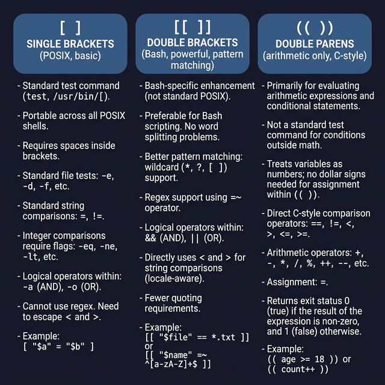

# Conditional Operators — The Language of Tests

Before you can write `if` statements, you need to understand **what goes inside the brackets**. Conditional operators are the building blocks — they test numbers, strings, and files and return true or false.

---

## The Three Test Syntaxes

Bash has three different ways to write conditions. Each has different capabilities:

```bash
# 1. Single brackets [ ] — POSIX-compatible, works everywhere
[ $a -eq $b ]

# 2. Double brackets [[ ]] — Bash-specific, more powerful
[[ $a == $b ]]

# 3. Double parentheses (( )) — Arithmetic only
(( a > b ))
```

> **Which should you use?** `[[ ]]` is the safest default for strings and files. `(( ))` is cleanest for numbers. Avoid `[ ]` unless you need POSIX compatibility.

---

## Numeric Comparison Operators

Inside `[ ]` and `[[ ]]`, numbers are compared using **letter-based operators**:

```bash
a=10; b=20

[ $a -eq $b ]   # ← Equal to           (a == b? NO → false)
[ $a -ne $b ]   # ← Not equal to       (a != b? YES → true)
[ $a -lt $b ]   # ← Less than          (a < b? YES → true)
[ $a -le $b ]   # ← Less than or equal (a ≤ b? YES → true)
[ $a -gt $b ]   # ← Greater than       (a > b? NO → false)
[ $a -ge $b ]   # ← Greater or equal   (a ≥ b? NO → false)
```

Inside `(( ))`, you can use **familiar math symbols** instead:
```bash
(( a == b ))    # ← Equal
(( a != b ))    # ← Not equal
(( a < b ))     # ← Less than
(( a > b ))     # ← Greater than
(( a <= b ))    # ← Less or equal
(( a >= b ))    # ← Greater or equal
```

> **Why two systems?** Historical reasons. `[ ]` is the old POSIX way. `(( ))` was added later for readability with numbers.

---

## String Comparison Operators

Strings are compared inside `[[ ]]` (recommended) or `[ ]`:

```bash
name="Karim"

[[ $name == "Karim" ]]    # ← Equal (exact match)
[[ $name != "Ahmed" ]]    # ← Not equal
[[ $name > "Ahmed" ]]     # ← Greater (alphabetically, K > A → true)
[[ $name < "Ziad" ]]      # ← Less (alphabetically, K < Z → true)
[[ -z $name ]]            # ← Is the string EMPTY? (zero length) → false
[[ -n $name ]]            # ← Is the string NOT empty? (non-zero length) → true
```

> **⚠️ Warning with `[ ]`:** If you use `<` or `>` inside single brackets, you MUST escape them:
> ```bash
> [ "$name" \> "Ahmed" ]   # ← Backslash required! Otherwise > means redirect to file
> [[ $name > "Ahmed" ]]    # ← No escaping needed in double brackets
> ```

### Pattern Matching (only in `[[ ]]`)
```bash
[[ "hello.txt" == *.txt ]]    # ← Glob pattern matching → true
[[ "hello" =~ ^hel ]]         # ← Regex matching → true
```

---

## Logical Operators — Combining Conditions

```bash
# ← AND: Both conditions must be true
[[ $age -ge 18 && $has_id == "yes" ]]    # ← Inside [[ ]], use &&
[ $age -ge 18 ] && [ $has_id == "yes" ]  # ← With [ ], chain with &&

# ← OR: At least one condition must be true
[[ $role == "admin" || $role == "root" ]]

# ← NOT: Invert the result
[[ ! -f "/tmp/lock" ]]    # ← True if the file does NOT exist
```

---

## File Test Operators — Checking Files and Directories

These are incredibly useful in real-world scripts:

```bash
[[ -e "/etc/passwd" ]]    # ← EXISTS: Does this path exist (file, directory, or link)?
[[ -f "/etc/passwd" ]]    # ← FILE: Is it a regular file?
[[ -d "/home/karim" ]]    # ← DIRECTORY: Is it a directory?
[[ -L "/usr/bin/python" ]]# ← LINK: Is it a symbolic link?
[[ -r "/etc/shadow" ]]    # ← READABLE: Can I read this file?
[[ -w "/tmp/test.txt" ]]  # ← WRITABLE: Can I write to this file?
[[ -x "/usr/bin/bash" ]]  # ← EXECUTABLE: Can I execute this file?
[[ -s "/var/log/app.log" ]]# ← SIZE: Is the file non-empty (size > 0)?
```

### Real-world example:
```bash
#!/bin/bash
CONFIG="/etc/myapp/config.yaml"

if [[ ! -f "$CONFIG" ]]; then
    echo "ERROR: Config file not found: $CONFIG" >&2
    exit 1
elif [[ ! -r "$CONFIG" ]]; then
    echo "ERROR: Config file not readable (check permissions): $CONFIG" >&2
    exit 1
fi

echo "Config loaded successfully."
```

---

## Quick Reference: `[ ]` vs `[[ ]]` vs `(( ))`

| Feature | `[ ]` | `[[ ]]` | `(( ))` |
|---------|-------|---------|---------|
| POSIX compatible | ✅ | ❌ | ❌ |
| Word splitting protection | ❌ (must quote vars) | ✅ | ✅ |
| Glob pattern matching | ❌ | ✅ (`==` with `*`) | ❌ |
| Regex matching | ❌ | ✅ (`=~`) | ❌ |
| Arithmetic comparison | `-eq`, `-lt`, etc. | `-eq`, `-lt`, etc. | `==`, `<`, `>` |
| Logical operators | `-a`, `-o` | `&&`, `\|\|` | `&&`, `\|\|` |




