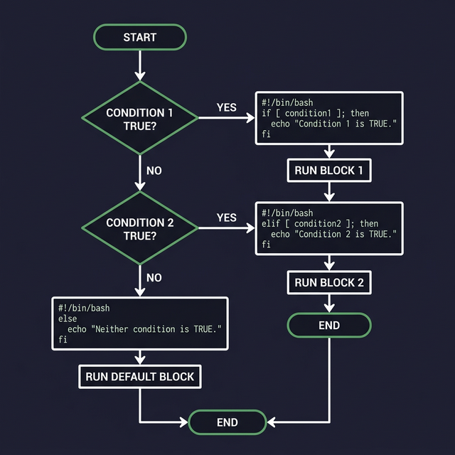
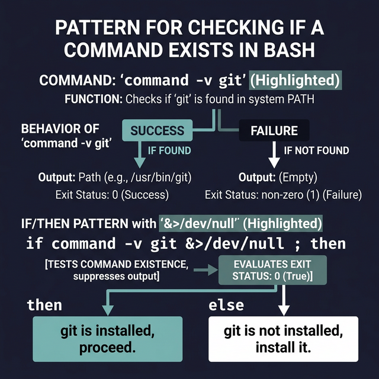

# If Statements — Controlling Script Flow

The `if` statement is how your script makes **decisions**. It checks a condition and runs different code depending on whether the condition is true or false.

---

## Basic Syntax

```bash
if [[ condition ]]; then
    # ← This code runs ONLY if the condition is true
fi       # ← "fi" closes the if block (it's "if" spelled backwards)
```

### if / else
```bash
if [[ condition ]]; then
    # ← Runs when condition is TRUE
else
    # ← Runs when condition is FALSE
fi
```

### if / elif / else (Multiple Conditions)
```bash
if [[ condition1 ]]; then
    # ← Runs if condition1 is true
elif [[ condition2 ]]; then
    # ← Runs if condition1 is false BUT condition2 is true
elif [[ condition3 ]]; then
    # ← Runs if both condition1 and condition2 are false BUT condition3 is true
else
    # ← Runs if ALL conditions above are false
fi
```

> **Important:** Bash checks conditions **top to bottom** and stops at the FIRST one that's true. It will never run two branches.

---

## Practical Examples

### Example 1: Check if a number is positive, negative, or zero
```bash
#!/bin/bash
read -p "Enter a number: " num

if (( num > 0 )); then
    echo "$num is positive"
elif (( num < 0 )); then
    echo "$num is negative"
else
    echo "You entered zero"
fi
```

### Example 2: File existence check (extremely common in scripts)
```bash
#!/bin/bash
FILE="/etc/hosts"

if [[ -f "$FILE" ]]; then
    echo "✅ File exists: $FILE"
    echo "   Size: $(wc -c < "$FILE") bytes"
    echo "   Lines: $(wc -l < "$FILE")"
else
    echo "❌ File not found: $FILE"
    exit 1
fi
```

### Example 3: User input validation
```bash
#!/bin/bash
read -p "Enter your age: " age

# ← First check: is it even a number?
if [[ ! $age =~ ^[0-9]+$ ]]; then
    echo "ERROR: '$age' is not a valid number."
    exit 1
fi

# ← Second check: is it in a reasonable range?
if (( age < 0 || age > 150 )); then
    echo "ERROR: Age must be between 0 and 150."
    exit 1
fi

if (( age >= 18 )); then
    echo "You are an adult."
else
    echo "You are a minor."
fi
```

---

## The `command` Built-in — Checking If a Program Exists

Before running a program, you should check if it's installed. The `command -v` built-in is the proper way:

```bash
# ← Check if "git" is installed:
if command -v git &> /dev/null; then
    echo "Git is installed: $(git --version)"
else
    echo "Git is NOT installed. Please install it first."
    exit 1
fi
```

> **Why `command -v` instead of `which`?**
> - `which` is an external program — it might not exist on minimal systems  
> - `command` is a Bash **built-in** — always available, always fast
> - `command -v` returns the path if found, or nothing if not found
> - `&> /dev/null` silences the output so we only care about the exit code

### Real-world script header pattern:
```bash
#!/bin/bash
# ← Check all required dependencies before doing anything:

for cmd in git docker curl jq; do
    if ! command -v "$cmd" &> /dev/null; then
        echo "ERROR: Required command '$cmd' is not installed." >&2
        exit 1
    fi
done

echo "All dependencies found. Starting..."
```

---

## Nested If Statements

You can put `if` statements inside other `if` statements, but don't go too deep — it becomes unreadable:

```bash
#!/bin/bash
if [[ -f "$1" ]]; then                          # ← Is it a file?
    if [[ -r "$1" ]]; then                       # ← Can we read it?
        if [[ -s "$1" ]]; then                   # ← Is it non-empty?
            echo "File is valid and has content."
        else
            echo "File exists but is empty."
        fi
    else
        echo "File exists but is not readable."
    fi
else
    echo "Not a file: $1"
fi
```

> **Better approach:** Use early returns to flatten nested ifs:
> ```bash
> [[ ! -f "$1" ]] && { echo "Not a file"; exit 1; }
> [[ ! -r "$1" ]] && { echo "Not readable"; exit 1; }
> [[ ! -s "$1" ]] && { echo "File is empty"; exit 1; }
> echo "File is valid and has content."
> ```




