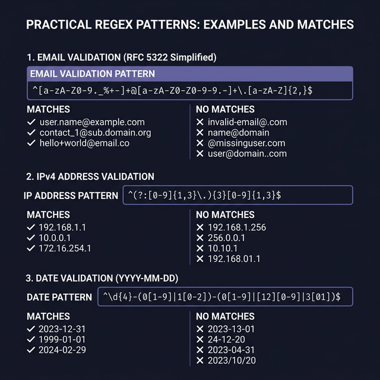
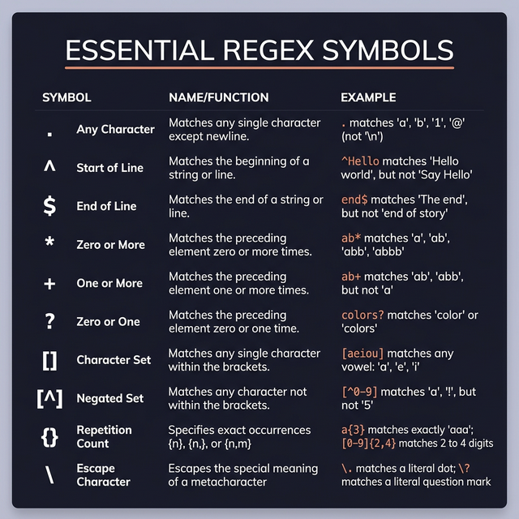
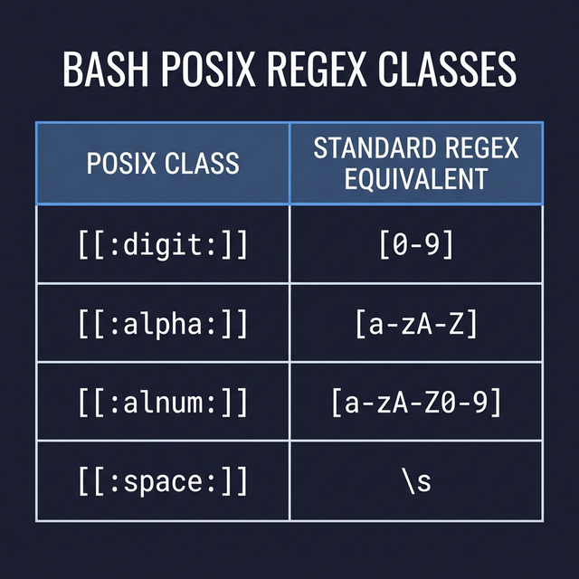

# Regular Expressions (Regex) in Bash: The Definitive Guide

Regular expressions natively look like a cat walked across your keyboard. But underneath the ugly syntax is a **mini-language for pattern matching** that is an absolute superpower for anyone working in Linux, DevOps, or Software Engineering.

This guide skips the dry, confusing official documentation and focuses on exactly what you need to know to read, write, and master Regex in Bash.

---

## 1. The Big Confusion: Basic (BRE) vs Extended (ERE) Regex

Before learning the symbols, you must understand why your regex sometimes "just doesn't work" in Linux.

Linux tools natively support **Basic Regular Expressions (BRE)** by default. In BRE, powerful symbols like `+`, `?`, `|`, `(`, and `{` are treated as **literal characters** unless you "escape" them with a backslash `\`. 

**Extended Regular Expressions (ERE)** fix this. In ERE, those symbols act as special regex operators automatically (no backslashes needed).

**Rule of Thumb:** ALWAYS use Extended Regex (ERE) if the tool allows it. It is vastly more readable.

```bash
# How to enable Extended Regex in common tools:
grep -E 'pattern' file.txt     # ← Use -E (or egrep)
sed -E 's/pattern/rep/g' file  # ← Use -E (or -r on older macOS/BSD)
awk '/pattern/' file.txt       # ← AWK uses ERE by default!

# Bash's built-in operator [[ =~ ]] uses ERE by default!
if [[ $text =~ ^[a-z]+$ ]]; then echo "Match"; fi
```



---

## 2. Core Metacharacters (Works in both BRE & ERE)

These symbols form the foundation of all pattern matching.

### `.` (The Wildcard / Any Character)
Matches **exactly one** character of any kind (except newline).
* `b.t` matches: `bat`, `bot`, `b9t`, `b_t`
* `b.t` does NOT match: `bt` (missing a char), `baat` (too many chars)

### `^` (The Start Anchor)
Ensures the pattern only matches at the **absolute beginning** of a line/string.
* `^Hello` matches: `"Hello World"`, `"Hello"`
* `^Hello` does NOT match: `"Say Hello"`

### `$` (The End Anchor)
Ensures the pattern only matches at the **absolute end** of a line/string.
* `World$` matches: `"Hello World"`, `"World"`
* `World$` does NOT match: `"World Peace"`

> **Pro Tip:** Combine them! `^Hello$` matches a line that is EXACTLY "Hello" and nothing else. `^$` matches an empty, blank line.

### `*` (Zero or More Times)
Matches the *preceding character* **zero or more times**. (It does NOT mean "anything" like it does in file globbing).
* `ab*c` matches: `ac` (zero b's), `abc` (one b), `abbbbc` (four b's)
* `.*` matches: **Absolutely anything** of any length (Any char `.` repeated zero or more times `*`).

### `[ ]` (Character Classes / Sets)
Matches **exactly ONE** of the characters inside the brackets.
* `[cbr]at` matches: `cat`, `bat`, `rat` (but not `hat`)
* `[A-Z]` matches: Any single uppercase letter
* `[0-9]` matches: Any single digit
* `[a-zA-Z0-9]` matches: Any strictly alphanumeric character

### `[^ ]` (Negated Character Classes)
Matches **exactly ONE** character that is NOT inside the brackets.
* `[^0-9]` matches: `A`, `!`, ` ` (Any non-digit)
* `[^a-z]` matches: Any character that is not a lowercase letter.

### `\` (The Escape Character)
Removes the "special power" of a metacharacter, treating it as a literal symbol.
* `3\.14` matches the exact string `3.14`. (Without the backslash, `3.14` would also match `3X14` or `3_14`).



---

## 3. Extended Metacharacters (ERE Only)

These are the powerful formatting tools that make ERE so much better. (If forced to use BRE, you'd have to write `\+`, `\?`, `\{`, etc.)

### `+` (One or More Times)
Matches the *preceding character* **one or more times**. (Unlike `*`, it requires at least one occurrence).
* `ab+c` matches: `abc`, `abbbc`
* `ab+c` does NOT match: `ac` (must have at least one 'b')
* `^[0-9]+$` matches: A string containing ONLY digits (1 or more).

### `?` (Zero or One Time / Optional Check)
Makes the *preceding character* **optional**.
* `colou?r` matches: `color` (zero u's) or `colour` (one u)
* `https?://` matches: `http://` or `https://`

### `{n,m}` (Exact Repetition Boundaries)
Specifies exactly how many times the preceding character should appear.
* `a{3}` matches: Exactly 3 a's (`aaa`)
* `[0-9]{2,4}` matches: Between 2 and 4 digits (e.g., `12`, `123`, `1234`)
* `[a-z]{5,}` matches: 5 or more lowercase letters.

### `|` (The OR Operator)
Matches the pattern on its left OR its right.
* `cat|dog` matches: `cat` or `dog`
* `(start|stop|restart)` matches: Any of those three exact words.

### `( )` (Grouping and Capturing)
Groups multiple characters together so you can apply other operators to the whole group.
* `(abc)+` matches: `abc`, `abcabc`, `abcabcabc` (Without parentheses, `abc+` would match `abcccc`).
* `(ha){2,}` matches: `haha`, `hahaha`

---

## 4. POSIX Character Classes

Linux provides pre-defined, human-readable character classes inside brackets. They handle locale/language differences better than `[a-zA-Z]`.

| POSIX Name | Meaning | Equivalent Standard Brackets |
|---|---|---|
| `[[:digit:]]` | Any number | `[0-9]` |
| `[[:alpha:]]` | Any letter (upper and lower) | `[a-zA-Z]` |
| `[[:alnum:]]` | Letters and numbers | `[a-zA-Z0-9]` |
| `[[:space:]]` | Whitespace (spaces, tabs, newlines) | `[ \t\r\n\v\f]` |
| `[[:upper:]]` | Uppercase letters only | `[A-Z]` |
| `[[:lower:]]` | Lowercase letters only | `[a-z]` |

> **Warning:** You must put them inside another set of brackets if you are using them in a character class layout. E.g. `^[[:digit:]]+$`



---

## 5. Practical Native Bash Regex (`[[ =~ ]]`)

Bash has a built-in Regex engine! You don't always need `grep`. You can test strings directly in `if` statements using the `=~` operator.

**Crucial Rules for `[[ =~ ]]`:**
1. It uses EXTENDED regex (ERE) automatically.
2. Do **NOT** put quotes around the regex string. If you quote `"[0-9]"`, Bash searches for literal brackets.
3. It performs a **partial match** by default. Use `^` and `$` to lock it down.

### Example: Strict Number Validation
```bash
read -p "Enter your age: " age

if [[ $age =~ ^[0-9]+$ ]]; then
    echo "Valid purely numeric age."
else
    echo "Error: Please enter digits only."
fi
```

### Example: Checking String Prefixes/Suffixes
```bash
file="document_backup_v2.tar.gz"

if [[ $file =~ \.tar\.gz$ ]]; then
    echo "This is a tar.gz archive."
fi

if [[ $file =~ ^doc ]]; then
    echo "File starts with 'doc'."
fi
```

> **Pro-Tip for Complex Regex in Bash:** Sometimes advanced regex breaks the Bash parser. Store the regex in a variable first!
> ```bash
> email_regex="^[a-zA-Z0-9._%+-]+@[a-zA-Z0-9.-]+\.[a-zA-Z]{2,}$"
> if [[ $email =~ $email_regex ]]; then echo "Valid!"; fi
> ```

---

## 6. Real-World Recipe Cookbook

Here are production-ready Regex patterns you will use constantly.

### 1. Removing Blank Lines and Comments
Very useful for reading clean config files in scripts:
```bash
# Removes starting/trailing blanks, and lines starting with #
grep -E -v '^[[:space:]]*$|^[[:space:]]*#' config.conf
```

### 2. Validating IPv4 Addresses
Matches basic structure (doesn't mathematically validate 0-255, but structurally enforces 4 blocks of 1-3 digits):
```bash
ip_regex="^[0-9]{1,3}\.[0-9]{1,3}\.[0-9]{1,3}\.[0-9]{1,3}$"
[[ "192.168.1.1" =~ $ip_regex ]] && echo "Looks like an IP!"
```

### 3. Validating Email Addresses
An industry-standard (simplified) email validator:
```bash
email_regex="^[a-zA-Z0-9._%+-]+@[a-zA-Z0-9.-]+\.[a-zA-Z]{2,}$"
```

### 4. Validating Dates (YYYY-MM-DD Format)
```bash
date_regex="^[0-9]{4}-[0-9]{2}-[0-9]{2}$"
```

### 5. Validating MAC Addresses
Checks for 6 blocks of hex digits separated by colons:
```bash
mac_regex="^([0-9A-Fa-f]{2}:){5}[0-9A-Fa-f]{2}$"
```


