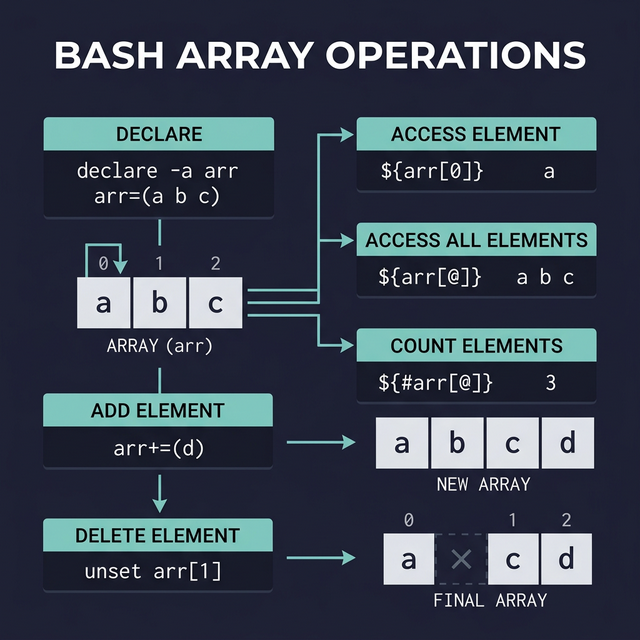

# Arrays in Bash

An **array** lets you store multiple values in a single variable — like a numbered list. Instead of creating `fruit1`, `fruit2`, `fruit3`, you create one array called `fruits` that holds all of them.

---

## Declaring and Using Arrays

```bash
# ← Create an array (values separated by SPACES, not commas):
fruits=(apple banana cherry mango)

# ← Access elements by index (starts at 0, not 1):
echo ${fruits[0]}          # ← Output: apple (first element)
echo ${fruits[1]}          # ← Output: banana (second element)
echo ${fruits[3]}          # ← Output: mango (fourth element)

# ← Print ALL elements:
echo "${fruits[@]}"        # ← Output: apple banana cherry mango

# ← Print ALL indices:
echo "${!fruits[@]}"       # ← Output: 0 1 2 3

# ← Count the number of elements:
echo "${#fruits[@]}"       # ← Output: 4
```

> **Common mistake:** `$fruits` without braces and index gives you ONLY the first element. Always use `${fruits[@]}` for the full array.

---

## Modifying Arrays

```bash
# ← Add a new element to the end:
fruits+=(grape)
echo "${fruits[@]}"        # ← Output: apple banana cherry mango grape

# ← Change a specific element:
fruits[1]="blueberry"
echo "${fruits[@]}"        # ← Output: apple blueberry cherry mango grape

# ← Delete a specific element:
unset fruits[2]            # ← Removes "cherry" (index 2)
echo "${fruits[@]}"        # ← Output: apple blueberry mango grape
# ⚠️ WARNING: unset leaves a GAP in the indices! Index 2 is now empty, not shifted.
echo "${!fruits[@]}"       # ← Output: 0 1 3 4 (notice: no index 2!)

# ← Extract a range (slice):
colors=(red green blue yellow purple)
echo "${colors[@]:1:3}"    # ← From index 1, take 3 elements → green blue yellow
```

---

## The Bracket Confusion — Solved

One of the most confusing things about Bash arrays is all the different brackets. Here's the definitive guide:

```bash
arr=(10 20 30 40 50)       # ← () creates the array

echo ${arr[2]}             # ← [] selects an element by index → 30
echo "${arr[@]}"           # ← {} enables parameter expansion → all elements
echo "${#arr[@]}"          # ← # inside {} gives the count → 5
echo "${!arr[@]}"          # ← ! inside {} gives the indices → 0 1 2 3 4
```

| Symbol | Purpose | Example |
|--------|---------|---------|
| `( )` | Create an array | `arr=(a b c)` |
| `[ ]` | Access by index | `${arr[0]}` |
| `{ }` | Parameter expansion | `${arr[@]}`, `${#arr[@]}` |
| `@` | All elements | `${arr[@]}` |
| `!` | All indices | `${!arr[@]}` |
| `#` | Count elements | `${#arr[@]}` |

---

## Practical Example: Processing a List

```bash
#!/bin/bash
servers=("web01" "web02" "db01" "cache01")

echo "Checking ${#servers[@]} servers..."

for server in "${servers[@]}"; do
    echo -n "  Pinging $server... "
    if ping -c 1 -W 1 "$server" &> /dev/null; then
        echo "✅ UP"
    else
        echo "❌ DOWN"
    fi
done
```



