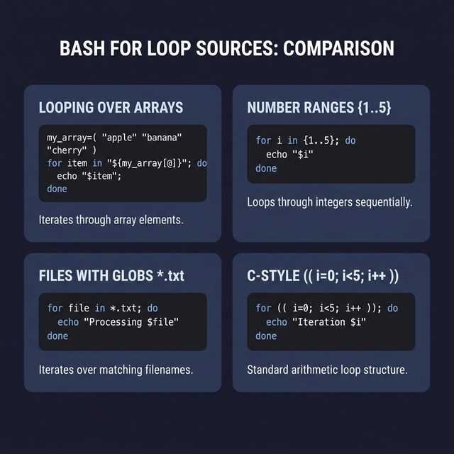

# For Loops — Repeating Actions

A `for` loop lets you run the same code **once for each item** in a list. It's the most common loop in Bash, and you'll use it daily.

---

## Basic Syntax

```bash
for variable in list_of_items
do
    # ← This code runs once for each item. $variable = current item.
done
```

### Simple Example: Iterate Over Words
```bash
for color in red green blue
do
    echo "Color: $color"
done
# Output:
# Color: red
# Color: green
# Color: blue
```

### One-Liner Syntax
```bash
for color in red green blue; do echo "Color: $color"; done
```

---

## Looping Over Number Ranges

```bash
# ← Brace expansion: generate a sequence
for i in {1..5}; do
    echo "Number: $i"
done
# Output: 1, 2, 3, 4, 5

# ← With a step (count by 2):
for i in {0..10..2}; do
    echo "Even: $i"
done
# Output: 0, 2, 4, 6, 8, 10

# ← C-style for loop (when you need more control):
for (( i=1; i<=5; i++ )); do
    echo "Iteration $i"
done
```

---

## Looping Over Arrays

This is the most practical use of `for` loops:

### Iterate Over Values
```bash
fruits=(apple banana cherry)

for fruit in "${fruits[@]}"; do     # ← "${fruits[@]}" = each element separately
    echo "Fruit: $fruit"
done
```

### Iterate Over Indices (When You Need the Position)
```bash
fruits=(apple banana cherry)

for i in "${!fruits[@]}"; do        # ← "${!fruits[@]}" = the indices 0, 1, 2
    echo "Index $i → ${fruits[$i]}"
done
# Output:
# Index 0 → apple
# Index 1 → banana
# Index 2 → cherry
```

> **Why would you need indices?** When you want to update an element, or when you need to know the position, or when you're processing two arrays in parallel.

---

## Looping Over Files

### Process All Files Matching a Pattern
```bash
# ← Loop over all .txt files in the current directory:
for file in *.txt; do
    echo "Processing: $file ($(wc -l < "$file") lines)"
done

# ← Loop over all files in a specific directory:
for file in /var/log/*.log; do
    echo "Log file: $file"
done
```

### Reading a File Line by Line
```bash
# ← The correct way to read a file line by line (using while, not for):
while IFS= read -r line; do
    echo "Line: $line"
done < input.txt
```

> **⚠️ Why not `for line in $(cat file)`?** Because `for` splits on spaces AND newlines. A line like "hello world" would be split into two iterations: "hello" and "world". The `while read` approach keeps each line intact.

---

## Real-World Examples

### Batch Rename Files
```bash
for file in *.jpeg; do
    new_name="${file%.jpeg}.jpg"    # ← Remove .jpeg suffix, add .jpg
    mv "$file" "$new_name"
    echo "Renamed: $file → $new_name"
done
```

### Check Multiple Servers
```bash
for host in server1 server2 server3; do
    if ping -c 1 -W 2 "$host" &>/dev/null; then
        echo "✅ $host is up"
    else
        echo "❌ $host is down"
    fi
done
```



