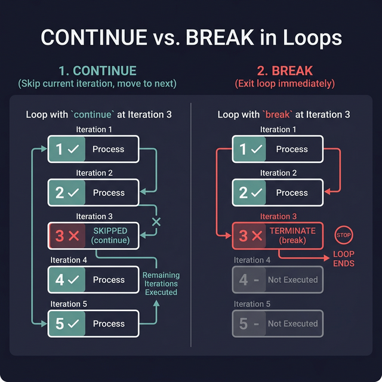
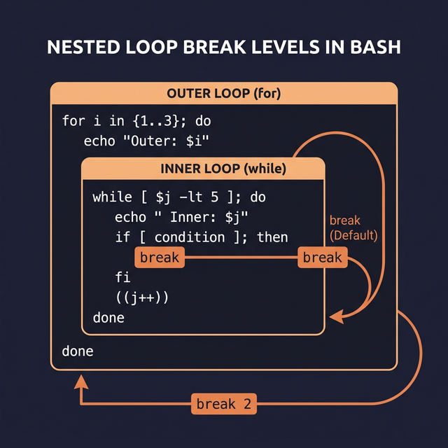

# Continue and Break — Controlling Loop Flow

When you're inside a loop, sometimes you need to **skip an iteration** or **stop the loop entirely**. That's what `continue` and `break` do.

---

## `continue` — Skip to the Next Iteration

`continue` says: "Stop executing the current iteration, go back to the top of the loop, and start the next one."

```bash
for i in {1..5}; do
    if [ $i -eq 3 ]; then
        continue         # ← When i=3, skip everything below and jump to i=4
    fi
    echo "Number: $i"
done
# Output:
# Number: 1
# Number: 2
# Number: 4        ← 3 is missing — it was skipped
# Number: 5
```

### Practical Example: Process Only Odd Numbers
```bash
for i in {1..10}; do
    if (( i % 2 == 0 )); then  # ← Is it even?
        continue                # ← Skip even numbers
    fi
    echo "Odd: $i"
done
# Output: 1, 3, 5, 7, 9
```

---

## `break` — Exit the Loop Entirely

`break` says: "Stop the loop completely. Don't run any more iterations."

```bash
for i in {1..5}; do
    if [ $i -eq 3 ]; then
        break            # ← At i=3, EXIT the loop entirely
    fi
    echo "Number: $i"
done
# Output:
# Number: 1
# Number: 2        ← Stops here. 3, 4, 5 never run.
```

### Practical Example: Stop on First Error
```bash
files=("config.yaml" "data.csv" "missing.txt" "report.pdf")

for file in "${files[@]}"; do
    if [[ ! -f "$file" ]]; then
        echo "❌ FATAL: File not found: $file"
        break            # ← Stop processing. No point continuing if a file is missing.
    fi
    echo "✅ Found: $file"
done
```

---

## Nested Loops — Where It Gets Tricky

When you have a loop inside another loop, `continue` and `break` only affect the **innermost loop** they're inside.

```bash
for i in {1..3}; do
    for j in {1..3}; do
        if [ $j -eq 2 ]; then
            break               # ← This only breaks the INNER loop (j)
        fi                      #    The outer loop (i) keeps going
        echo "i=$i, j=$j"
    done
done
# Output: i=1,j=1 → i=2,j=1 → i=3,j=1
```

### Breaking Multiple Levels: `break N`

To break out of N levels of nesting, use `break N`:

```bash
for i in {1..3}; do
    for j in {1..3}; do
        if [[ $i -eq 2 && $j -eq 2 ]]; then
            break 2         # ← Break out of BOTH loops at once
        fi
        echo "i=$i, j=$j"
    done
done
# Stops completely when i=2, j=2
```

### Alternative: Using a Flag Variable
```bash
found=false
for i in {1..3}; do
    for j in {1..3}; do
        if [[ $i -eq 2 && $j -eq 2 ]]; then
            found=true
            break           # ← Break inner loop
        fi
        echo "i=$i, j=$j"
    done
    if $found; then
        break               # ← Break outer loop based on flag
    fi
done
```




