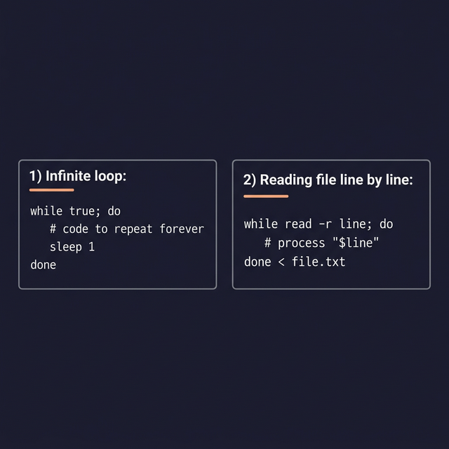

# While Loop — Repeat While True

A `while` loop runs its code block **as long as** its condition is true. When the condition becomes false, the loop stops and the script continues.

---

## Syntax

```bash
while [[ condition ]]; do
    # ← Code runs repeatedly while condition is TRUE
    # ← You MUST change something inside to eventually make the condition FALSE
    #    Otherwise you get an infinite loop!
done
```

---

## Example 1: Countdown Timer

```bash
#!/bin/bash
count=5

while (( count > 0 )); do
    echo "Countdown: $count"
    (( count-- ))          # ← Subtract 1 each loop. Without this → infinite loop!
done

echo "🚀 Liftoff!"
```

**Output:**
```
Countdown: 5
Countdown: 4
Countdown: 3
Countdown: 2
Countdown: 1
🚀 Liftoff!
```

---

## Example 2: Infinite Loops (Intentional)

Sometimes you WANT a loop that never stops — like a monitoring script:

```bash
# ← Method 1: while true
while true; do
    echo "Checking disk space..."
    df -h / | tail -1
    sleep 60             # ← Wait 60 seconds before checking again
done

# ← Method 2: while : (colon is a no-op command that always returns true)
while :; do
    echo "Monitoring..."
    sleep 5
done
```

> **How to stop it:** Press `Ctrl+C` to send SIGINT and kill the script.

---

## Example 3: Read Input Until User Quits

```bash
#!/bin/bash
while true; do
    read -p "Enter a command (or 'quit' to exit): " cmd
    
    if [[ $cmd == "quit" ]]; then
        echo "Goodbye!"
        break
    fi
    
    echo "You said: $cmd"
done
```

---

## Example 4: Wait for a Condition (Polling Pattern)

```bash
#!/bin/bash
# ← Wait until a service is ready:
echo "Waiting for database to start..."

while ! pg_isready -q 2>/dev/null; do    # ← ! inverts: "while NOT ready"
    echo -n "."
    sleep 2
done

echo ""
echo "Database is ready!"
```

> **This "polling" pattern** is extremely common in DevOps: waiting for a container to start, a file to appear, a port to open, or a service to respond.



