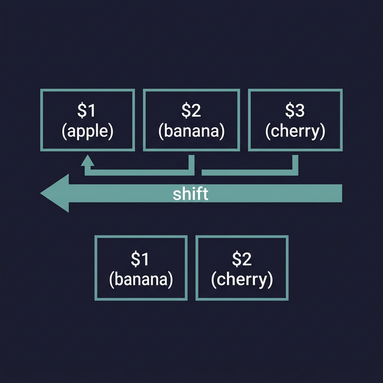

# The `shift` Command — Processing Arguments One by One

`shift` moves all positional parameters **one position to the left**, discarding `$1` and renumbering everything. It's the standard way to process command-line arguments in a loop.

---

## How It Works — Visually

**Before `shift`:**
```
Position:  $1      $2      $3      $4      $5
Value:     apple   banana  cherry  date    elderberry
```

**After `shift` (one position):**
```
Position:  $1      $2      $3      $4
Value:     banana  cherry  date    elderberry
           ↑ was $2, now $1
```

`apple` is gone. Every argument moved left. `$#` (argument count) decreased by 1.

**After `shift 2` (two positions at once):**
```
Position:  $1      $2
Value:     date    elderberry
```

---

## Practical Examples

### Example 1: Process All Arguments in a Loop
```bash
#!/bin/bash
echo "You passed $# arguments."

while [[ $# -gt 0 ]]; do        # ← While there are still arguments
    echo "Processing: $1"        # ← Always work with $1
    shift                        # ← Remove $1, shift everything left
done

echo "All arguments processed."
```

```bash
./script.sh apple banana cherry
# Output:
# You passed 3 arguments.
# Processing: apple
# Processing: banana
# Processing: cherry
# All arguments processed.
```

### Example 2: Parsing Flags and Options
```bash
#!/bin/bash
# ← Usage: ./deploy.sh -e production -v --force

ENVIRONMENT=""
VERBOSE=false
FORCE=false

while [[ $# -gt 0 ]]; do
    case $1 in
        -e|--environment)
            ENVIRONMENT="$2"     # ← $2 is the value AFTER the flag
            shift 2              # ← Skip both the flag AND its value
            ;;
        -v|--verbose)
            VERBOSE=true
            shift                # ← Skip just the flag
            ;;
        --force)
            FORCE=true
            shift
            ;;
        *)
            echo "Unknown option: $1" >&2
            exit 1
            ;;
    esac
done

echo "Environment: $ENVIRONMENT"
echo "Verbose: $VERBOSE"
echo "Force: $FORCE"
```

> **This is how real CLI tools parse arguments.** The `shift` + `while` + `case` pattern is the standard approach before tools like `getopts` were introduced.




