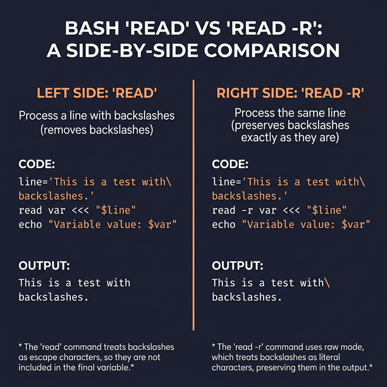

# Reading Files Line by Line

Reading files is one of the most common tasks in Bash scripting. The **correct** way involves a `while` loop with `read` — but there are important options that most tutorials skip.

---

## The Correct Pattern

```bash
while IFS= read -r line; do
    echo "Processing: $line"
done < input.txt
```

Let's break down **every piece** of this pattern:

| Part | What It Does | What Happens Without It |
|------|-------------|------------------------|
| `IFS=` | Clears the field separator | Leading/trailing whitespace gets stripped |
| `read -r` | Raw read (no backslash interpretation) | `\n` gets converted to a newline, `\\` becomes `\` |
| `line` | Variable name to store each line | You can use any name: `row`, `text`, etc. |
| `done < input.txt` | Redirects the file into the loop | You'd need `cat` piping (which has problems) |

---

## Why Each Option Matters — With Proof

### Without `IFS=`:
```bash
# File content: "   hello world   "
while read line; do echo ">$line<"; done < file.txt
# Output: >hello world<         ← Leading/trailing spaces GONE!

while IFS= read line; do echo ">$line<"; done < file.txt
# Output: >   hello world   <   ← Spaces PRESERVED
```

### Without `-r`:
```bash
# File content: "path\to\file"
while read line; do echo "$line"; done < file.txt
# Output: pathtofile             ← Backslashes EATEN by read!

while read -r line; do echo "$line"; done < file.txt
# Output: path\to\file          ← Backslashes PRESERVED
```

---

## Reading Into Multiple Variables

If each line has columns separated by spaces (or a delimiter), you can split into multiple variables:

```bash
# File content:
# John 30 Engineer
# Jane 25 Designer

while read -r name age role; do
    echo "$name is $age years old and works as a $role"
done < employees.txt
```

> **How splitting works:** The LAST variable gets ALL remaining text. If a line has 5 words but you only have 3 variables, the third variable gets words 3, 4, and 5 combined.

### Reading CSV Files (Custom Delimiter)
```bash
# File content:
# John,30,Engineer
# Jane,25,Designer

while IFS=',' read -r name age role; do
    echo "$name ($age) — $role"
done < employees.csv
```

---

## Common Mistakes

### ❌ Don't Use `for` to Read Files
```bash
# BAD — for splits on spaces AND newlines:
for line in $(cat file.txt); do
    echo "$line"
done
# "hello world" becomes TWO iterations: "hello" and "world"
```

### ❌ Don't Pipe cat (Subshell Problem)
```bash
# BAD — variables set inside a pipe don't persist:
count=0
cat file.txt | while read line; do
    (( count++ ))
done
echo "Lines: $count"    # ← Always prints 0! The while loop ran in a subshell.

# CORRECT — use redirection:
count=0
while read -r line; do
    (( count++ ))
done < file.txt
echo "Lines: $count"    # ← Prints the correct count
```



