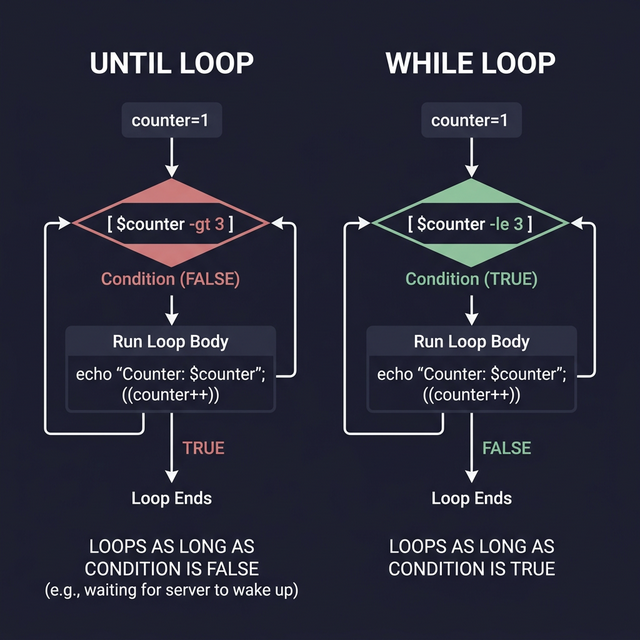
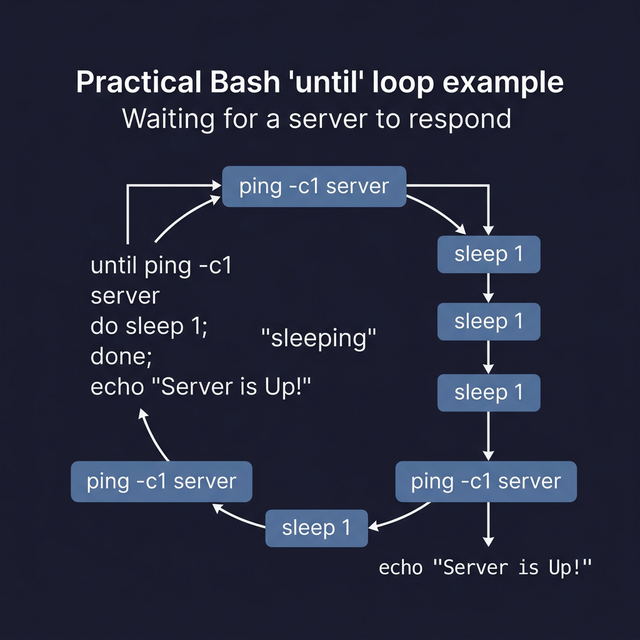

# Until Loop — Repeat Until True

The `until` loop is the **exact opposite** of `while`. It runs its code block as long as the condition is **false**, and stops when the condition becomes **true**.

---

## Syntax

```bash
until [[ condition ]]; do
    # ← This code runs while condition is FALSE
    # ← As soon as condition becomes TRUE, the loop exits
done
```

> **Mental model:** `while` = "keep going while this is true." `until` = "keep going until this becomes true."

---

## Example 1: Counter (Compare with While)

```bash
# ← WHILE version: "keep counting while count ≤ 5"
count=1
while (( count <= 5 )); do
    echo "Count: $count"
    (( count++ ))
done

# ← UNTIL version: "keep counting until count > 5" (same result!)
count=1
until (( count > 5 )); do
    echo "Count: $count"
    (( count++ ))
done
```

Both produce identical output. The difference is purely **how you think about the condition**:
- `while`: think about when to CONTINUE
- `until`: think about when to STOP

---

## Example 2: Wait for a File to Appear

This is where `until` really shines — waiting for something to happen:

```bash
#!/bin/bash
echo "Waiting for /tmp/ready.txt to be created..."

until [[ -f /tmp/ready.txt ]]; do
    echo -n "."             # ← Print a dot every 2 seconds while waiting
    sleep 2
done

echo ""
echo "✅ File found! Proceeding..."
```

> **How to test this:** Open a second terminal and run `touch /tmp/ready.txt`. The script will immediately detect it and continue.

---

## Example 3: Wait for a Service to Come Online

```bash
#!/bin/bash
echo "Waiting for web server on port 8080..."

until curl -s http://localhost:8080 > /dev/null 2>&1; do
    echo "Not ready yet. Retrying in 3 seconds..."
    sleep 3
done

echo "🟢 Server is up and responding!"
```

---

## When to Use `until` vs `while`

Use whichever reads more naturally in English:

| Scenario | More Natural | Why |
|----------|-------------|-----|
| "Run while connected" | `while` | You're thinking about the ACTIVE state |
| "Run until the file appears" | `until` | You're thinking about the GOAL state |
| "Loop while counter < 10" | `while` | Standard counting pattern |
| "Wait until process finishes" | `until` | You're waiting for a FUTURE event |

> **Pro tip:** Any `until` loop can be rewritten as a `while` by inverting the condition (and vice versa). Choose whichever is more readable for your specific use case.



