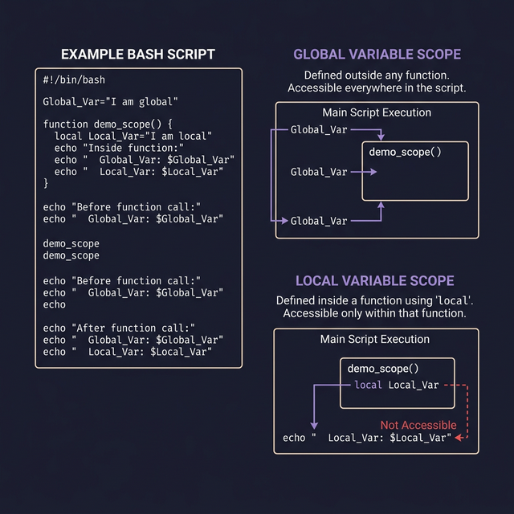
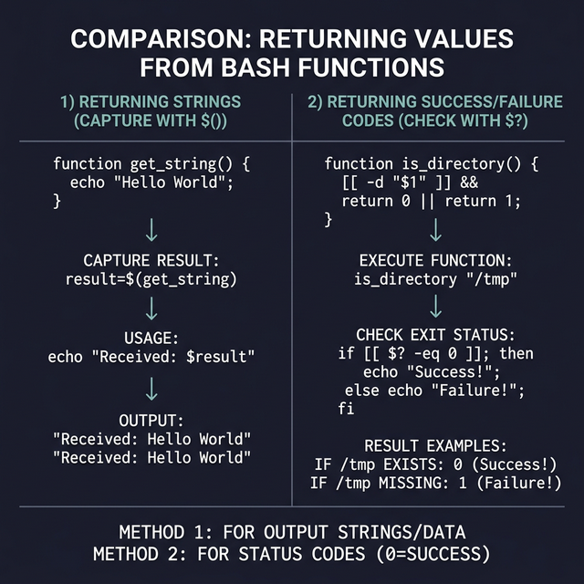

# Functions in Bash

Functions let you **group commands into a reusable block** with a name. Instead of copying the same 10 lines throughout your script, you write them once inside a function and call it by name wherever needed.

---

## Declaring Functions

```bash
# ← Standard syntax (recommended):
greet() {
    echo "Hello, $1!"    # ← $1 inside a function = first argument passed TO the function
}

# ← Alternative with 'function' keyword:
function greet() {
    echo "Hello, $1!"
}
```

## Calling Functions

```bash
greet "Karim"             # ← Call by name + arguments separated by spaces
# Output: Hello, Karim!
```

> **⚠️ Important:** Do NOT use parentheses when calling: `greet("Karim")` is WRONG. Functions in Bash are called like commands, not like functions in Python/JavaScript.

---

## Arguments Inside Functions

Functions receive arguments via `$1`, `$2`, `$3`, etc. — just like a script receives command-line arguments. **These are LOCAL to the function** and completely separate from the script's own `$1`, `$2`.

```bash
#!/bin/bash
describe() {
    echo "Name: $1"
    echo "Age: $2"
    echo "Total args: $#"
}

describe "Ahmed" 25
# Output:
# Name: Ahmed
# Age: 25
# Total args: 2
```

---

## Local Variables — Preventing Scope Leaks

Without `local`, variables inside a function **leak into the global scope** (they change variables outside the function):

```bash
# ← WITHOUT local (dangerous):
name="Global"
change_name() {
    name="Changed Inside Function"   # ← This MODIFIES the global $name!
}
change_name
echo $name                           # ← Output: Changed Inside Function (oops!)

# ← WITH local (safe):
name="Global"
change_name_safe() {
    local name="Changed Inside Function"  # ← This creates a SEPARATE local variable
}
change_name_safe
echo $name                                # ← Output: Global (unchanged!)
```

> **Golden rule:** Always use `local` for variables inside functions unless you intentionally want to modify a global variable.

---

## Returning Values from Functions

Bash functions can't "return" strings like Python or JavaScript. The `return` command only sets an **exit code** (0-255). To return actual data, use `echo` and capture it with command substitution:

```bash
# ← WRONG approach (return only sends exit codes):
get_name() {
    return "Karim"        # ← ERROR or unexpected behavior
}

# ← CORRECT approach (echo + capture):
get_name() {
    echo "Karim"          # ← Function "outputs" the value
}
result=$(get_name)         # ← Command substitution captures the output
echo "Name is: $result"   # ← Output: Name is: Karim

# ← Practical example: calculate and return a value
get_file_size() {
    local file=$1
    local size=$(wc -c < "$file")    # ← Get file size in bytes
    echo "$size"                      # ← "Return" via echo
}

size=$(get_file_size "/etc/passwd")
echo "/etc/passwd is $size bytes"
```

### Using `return` for Success/Failure
```bash
is_even() {
    local num=$1
    if (( num % 2 == 0 )); then
        return 0           # ← 0 = true/success
    else
        return 1           # ← 1 = false/failure
    fi
}

if is_even 42; then
    echo "42 is even"
fi
```




