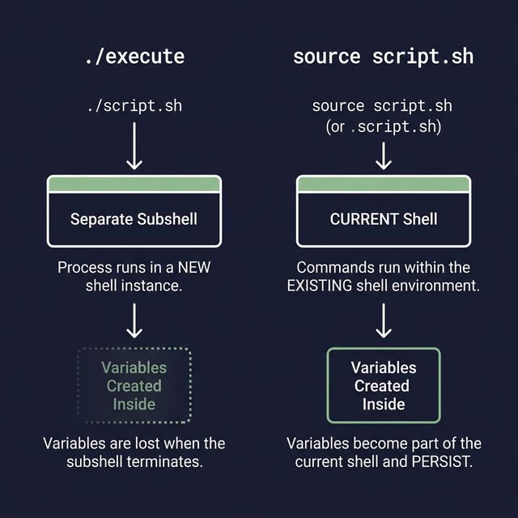

# The `source` Command — Including Scripts

The `source` command (or its shorthand `.`) lets you run one script **inside the current shell**, making all its functions and variables immediately available. This is how Bash achieves modularity — splitting code across multiple files.

---

## The Difference: `source` vs `bash`

```bash
# ← source: runs in YOUR current shell (functions/variables STAY)
source ./helpers.sh

# ← bash: runs in a NEW child shell (functions/variables DISAPPEAR after)
bash ./helpers.sh
```

This is the most important thing to understand about `source`. Let me prove it:

```bash
# --- In helpers.sh ---
#!/bin/bash
MY_VAR="I was set in helpers.sh"
greet() { echo "Hello from helpers.sh!"; }

# --- In your terminal ---
bash ./helpers.sh
echo $MY_VAR              # ← (empty) — Variable died with the child shell
greet                      # ← command not found — Function died too

source ./helpers.sh
echo $MY_VAR              # ← "I was set in helpers.sh" — Variable PERSISTS
greet                      # ← "Hello from helpers.sh!" — Function is AVAILABLE
```

---

## Practical Example: Modular Scripts

### The Library File: `lib/utils.sh`
```bash
#!/bin/bash
# ← Utility functions used across multiple scripts

log_info()  { echo "[INFO]  $(date '+%H:%M:%S') $1"; }
log_warn()  { echo "[WARN]  $(date '+%H:%M:%S') $1" >&2; }
log_error() { echo "[ERROR] $(date '+%H:%M:%S') $1" >&2; }

check_root() {
    if [[ $EUID -ne 0 ]]; then
        log_error "This script must be run as root"
        exit 1
    fi
}
```

### The Main Script: `deploy.sh`
```bash
#!/bin/bash
source ./lib/utils.sh       # ← Now all functions from utils.sh are available

log_info "Starting deployment..."
check_root
log_info "Deploying application..."
# ... deployment logic ...
log_info "Deployment complete!"
```

---

## The Dot Shorthand

```bash
. ./helpers.sh              # ← Exactly the same as: source ./helpers.sh
```

---

## Real-World Uses

1. **Loading config files:**
   ```bash
   source /etc/myapp/config.sh     # ← Sets variables like DB_HOST, DB_PORT, etc.
   echo "Connecting to $DB_HOST:$DB_PORT"
   ```

2. **Applying `.bashrc` changes immediately:**
   ```bash
   # After editing ~/.bashrc:
   source ~/.bashrc                 # ← Changes take effect WITHOUT restarting the terminal
   ```

3. **Creating reusable function libraries:**
   ```bash
   source ./lib/database.sh
   source ./lib/logging.sh
   source ./lib/validation.sh
   ```

> **`source` is non-recursive by default.** If `a.sh` sources `b.sh`, and `b.sh` sources `c.sh`, then after sourcing `a.sh`, you'll have everything from all three files.




