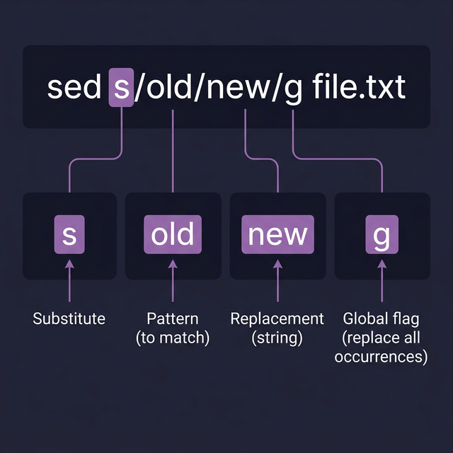

# SED — The Stream Editor

`sed` is a **non-interactive text editor** that processes text line by line. It can find, replace, insert, and delete text in files — all without opening them. It's one of the most powerful text manipulation tools in Linux.

---

## Basic Syntax

```bash
sed [options] 'command' input_file
```

> **Key fact:** By default, `sed` does NOT modify the original file. It prints the modified output to the screen. Use `-i` to save changes in-place.

---

## Substitution — The Core Command

The `s` (substitute) command follows this pattern: `s/find/replace/flags`

```bash
# ← Replace FIRST occurrence per line:
sed 's/old/new/' file.txt

# ← Replace ALL occurrences per line (global):
sed 's/old/new/g' file.txt

# ← Replace only the 2nd occurrence per line:
sed 's/old/new/2' file.txt
```

### With Addressing (Target Specific Lines)
```bash
# ← Replace only on line 1:
sed '1 s/old/new/g' file.txt

# ← Replace on lines 2 through 5:
sed '2,5 s/old/new/g' file.txt

# ← Replace from line 3 to the last line ($):
sed '3,$ s/old/new/g' file.txt

# ← Replace only on lines containing "error":
sed '/error/ s/old/new/g' file.txt
```

---

## Using Regex with SED

```bash
# ← Replace word at the START of each line:
sed 's/^old/new/' file.txt       # ← ^ matches the beginning of a line

# ← Replace word at the END of each line:
sed 's/old$/new/' file.txt       # ← $ matches the end of a line

# ← Remove all blank lines:
sed '/^$/d' file.txt             # ← ^$ matches lines with NOTHING between start and end

# ← Remove comment lines (starting with #):
sed '/^#/d' config.txt
```

---

## Essential SED Operations

### Delete Lines
```bash
sed '3d' file.txt               # ← Delete line 3
sed '2,5d' file.txt             # ← Delete lines 2 through 5
sed '/pattern/d' file.txt       # ← Delete lines containing "pattern"
sed '/^$/d' file.txt            # ← Delete all blank lines
```

### Print Specific Lines
```bash
sed -n '5p' file.txt            # ← Print ONLY line 5 (-n suppresses default output)
sed -n '10,20p' file.txt        # ← Print lines 10 through 20
sed -n '/error/p' file.txt      # ← Print only lines containing "error"
```

### Multiple Commands
```bash
# ← Run multiple sed commands with -e:
sed -e 's/old/new/g' -e 's/foo/bar/g' file.txt

# ← Or from a file:
sed -f commands.sed file.txt
```

### In-Place Editing (Modify the Actual File)
```bash
# ← ⚠️ This changes the file directly:
sed -i 's/old/new/g' file.txt

# ← Safer: create a backup first:
sed -i.bak 's/old/new/g' file.txt    # ← Creates file.txt.bak before modifying
```

---

## Quick Reference

| Flag/Option | Meaning |
|-------------|---------|
| `s` | Substitute command |
| `g` | Global (all occurrences in a line) |
| `p` | Print the modified line |
| `-n` | Suppress automatic printing |
| `-i` | Edit file in-place |
| `-e` | Multiple commands |
| `-f` | Read commands from file |
| `d` | Delete matching lines |
| `^` | Start of line |
| `$` | End of line (or last line in addressing) |



