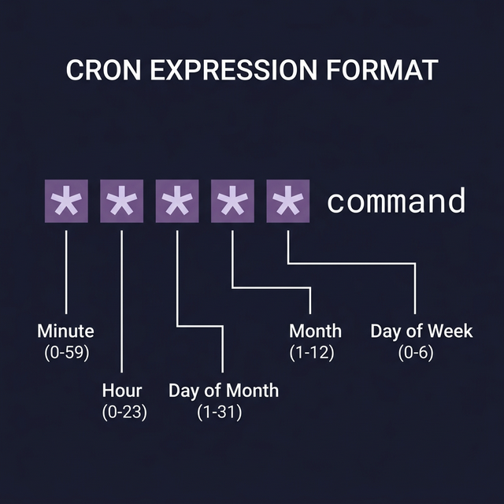

# Scheduling Tasks in Linux

Automation means your scripts run **without you**. Linux provides two tools for scheduling: `at` for one-time jobs, and `cron` for recurring jobs. Every DevOps engineer uses these daily.

---

## 1. `at` — Run Once at a Specific Time

Use `at` when you need to run a command or script **one time** at a future time.

### Syntax
```bash
at [time]                  # ← Interactive: type commands, then Ctrl+D to finish
at [time] -f script.sh     # ← Run a script file at the specified time
```

### Time Formats (Flexible!)
```bash
at 11:00                   # ← Today at 11:00 AM
at 11pm                    # ← Today at 11:00 PM
at now + 30 minutes        # ← 30 minutes from now
at now + 2 hours           # ← 2 hours from now
at tomorrow                # ← Tomorrow at the current time
at next monday             # ← Next Monday
at 12/25/2026              # ← December 25, 2026
```

### Managing at Jobs
```bash
atq                        # ← List all pending at jobs (shows job ID and scheduled time)
at -l                      # ← Same as atq
atrm 5                     # ← Remove job #5 from the queue
```

> **Requirement:** The `atd` daemon must be running. Check with: `systemctl status atd`

---

## 2. `cron` — Recurring Scheduled Tasks

`cron` runs tasks automatically on a **repeating schedule** — every minute, hour, day, week, or month.

### Editing Your Crontab
```bash
crontab -e                 # ← Open YOUR personal crontab for editing
crontab -l                 # ← List your current cron jobs
crontab -r                 # ← ⚠️ DELETE all your cron jobs (be careful!)
```

### The Cron Schedule Format

Each line in a crontab follows this format:
```
┌──────── Minute (0-59)
│ ┌────── Hour (0-23)
│ │ ┌──── Day of Month (1-31)
│ │ │ ┌── Month (1-12)
│ │ │ │ ┌ Day of Week (0-6, 0=Sunday)
│ │ │ │ │
* * * * * /path/to/command
```

### Examples — Reading Cron Expressions
```bash
# Run every minute:
* * * * * /scripts/check.sh

# Run at 3:30 AM every day:
30 3 * * * /scripts/backup.sh

# Run at midnight on the 1st of every month:
0 0 1 * * /scripts/monthly-report.sh

# Run every Monday at 9 AM:
0 9 * * 1 /scripts/weekly-digest.sh

# Run every 15 minutes:
*/15 * * * * /scripts/monitor.sh
```

### Shorthand Expressions
```bash
@reboot   /scripts/startup.sh    # ← Run once at system boot
@hourly   /scripts/check.sh      # ← Same as: 0 * * * *
@daily    /scripts/backup.sh     # ← Same as: 0 0 * * *
@weekly   /scripts/report.sh     # ← Same as: 0 0 * * 0
@monthly  /scripts/cleanup.sh    # ← Same as: 0 0 1 * *
```

> **Pro tip & Practice:** Use [crontab.guru](https://crontab.guru) to build, verify, and **practice** cron expressions visually. It's the ultimate "guru link" for mastering cron scheduling.

---

## 3. System-Wide Scheduling (Root Level)

### The /etc/crontab File
```bash
# ← This file has an EXTRA field for the username:
# min hour dom month dow USER   command
0 2 * * * root /scripts/system-backup.sh     # ← Runs as root at 2 AM daily
0 3 * * * www-data /scripts/clear-cache.sh    # ← Runs as www-data at 3 AM
```

### Cron Directories (Drop-In Scripts)
```bash
/etc/cron.hourly/      # ← Scripts here run every hour
/etc/cron.daily/       # ← Scripts here run every day
/etc/cron.weekly/      # ← Scripts here run every week
/etc/cron.monthly/     # ← Scripts here run every month
```

> Just place an executable script in these directories — no cron syntax needed. The system handles the scheduling.

---

## Best Practices

1. **Always use absolute paths** in cron jobs (cron has a minimal `$PATH`)
2. **Redirect output** to avoid email spam: `command > /var/log/job.log 2>&1`
3. **Test scripts manually** before scheduling them
4. **Log everything** — cron fails silently if your script has errors



