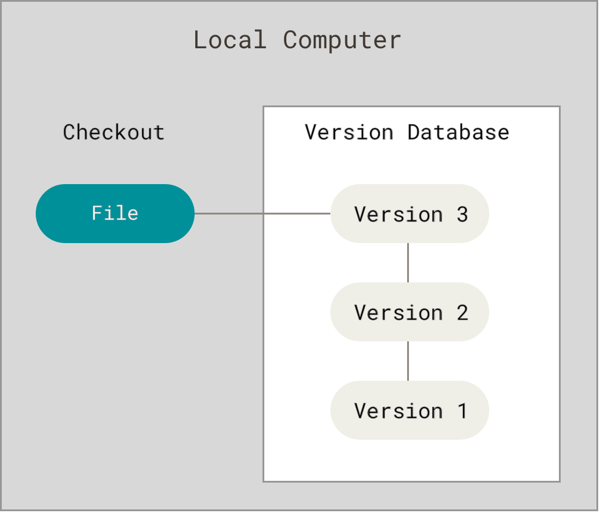
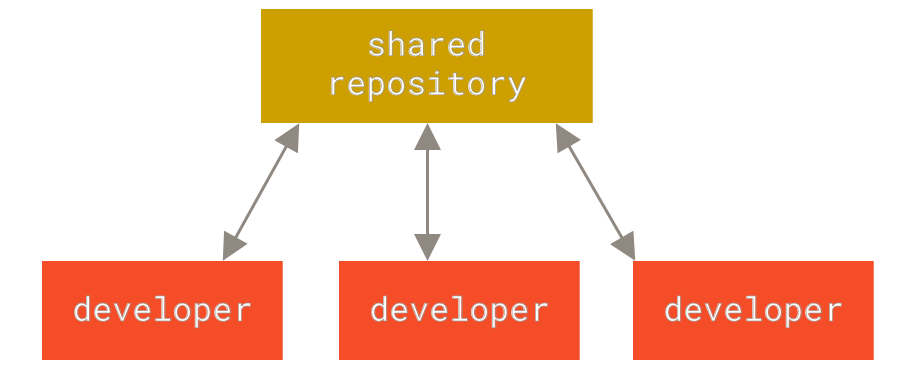
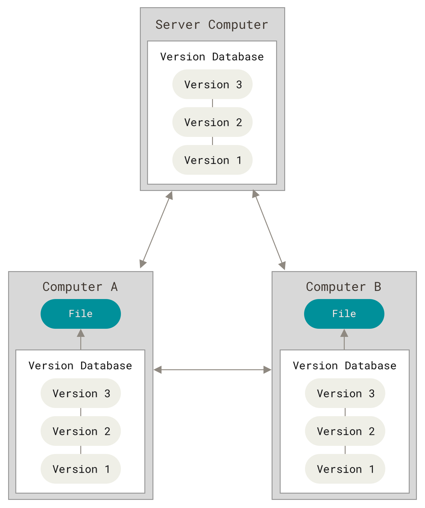

# What is VCS?

VCS (Version Control System) is a system that records changes to files over time so that you can recall specific versions later. It allows multiple developers to work on the same project without conflicts.

# What is Git?

Git is a distributed version control system designed for tracking changes in application code & infrastructure files and coordinating work among multiple developers.
It allows you to manage and keep track of your project's history, enabling you to collaborate effectively with others.

# Why Git Exists?

Git was created by Linus Torvalds in 2005 to manage the development of the Linux kernel. It was designed to be fast, efficient, and distributed, allowing developers to work on their own copies of the codebase and merge changes seamlessly.

- Teams frequently overwrote each other's work.
- NO Reliable way to track changes and history.
- Rolling back to previous versions was difficult and error-prone.
- Collaboration across engineering teams was challenging.

# Git Requirements
- Track every change in files, content+metadata.
- OS independent.
- Unique ID for each change (SHA-1 hash).
- Track history (logs).
- Ensure data integrity (no content change).


# Local, Centralized, Distributed VCSs

## Local VCS

A local version control system is a simple database that keeps all the changes to files on the local machine. It does not support collaboration and is not suitable for large projects.

- Example: local git repository without remote origin, or using a simple file-based version control system like RCS (Revision Control System).



## Centralized VCS

A centralized version control system has a single central server that stores all the files and their history. Developers check out files from the central server and commit changes back to it.



## Distributed VCS

A distributed version control system allows each developer to have a complete copy of the repository on their local machine. Changes can be committed locally and then synchronized with other developers.

Git is a distributed VCS, which means that every developer has a full copy of the repository, including its history. This allows for greater flexibility and collaboration, as developers can work independently and merge their changes when ready.



# Git Installation

## 1. Installing Git on Linux

Most Linux distributions come with Git pre-installed. You can check if Git is installed by running:

```bash
git --version
```

If Git is not installed, you can install it using your package manager. For example, on Debian-based systems (like Ubuntu), you can use:

```bash
sudo apt update
sudo apt install git
```

On Red Hat-based systems (like CentOS), you can use:

```bash
sudo yum install git
```

## 2. Installing Git on Windows

You can download the Git installer for Windows from the official Git website: [https://git-scm.com/download/win](https://git-scm.com/download/win). Follow the installation wizard, and make sure to select the option to add Git to your system PATH during the installation process.

## 3. Installing Git on macOS

You can install Git on macOS using Homebrew. First, install Homebrew if you haven't already:

```bash
/bin/bash -c "$(curl -fsSL https://raw.githubusercontent.com/Homebrew/install/HEAD/install.sh)"
```

Then, you can install Git using Homebrew:

```bash
brew install git
```

## 4. Verifying Git Installation

After installing Git, you can verify the installation by running:

```bash
git --version
```

This should display the installed version of Git, confirming that the installation was successful.
