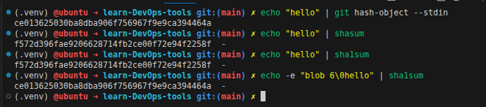
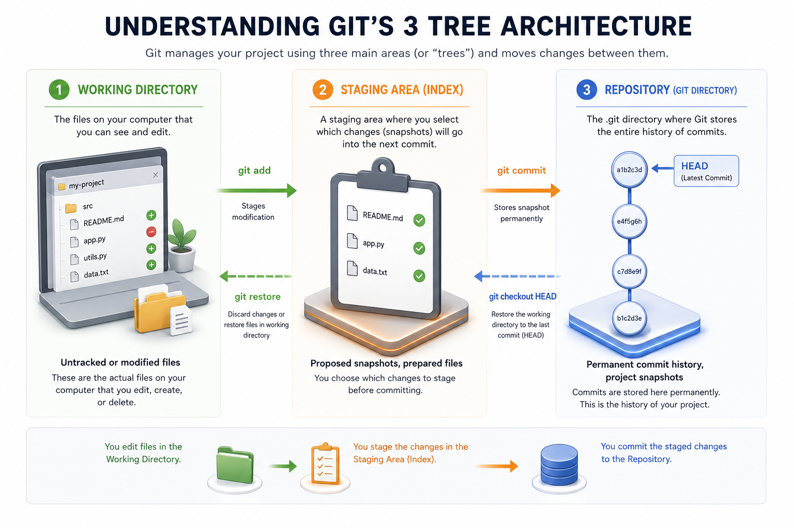
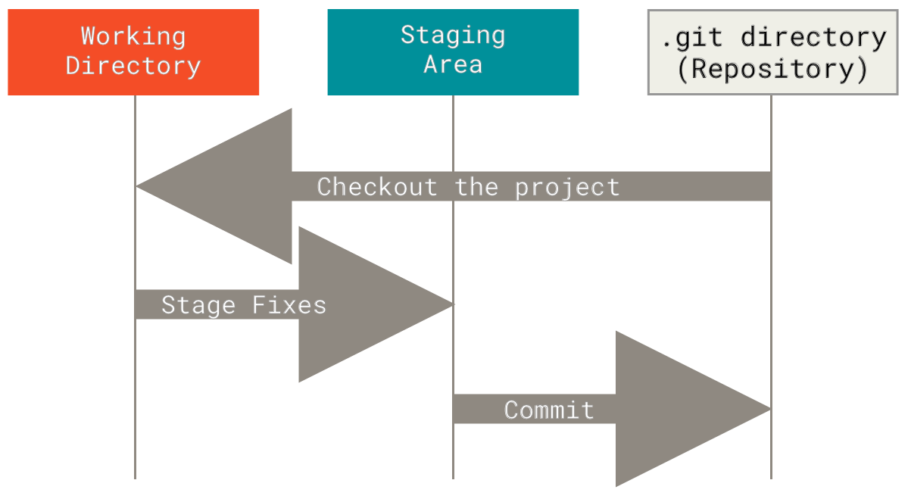

# 01_Git_Architecture


# Git Requirements
- Track every change in files, content+metadata.
- OS independent.
- Unique ID for each change (SHA-1 hash).
- Track history (logs).
- Ensure data integrity (no content change).


## Git Object Model and Identifiers

Git stores project data as objects in the repository database (`.git/objects`).

- **blob**: file **content only** (no filename, no timestamp)
- **tree**: directory structure (names, paths, file modes, and references to blobs/trees)
- **commit**: snapshot reference (root tree), parent commit(s), author/committer info, message, timestamp
- **tag**: named reference to another object (usually a commit), optionally with annotation metadata

### Why hashes are needed

File names and many filesystem attributes are not reliable unique identifiers.  
Git therefore uses a cryptographic hash as an object ID.

Example:

`"hello"` → hash → `5d41402abc4b2a76b9719d911017c592` (example hash output)

- A hash is deterministic: the same input always gives the same output.
- Different content should produce different hashes.
- Any content change produces a different hash, which supports integrity checks.
- Git historically used **SHA-1** for object IDs; modern Git can also use **SHA-256** repositories.

> In short: Git identifies objects by hashing their serialized object data (object header + content), not by filename alone.

example:
```bash
echo "hello Karim" | git hash-object --stdin
# Output: 5d41402abc4b2a76b9719d911017c592
# git take the content "hello Karim", add the object header (type, size, Null character).

# Try with Linux command:
echo -e "blob 11\0hello Karim" | sha1sum
# Output: 5d41402abc4b2a76b9719d911017c592  -
```



# Initializing a Git Repository
To initialize a Git repository, you can use the following command in your terminal:

```bash
git init
```

Learn-Git/ (main) ✗ tree .git
```sh
.git
├── branches
├── config
├── description
├── FETCH_HEAD
├── HEAD
├── hooks
│   ├── applypatch-msg.sample
│   ├── commit-msg.sample
│   ├── fsmonitor-watchman.sample
│   ├── post-update.sample
│   ├── pre-applypatch.sample
│   ├── pre-commit.sample
│   ├── pre-merge-commit.sample
│   ├── prepare-commit-msg.sample
│   ├── pre-push.sample
│   ├── pre-rebase.sample
│   ├── pre-receive.sample
│   ├── push-to-checkout.sample
│   ├── sendemail-validate.sample
│   └── update.sample
├── info
│   └── exclude
├── objects
│   ├── info
│   └── pack
└── refs
    ├── heads
    └── tags

```


## Three Tree Architecture
1. Working Area/Directory/Tree (current working folder)
2. Staging Area (index)
3. Respository (.git directory)



## 1. Working Area/Directory/Tree
The working area is the current directory where you are making changes to your files. It contains the actual files that you are working on. When you make changes to these files, they are not yet tracked by Git until you add them to the staging area.

## 2. Staging Area (index)
The staging area, also known as the index, is a file that acts as a middle ground between the working area and the repository. It holds a snapshot of the changes that you want to commit to the repository. When you use the `git add` command, you are adding changes from the working area to the staging area. This allows you to prepare your changes before committing them to the repository.

## 3. Repository (.git directory)
The Brain of the Git System, The repository is where Git stores all the information about the project, including the history of commits, branches, tags, and the actual content of the files. The repository is located in the `.git` directory at the root of your project. When you commit changes, Git takes the changes from the staging area and creates a new commit object in the repository, which includes a reference to the previous commits, the author information, and the commit message. The repository is where all the history of your project is stored, and it allows you to track changes, revert to previous versions, and collaborate with other developers.


# What actually the meaning of "index - srage area" is?
## The Architecture of the Staging Area (Index) in Git

In Git, the **Staging Area** (also known as the Index) is the middle layer between your Working Directory (your messy desk) and the Repository (the permanent vault). Its primary purpose is to enable **Atomic Commits**—commits that contain one logical change, making the history easy to read, review, and revert.

---

### 1. The Multi-File Scenario: Clean History vs. Messy Resets

**The Situation:** You have modified 5 different files in your project. Three files are related to fixing a database connection, and two files are related to changing button colors on the frontend.

**The "No Staging" Argument:** You might think: *"If I accidentally commit all 5 files together, I can just use `git reset` to undo it later. Why do I need a Staging Area if I can just fix my mistakes?"*

**The DevOps Reality:**
While `git reset` allows you to undo mistakes, relying on it is like building a crooked wall just to demolish it and build it again. The Staging Area allows you to actively organize your changes *before* they hit the permanent record. 

By staging only the 3 database files first, you create a clean, single-purpose commit: `git commit -m "Fix database connection string"`. 

This keeps your `git log` perfectly organized for code reviewers. A messy history full of combined changes makes debugging and finding the root cause of future crashes nearly impossible.

---

### 2. The Single-File Scenario: Surgical Precision (The True Power)

**The Situation:**
You are working on a single file, but you have made multiple, completely unrelated changes inside that *same file*. 

**Why bypassing Staging is Impossible here:**
If you want to commit these changes separately, you cannot do it without the Staging Area. If you just run `git commit filename`, Git takes the *entire* current state of the file on your hard drive. You cannot tell a direct commit command to ignore specific lines of code.

The Staging Area acts as a surgical filter. By using the interactive staging tool (`git add -p` or `--patch`), Git allows you to dissect a single file and push only specific lines (hunks) into the Index, leaving the experimental or broken lines safely in your Working Directory.

---

### Real-World Example: Partial Commits in Action

Imagine you have a single file named `app.py` that currently looks like this:

```python
# app.py

def login():
    # BUG FIX: We fixed the authentication crash here!
    return "User authenticated securely"

def process_payment():
    # EXPERIMENT: I am still writing this, it is broken and crashes the app.
    return "Payment processing..."
```

You **must** commit the `login()` bug fix to production now, but your `process_payment()` code is broken. 

**Step 1: Interactive Staging**
You run the patch command:
```bash
git add -p app.py
```

**Step 2: Selecting the Hunks**
Git splits the file into blocks and asks you what to do with each one in the terminal:

```text
diff --git a/app.py b/app.py
@@ -3,2 +3,3 @@
 def login():
-    return "Crash"
+    # BUG FIX: We fixed the authentication crash here!
+    return "User authenticated securely"
Stage this hunk [y,n,q,a,d,/,e,?]? 
```
* You type **`y` (yes)**. The login fix is moved to the Staging Area.

It will continue hunking the file and asking about the next block:

```text
@@ -8,2 +8,3 @@
 def process_payment():
+    # EXPERIMENT: I am still writing this, it is broken and crashes the app.
+    return "Payment processing..."
Stage this hunk [y,n,q,a,d,/,e,?]?
```
* You type **`n` (no)**. The broken payment code is rejected from the Staging Area.

**Step 3: The Atomic Commit**
Now, you commit the staged changes:
```bash
git commit -m "Fix critical login crash"
```

**The Result:** Git creates a commit containing *only* the repaired login code. The broken payment code remains exactly where it was in your Working Directory, completely untouched by the commit.


## What Actually happens when you add,commit?
1. When you run `git add <file>`, Git takes the content of the file from the working area, creates a sha-1 hash of the content and records it in index file, creates a blob object `blob` in the `.git` repository with the same hash in index just for reference or tracking,files changed from UNTRACKED to `STAGED/TRACKED`.

2. When you run `git commit`, Git takes the content of the staging area (index), creates a tree object `tree` that represents the directory structure and references to the blob objects, creates a commit object `commit` that references the tree object and parent commit(s), and stores it in the repository. The commit object also includes metadata such as author information, commit message, and timestamp. After the commit is created, the staging area is cleared, and the changes are now part of the repository's history.

### File States in Git
- Untracked (U): The file is not being tracked by Git. It has not been added to the staging area.   
- Staged/Tracked (S): The file has been added to the staging area and is ready to be committed.
- Modified (M): The file has been changed in the working area but has not yet been staged or committed.
- Unmodified: The file has not been changed since the last commit.





# Full Git Flow Example:
```bash 
# initialize a Git repository
git init

# create a new file
echo "Hello World" > file.txt

# check the status of the file
git status # git status -s 
# Output: file.txt - Untracked (U)

# add the file to the staging area
git add file.txt

# list objects in staging area
git ls-files --stage
# Output: 100644 3b18e1c8f0a9e5b2c8f0a9e5b2c 0    file.txt

# list reference objects in the repository
find .git/objects -type f
# Output: .git/objects/3b/18e1c8f0a9e5b2c8f0a9e5b2c

# commit the staged changes to the repository
git commit -m "Initial commit"

# list objects in the repository after commit
find .git/objects -type f
# Output:
# .git/objects/3b/18e1c8f0a9e5b2c8f0a9e5b2c
# .git/objects/4f/8e5b2c8f0a9e5b2c8f0a9e5b2c
# .git/objects/5d/41402abc4b2a76b9719d911017c592
# blob + tree + commit objects created in the repository

# Find the starting point
git log --oneline  
# Output: commit 5d41402abc4b2a76b9719d911017c592 (HEAD -> main) Initial commit

# Cat objects contnect
git cat-file -t 5d41402abc4b2a76b9719d911017c592 # commit
git cat-file -p 5d41402abc4b2a76b9719d911017c592
# Output:
# tree 4f8e5b2c8f0a9e5b2c8f0a9e5b2c
# parent (if any)
# author Karim Fathy <karim.fathy@example.com>

git cat-file -t 4f8e5b2c8f0a9e5b2c8f0a9e5b2c # tree
git cat-file -p 4f8e5b2c8f0a9e5b2c8f0a9e5b2c
# Output: 100644 blob 3b18e1c8f0a9e5b2c8f0a9e5b2c file.txt

git cat-file -t 3b18e1c8f0a9e5b2c8f0a9e5b2c # blob
git cat-file -p 3b18e1c8f0a9e5b2c8f0a9e5b2c
# Output: Hello World
```


Each object points to the next one, forming a chain of references that allows Git to track the history and content of the project efficiently.

Each commit at least creates 3 objects (blob, tree, commit) and sometimes more if there are multiple files or directories.
