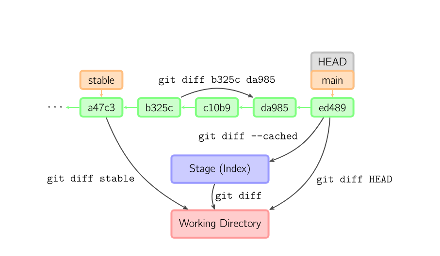

# Git Basic Commands

## `git init`

Initializes a new Git repository in the specified location.

- **git init**: Initialize a new Git repository in the current directory.
- **git init <directory>**: Initialize a new Git repository in the specified directory.

## `git status`

Displays the status of the working directory and staging area.

- **git status**: Show the status of the working directory and staging area, including untracked, modified, and staged files.
- **git status -s**: Display status in short format:
    - `??` — untracked files
    - `M` — modified files
    - `A` — added files (staged)
    - `D` — deleted files
    - `R` — renamed files

## `git add`

Stages files for commit.

- **git add <file>**: Stage a specific file.
- **git add <directory>**: Stage all files in a directory.
- **git add .**: Stage all changes in the current directory and subdirectories.
- **git add -A**: Stage all changes, including deletions, in the current directory and subdirectories.

## `git commit`

Records staged changes to the repository.

- **git commit -m "message"**: Commit staged changes with a descriptive message.
- **git commit -am "message"**: Stage and commit all modified and deleted files (excludes new untracked files).
- **git commit**:Add a long Commit message in Editor.

### `General Format of Commit Message:`
> \<type\>:   \<short description\>
- **feat**: -> new feature
- **fix**: -> bug fix
- **docs**: -> documentation changes 
- **style**: -> formatting or whitespace changes (no logic change)
- **refactor**: -> restructuion code without changing behavior
- **test**: -> adding or modifying tests
- **chore**: -> maintenance tasks (dependencies, tooling, build updates)

- **git commit --amend**: Amend the last commit with a new message or staged changes.


### The Anatomy of `git commit --amend`

In Git, `git commit --amend` is a powerful tool used to modify the most recent commit (HEAD). However, it is fundamentally misunderstood by most junior developers. It does **not** edit an existing commit; it completely replaces it.

---

### 1. How It Works Under the Hood (The Architecture)

Git commits are immutable (unchangeable). Once a commit object is created in the `.git/objects` database, it can never be altered. 

When you run `git commit --amend`:
1. Git takes the current Staging Area (Index).
2. It combines it with the contents of the previous commit.
3. It creates a **brand new Commit Object** with a completely different SHA-1 Hash.
4. It deletes the old commit from your timeline and points the `HEAD` to this new commit.

**Key Takeaway:** You are literally rewriting history. The old commit is orphaned and eventually garbage-collected by Git.

---

## 2. Common Use Cases

### Case A: Changing a Commit Message
You made a typo in your last commit message.
```bash
# This creates a new commit with the same files but a new message
git commit --amend -m "fix: resolve database connection timeout"
```

### Case B: Forgetting to Add a File
You committed your feature, but realized you forgot to save or stage a configuration file.
```bash
# 1. Stage the forgotten file
git add config.yaml

# 2. Amend the last commit without changing its message
git commit --amend --no-edit
```

---

## 3. The `git push` Problem (Diverged History)

If you have already pushed your commit to GitHub (e.g., origin) and *then* you amend it locally, you have created a split timeline:
* **GitHub has:** Commit A -> Commit B (SHA: 123)
* **Your Laptop has:** Commit A -> Commit C (SHA: 999)

If you try a normal `git push`, Git will reject it with a `non-fast-forward` error because it refuses to overwrite existing history.

**The Solution:** You must force Git to overwrite the remote history.
```bash
# Standard force push (overwrites remote with your local state)
git push --force origin <branch-name>

# Safer DevOps method (only forces if nobody else pushed in the meantime)
git push --force-with-lease origin <branch-name>
```

---

## 4. The Golden Rule of Amending

**NEVER amend a commit that has been pushed to a public/shared branch (like `main` or `develop`).**

If you rewrite history on a branch that other developers are actively pulling from, their local histories will instantly break, causing massive merge conflicts for the entire team. 
**Only amend commits on your local machine, or on your own isolated Pull Request branch.**


## `git log`

Displays the commit history.

- **git log**: Show commit history including messages, authors, and dates.
- **git log --oneline**: Display commit history in condensed format with abbreviated SHA-1 hash and message.
- **git log --graph**: Display commit history as a graph illustrating branching and merging.
- **git log --decorate**: Display commit history with branch and tag information.
- **git log --graph --all --decorate --oneline**: Display commit history with graph, all branches, and decorations in condensed format.
- **git log file.txt**: Show commits that affected a specific file.
- **git log -n <number>**: Show the last `<number>` commits.
- **git log --since="date"**: Show commits made since a specific date.
- **git log --until="date"**: Show commits made until a specific date.
- **git log --author="name"**: Show commits made by a specific author.
- **git log --grep="pattern"**: Show commits with messages matching a specific pattern.
- **git log -p**: Show commit history with the patch (diff) for each commit.
- **git log --stat**: Show commit history with statistics about changes (files changed, insertions, deletions).


## `git show`
Displays information about a specific commit.
- **git show <commit_sha>**: Show details of a specific commit, including the commit message, author, date, and changes made.
- **git show HEAD**: Show details of the most recent commit on the current branch.


## `git reflog`

Records updates to repository references.

- **git reflog**: Display the reference log of HEAD and branch references, including commits, checkouts, resets, and other state changes.
- **git reflog show <branch_name>**: Display the reference log for a specific branch.

## `git diff`

Displays differences between repository states.

- **git diff**: Show differences between the working directory and staging area (index).
- **git diff --staged [--cached]**: Show differences between the staging area and the last commit.
- **git diff <commit_sha_old> <commit_sha_new>**: Show differences between two specific commits.
- **git diff <branch1> <branch2>**: Show differences between two branches.



## `git mv`
###  The Architecture of `git mv` (Moving and Renaming)

The `git mv` command stands for "move." It is used to do two things: **rename a file** or **move a file to a different folder** within your repository.

But why use `git mv` instead of the standard Linux `mv` command? It is all about **Traceability and History**.

**1. The Wrong Way (Standard Linux `mv`):**
If you rename a file using your OS (e.g., `mv config.txt app-config.txt`), Git's tracking engine gets confused. When you run `git status`, Git will tell you two separate events happened:

* `config.txt` was deleted.
* An untracked, completely brand-new file called `app-config.txt` was created.

If you commit this, **you permanently lose the entire commit history of that file.** Git thinks the old file died and a completely unrelated new one was born.

**2. The DevOps Way (`git mv`):**
If you use `git mv config.txt app-config.txt`, you are explicitly speaking to Git's internal tracking system. You are saying: *"I am renaming this file. Keep all of its past commit history attached to this new name."*

When you run `git status` after using this command, Git will clearly understand and say: `renamed: config.txt -> app-config.txt`. Your history remains perfectly intact.
