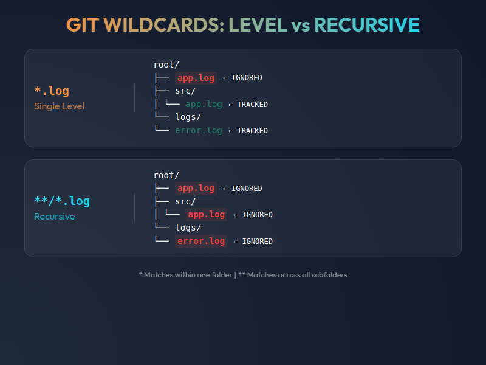

# Gitignore Guide

## What is .gitignore?

`.gitignore` is a file used in Git to specify which files or directories should be ignored by Git when tracking changes. Any files or directories listed in `.gitignore` will not be included in commits, and Git will not track their changes.

---

## Key Concepts

### Wildcard Patterns: `*` vs `**`

##### Single Asterisk `*` — Level-Specific Match
- Matches any string of zero or more characters within a **single directory level**
- Stops at directory separators (`/`)
- **Example**: `*.log` ignores `app.log` in root, but **not** `backend/app.log`

##### Double Asterisk `**` — Recursive Globstar
- Matches zero or more directories recursively across all depth levels
- Penetrates through all `/` separators
- **Example**: `**/*.log` ignores `.log` files everywhere: `app.log`, `backend/app.log`, `backend/logs/error.log`, etc.

---

## Important Notes

> **Already Tracked Files**: If Git is already tracking a file, adding it to `.gitignore` won't stop tracking. Use `git rm --cached <file>` first.

> **Multiple .gitignore Files**: You can place `.gitignore` files in different project directories.

---

## Common Syntax Patterns

| Pattern | Purpose |
|---------|---------|
| `*.log` | Ignore all `.log` files |
| `build/` | Ignore `build` directory and contents |
| `!important.txt` | Don't ignore `important.txt` (negation) |
| `**/temp/` | Ignore `temp` at any project level |
| `tmp/*` | Ignore all files in `tmp/` |
| `!tmp/keep.txt` | Exception: keep this file |
| `#` | Comment line (ignored) |
| (blank line) | Improves readability |

---

## Generate .gitignore Automatically

Use **[gitignore.io](https://www.toptal.com/developers/gitignore)** to generate customized `.gitignore` files based on your tech stack.

**Reference**: [GitHub's gitignore Collection](https://github.com/github/gitignore)
