# Git Branching Guide
## What is Branching in Git?
Branching in Git allows you to create separate lines of development within a repository. Each branch can have its own commits, allowing you to work on different features, bug fixes, or experiments without affecting the main codebase. This enables parallel development and makes it easier to manage changes.


## Why Use Branching?
- **Isolation**: Work on new features or bug fixes without affecting the main codebase.
- **Collaboration**: Multiple developers can work on different branches simultaneously.
- **Experimentation**: Try out new ideas without risking the stability of the main branch.
- **Version Control**: Keep a history of changes and easily switch between different versions of the codebase.


## Branches Naming Conventions
- Use descriptive names for branches to indicate their purpose (e.g., `feature/login`, `bugfix/header`, `hotfix/payment`).
- Avoid using spaces or special characters in branch names; use hyphens or underscores instead.
- Consider using prefixes like `feature/`, `bugfix/`, or `hotfix/` to categorize branches based on their purpose.

- **Atomic Development in Git**

In Git, both commits and branches are most effective when they represent a single, focused change or feature. This is often referred to as "atomic commits" and "atomic branches."

1. **Atomic Commits**: Each commit should represent a single logical change. This makes it easier to understand the history of changes, revert specific changes if needed, and collaborate with others. For example, instead of committing multiple unrelated changes together, you would create separate commits for each change.

| Do (Atomic) | Don't (Non-Atomic) |
|----------------|----------------|
|feat: add login feature|feat: add login and registration features|
|fix: correct header alignment|fix: correct header alignment and update footer|
|feature/login|feature/login-and-registration|
|bugfix/header|bugfix/header-and-footer|


2. **Atomic Branches**: Similar to commits, branches should also be focused on a single feature or change. This allows for easier code reviews, testing, and merging. For example, instead of creating a branch that includes multiple features or bug fixes, you would create separate branches for each feature or fix.

| Do (Atomic) | Don't (Non-Atomic) |
|----------------|----------------|
|feature/login|feature/login-and-registration|
|bugfix/header|bugfix/header-and-footer|
|hotfix/payment|hotfix/payment-and-shipping|
| feature/search|feature/search-and-filter|
|----------------|----------------|

## Commit and and its tree
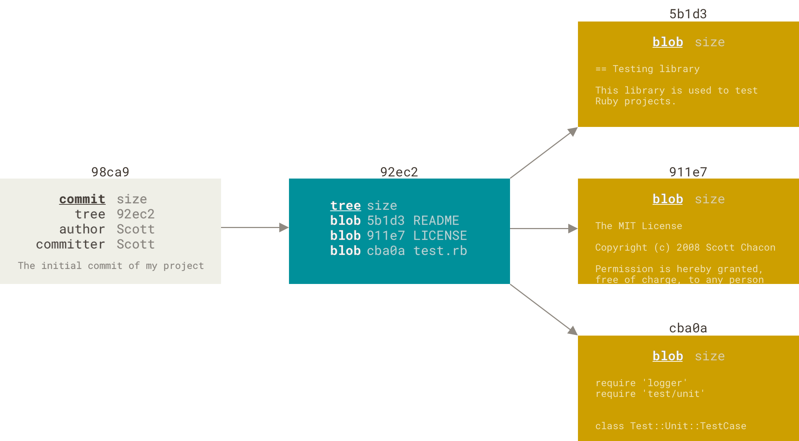

## Commits and their parents
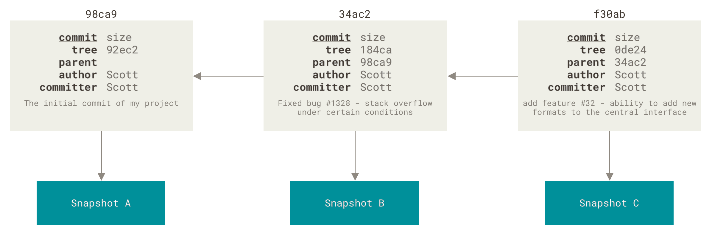

# Common Branching Commands
- `git branch`: List all branches.

- `git branch <branch_name>`: Create a new branch.
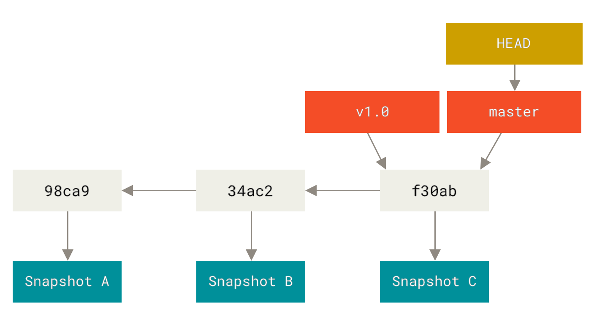

### Head pointer points to the current branch, and when you create a new branch, it points to the same commit as the current branch.


## HEAD Pointer
> The HEAD pointer in Git represents the current branch or commit that you are working on.
When you switch branches, the HEAD pointer moves to point to the new branch.
When you make a commit, the HEAD pointer moves to point to the new commit.
Understanding how the HEAD pointer works is crucial for managing branches and commits effectively in Git.
You can view the current HEAD pointer using `cat .git/HEAD` and see which branch or commit it points to.

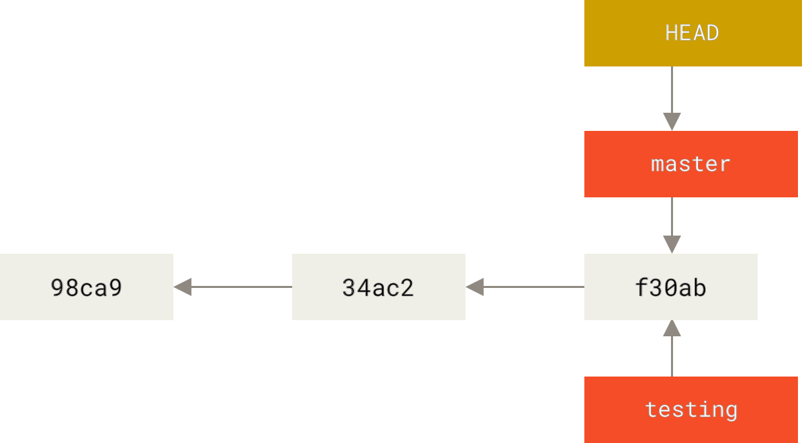

- `git checkout <branch_name>`: Switch to the specified branch.
- `git switch <branch_name>`: Alternative to `git checkout` for switching branches.
- `git branch -b <branch_name>`: Create and switch to a new branch in one command.
- `git switch -c <branch_name>`: Alternative to `git branch -b` for creating and switching to a new branch.

### When you switch to the new branch, the HEAD pointer moves to point to the new branch, and you can start making commits on that branch without affecting the original branch.
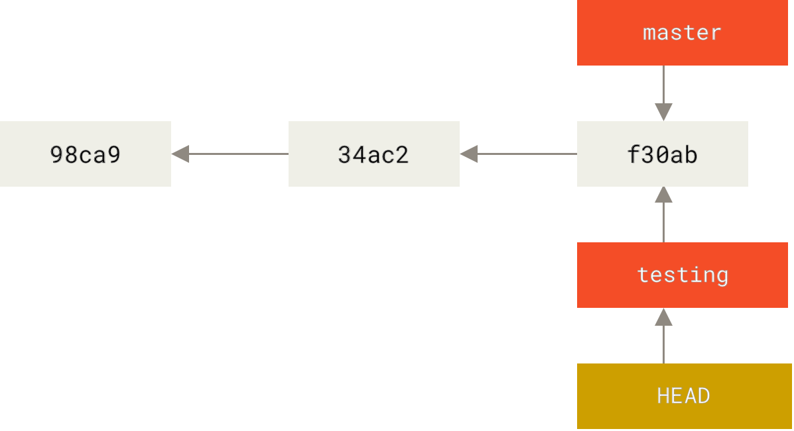


## The HEAD Branch moves forward when a commit is made.
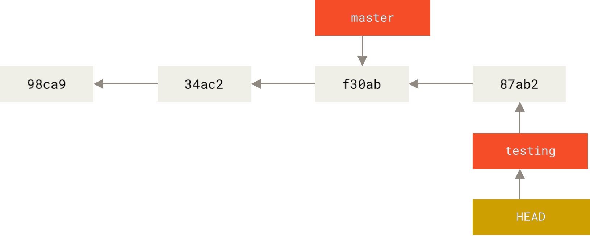

### HEAD moves when checking out a branch, and when making a commit, it moves to the new commit on the current branch.
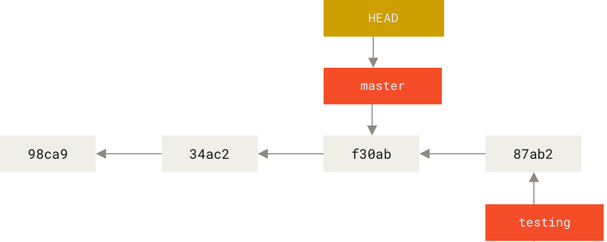


## Divergent Branches
> When two branches diverge, it means they have different commits that are not shared between them. This can happen when you create a new branch and make commits on it while the original branch also has new commits. To merge the changes from one branch to another, you can use `git merge` or `git rebase`.

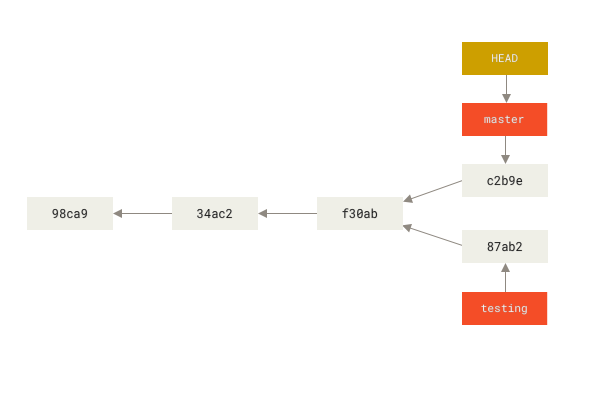

* also you can see the divergent branches using `git log --graph --oneline --decorate --all` to visualize the commit history and branch structure.
```sh
* c2b9e (HEAD, master) Make other changes
| * 87ab2 (testing) Make a change
|/
* f30ab Add feature #32 - ability to add new formats to the central interface
* 34ac2 Fix bug #1328 - stack overflow under certain conditions
* 98ca9 Initial commit of my project
```

### for continues commits on the new branch, the HEAD pointer will move forward on that branch, and the original branch will not be affected until you merge or rebase.
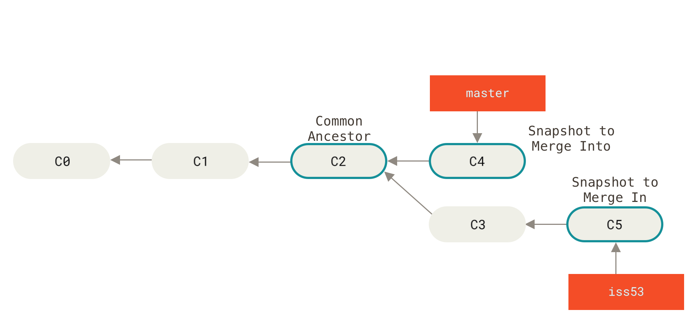


## Merging Strategies
### 1. **Fast Forward**
- If the current branch has not diverged from the target branch, Git will perform a fast-forward merge, simply moving the HEAD pointer forward to the latest commit on the target branch.
`The HEAD Pointer now is in the latest commit of the branch`.
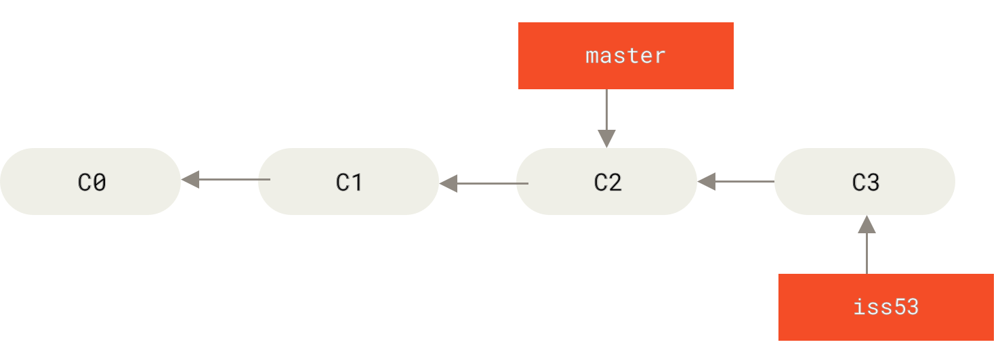

```bash
# Example of a fast-forward merge
# ensure you are on the branch you want to merge into (e.g., master)
git checkout master
# merge the feature/login branch into master (fast-forward if no divergence)
git merge feature/login
```

The master branch is updated to point to that commit as well. The HEAD Pointer now is in the latest commit of the master branch. This is a fast-forward merge because there were no divergent commits between the branches.
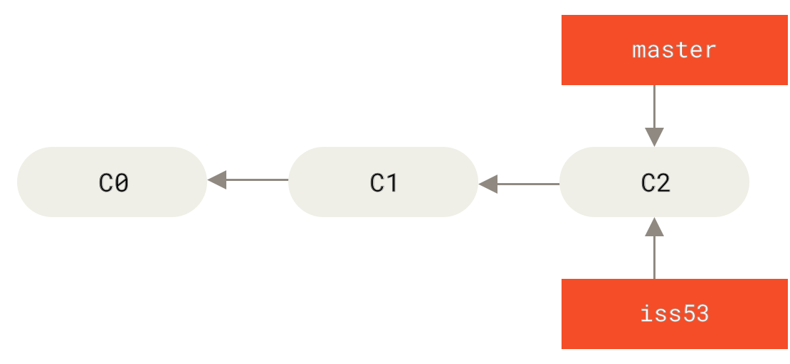


### 2. **Three-Way Merge**
- If the branches have diverged, Git will perform a three-way merge, `**creating a new commit**` that combines the changes from both branches. This new commit will have two parent commits, one from each branch.

The Pointer now is in the new commit from the new branch that diverged from the master branch.


Now when you merge the new branch into master, Git will `create a new commit` that combines the changes from both branches.
This new commit will have two parent commits: one from the master branch and one from the feature/login branch.
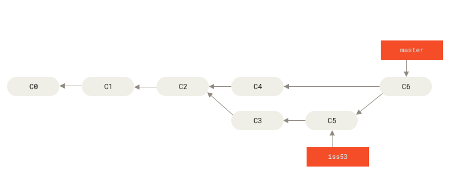


- **Logs**: if you run `git log --graph --oneline --decorate --all`, you will see the commit history with the branches and merges visually represented. The three-way merge will show a new commit that has two parent commits, indicating that it is a merge commit.
    ```bash

    *   db63d8c (HEAD -> main) Merge branch in main branch -> 3-Way Merge
    |\  
    | * cfd70fc (new/branch) Addition: Add new feature
    | * 87ab2 (testing) Make a change
    * | 9241220 chore: Update README.md
    |/  
    * bfce427 Initial Commit: Base App.dart
    ```
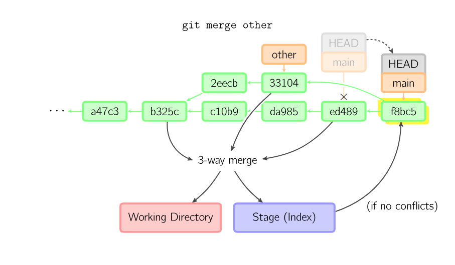


- **Delete merged branches**:
After merging a branch, it's best practice to delete it to keep your repository clean and organized.
```bash
# List all merged branches
git branch --merged
# output:
# *main
# feat

# Delete a specific merged branch
git branch -d <branch_name>

# Delete multiple merged branches at once
git branch --merged | grep -v "\*" | xargs git branch -d
```
This helps prevent clutter and makes it easier to navigate your repository's branch structure. Deleted branches can always be recovered using `git reflog` if needed.


- `**git reflog**`:
If you run the command `git log`, you will not see how the merge was performed or any merge logs with fast-forward merges.
So Try to use `git reflog` to see the merge logs and how the HEAD pointer moved during the merge process.
`git reflog` will show you the history of all the actions that have affected the HEAD pointer, including merges, checkouts, commits, and more. This can help you understand how the branches have diverged and merged over time.


- **How to read the `git reflog` output**:
- Each entry in the reflog represents a change to the HEAD pointer, such as a commit, merge, or checkout.
- The entries are listed in reverse chronological order, with the most recent changes at the top.
- Each entry includes a reference to the commit SHA, the action that was performed (e.g., commit, merge, checkout), and a message describing the change.
- Very Helpful for Undoing Changes: You can use the reflog to find previous states of the repository and reset or revert to those states if needed.


## Merge Conflicts and Resolution:
When merging branches, you may encounter merge conflicts if there are changes in the `same lines of code in the same file in both branches`. Git will mark the conflicting areas in the files, and you will need to manually resolve the conflicts by editing the files and choosing which changes to keep. After resolving the conflicts, you can stage the changes and commit the merge.


### To resolve merge conflicts:
1. Open the conflicting files and look for the conflict markers (`<<<<<<<`, `=======`, `>>>>>>>`).
2. Decide which changes to keep (from either branch or a combination of both).
3. Edit the file to remove the conflict markers and keep the desired changes.
4. Stage the resolved files using `git add <file>`.
5. Commit the merge using `git commit` (if it was not automatically committed after resolving conflicts).

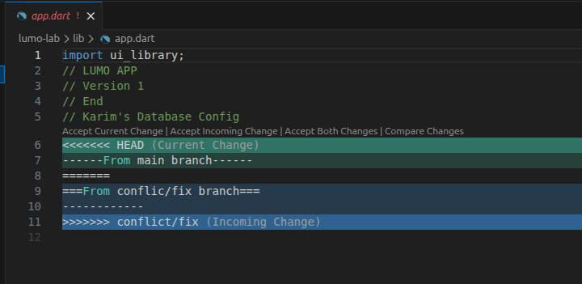

- `git branch -d <branch_name>`: Delete the specified branch (only if it has been merged). you can't delete the branch that you are currently on, you need to switch to another branch first before deleting it.
- `git branch -D <branch_name>`: Force delete the specified branch (even if it hasn't been merged).


