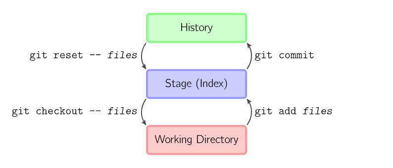
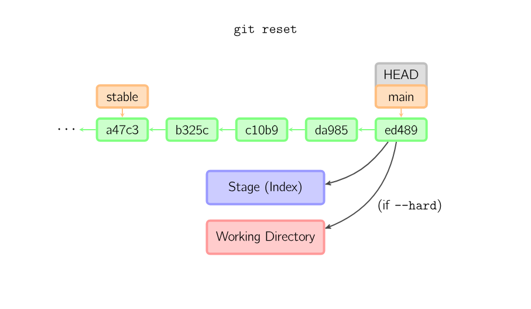
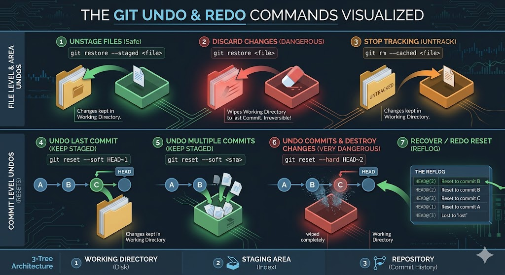

# Undoing Things in Git

In Git, you can undo changes in various ways depending on what you want to achieve.

---

## Part 1: File-Level Changes (The 3-Tree Perspective)



This guide explains how to undo changes based on where they sit in the Git architecture.

### 1. Discarding Changes (Wiping the Working Directory)
**Command:** `git restore <file>`
- **When to use:** You made a mess in your code and want to start over from the last commit.
- **Result:** **DANGEROUS.** All uncommitted changes in the file are deleted. The file returns to its state in the last `commit`.
- **Warning:** There is no "undo" for this. The code is gone forever.
- **Comparison:** Files changed but not yet added to the Staging Area, `git restore` will restore from the staging area, make the working directory is the same as the index version.

### 2. Unstaging Files (Staging → Working Directory)
**Command:** `git restore --staged <file>`
- **When to use:** You ran `git add`, but you aren't ready to commit yet.
- **Result:** Files are removed from the Staging Area. Your changes remain safe in the Working Directory.
- **Comparison:** This is the direct opposite of `git add`. After staging a file, if you change your mind, The file will changed from staged to unstaged, but the changes are still in the working directory.

### 3. Restore working area from commit history
**Command:** `git restore --staged <file>` + `git restore <file>`
- **When to use:** You want to undo a committed change and start fresh from the last commit.
- **Result:** The file is removed from the Staging Area and the Working Directory is reset to match the last commit. All changes are lost.
- **Warning:** This is a combination of the previous two commands. It will completely wipe out your changes and restore the file to its last committed state. Use with caution.


### 4. Stopping Tracking (Repository → Working Directory)
**Command:** `git rm --cached <file>`
- **When to use:** You accidentally committed a file that should be ignored (like `.env` or `node_modules`).
- **Result:** Git "forgets" the file exists. It becomes `untracked`. The file stays on your hard drive but will be deleted from the repository on the next commit.
- **Pro Tip:** Use this before adding a previously tracked file to `.gitignore`.

---

## Part 2: Commit-Level Changes (Git Time Travel)

### Overview: Reset vs. Revert

When you need to undo a committed change, Git offers two primary tools. Choosing the wrong one can destroy your team's workflow.



### The Time Machine: `git reset <commit_sha>`
**Purpose:** Moves the `HEAD` pointer backward in time, effectively erasing the commits that came after it from the branch history.
- **How it works:** It rewrites history. It makes Git pretend the newer commits never happened.
- **When to use:** **ONLY** use this for local, unpushed branches that only live on your machine.
- **Why?** If you make a mess locally, you can wipe it clean before anyone else sees it.
- **The Danger Zone:** Never use `git reset` on a branch that others have already downloaded. Rewriting shared history causes massive synchronization conflicts for your entire team.

#### 1. Soft Reset (Keep Changes Staged)
**Command:** `git reset --soft HEAD~<n>`
- **When to use:** You want to undo several commits but keep the changes staged.
- **Result:** The last `<n>` commits are undone. All changes from those commits are preserved and placed back in the Staging Area.
- **Note:** Use `git reflog` to find the commit you want to reset to, or use the SHA instead of `HEAD~<n>`.
    ```bash
    git reset --soft 42a1b2c
    ```
- **Next action:** Review the changes, make any necessary adjustments, and commit again.

#### 2. Mixed Reset (Keep Changes in Working Directory)
**Command:** `git reset --mixed HEAD~<n>` (default)
- **When to use:** You want to undo several commits and unstage the changes, but keep them in the Working Directory.
- **Result:** The last `<n>` commits are undone. All changes from those commits are preserved but moved to the Working Directory. The Staging Area is cleared.
- **Note:** Use `git reflog` to find the commit you want to reset to, or use the SHA instead of `HEAD~<n>`.
    ```bash
    git reset --mixed 42a1b2c
    ```
- **Next action:** Review the changes, make any necessary adjustments, stage the desired changes with `git add`, and commit again.

#### 3. Hard Reset (Discard All Changes)
**Command:** `git reset --hard HEAD~<n>`
- **When to use:** You want to completely discard the last `<n>` commits and all associated changes.
- **Result:** The last `<n>` commits are undone. All changes from those commits are permanently deleted from both the Staging Area and the Working Directory. The HEAD pointer now points to the previous `<n>` commit.
- **Warning:** Use with extreme caution. All changes will be lost forever.
- **Note:** You can also use the SHA of the commit instead of `HEAD~<n>`.
    ```bash
    git reset --hard 42a1b2c
    ```



#### 4. Recovering Lost Commits (Reflog and Reset)
**Commands:**
- `git reflog`: View the history of HEAD movements, including commits, resets, and checkouts.
- `git reset --hard HEAD@{<n>}`: Reset to a previous state from the reflog.

**When to use:** You accidentally reset too far back or want to recover a commit that was lost.
**Result:** You can move the HEAD pointer back to a previous state, effectively "redoing" commits that were undone by a reset. The commits that are HEAD detached are still preserved.
**Pro Tip:** Always check the reflog before performing a hard reset to ensure you can recover if needed.

**Tip:** Use `~` for undoing and `@{}` for redoing.

**Example:**
```bash
# Undo the last 2 commits
git reset --hard HEAD~2

# Check the reflog to find the commit you want to recover
git reflog

# Redo the commit by resetting to the desired state (note the @{} syntax)
git reset --hard HEAD@{2}
```

### Safe Alternative: `git revert <commit_sha>`
**When to use:** **ALWAYS** use this for public/shared branches (e.g., `main`).
**Purpose:** Creates a *new* commit that applies the exact opposite changes of the specified commit.
- **How it works:** It does not erase history. If the target commit added Line 2, `git revert` creates a new commit that deletes Line 2. Commits that came after it are untouched.
- **Why?** It preserves the audit trail. Everyone on the team can see that a mistake was made and explicitly corrected. It prevents catastrophic push/pull conflicts with other developers.
- **Result:** A new commit is created that reverses the changes introduced by the specified commit. The original commit remains in the history, and the new commit effectively "undoes" its changes.
- **Pro Tip:** Use `git log` to find the commit SHA you want to revert. This is a safe way to undo changes on shared branches without rewriting history.

Example:
```bash
echo "Line 1" > file.txt
git add file.txt
git commit -m "Add Line 1" 
echo "Line 2" >> file.txt
git add file.txt
git commit -m "Add Line 2"
echo "Line 3" >> file.txt
git add file.txt
git commit -m "Add Line 3"
git log --oneline
# Output:
# 3c4d5e6 (HEAD -> main) Add Line 3
# 2b3c4d5 Add Line 2
# 1a2b3c4 Add Line 1
# revert the commit that added Line 2
git revert 2b3c4d5
# This will create a new commit that removes Line 2, while keeping Line 1 and Line 3 intact.
cat file.txt
# Output:
# Line 1
# Line 3
```