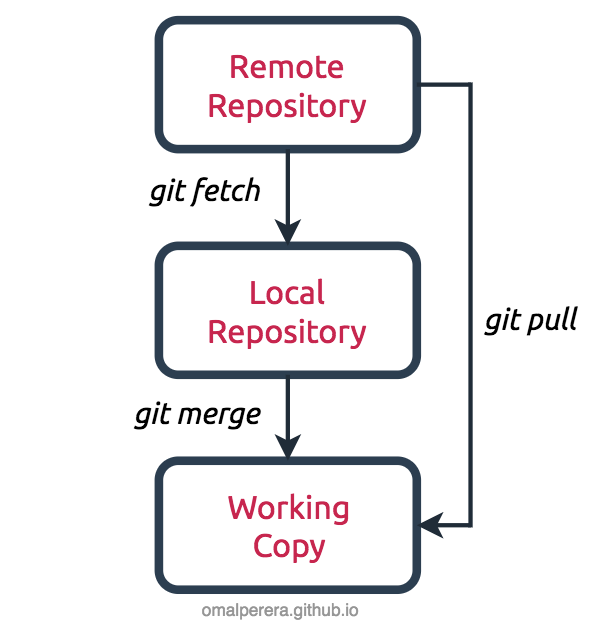

# Git fetch VS Git pull
- `git fetch` is a command that retrieves the latest changes from the remote repository and updates your local copy of the remote branches, but it does not merge those changes into your current branch. It allows you to see what changes are available on the remote without affecting your local work. 

- `git pull` is a command that retrieves the latest changes from the remote repository and automatically merges those changes into your current branch. It is essentially a combination of `git fetch` followed by `git merge`. When you run `git pull`, it will first fetch the changes from the remote and then attempt to merge them into your current branch, which can lead to conflicts if there are conflicting changes between your local branch and the remote branch.



## git diff origin/main
To see the differences between your local branch and the remote branch, you can use the `git diff` command with the remote branch reference. For example, if you want to see the differences between your local `main` branch and the `origin/main` branch, you can run:
```bash
git fetch origin main  # Fetch the latest changes from the remote
git diff origin/main  # Show the differences between local main and origin/main
```
This will show you the changes that have been made in the `origin/main` branch that are not yet in your local `main` branch. You can review these changes before deciding to merge them into your local branch using `git pull` or `git merge`. This is a good practice to avoid unexpected conflicts and to understand what changes are coming from the remote before integrating them into your local workflow.

## Typical Workflow
1. Use `git fetch` to retrieve and review the latest changes from the remote repository without merging them
2. Use `git diff origin/main` to see the differences between your local branch and the remote branch
3. If you are satisfied with the changes and want to integrate them into your local branch, use `git pull` to fetch and merge the changes in one step, or use `git merge origin/main` to merge the changes after fetching.
4. If there are conflicts during the merge, resolve them manually, commit the changes, and then push your updated branch back to the remote repository if needed.


## Common Commands
- `git fetch <remote>`: Fetches the latest changes from the specified remote repository without merging them into your local branch.
- `git pull <remote> <branch>`: Fetches the latest changes from the specified remote branch and merges them into your current local branch.
- `git diff <remote>/<branch>`: Shows the differences between your local branch and the specified remote branch after fetching the latest changes.
- `git merge <remote>/<branch>`: Merges the specified remote branch into your current local branch after fetching the latest changes.
- `git diff main origin/main -- <specific_file.txt>`: Shows the differences for a specific file between your local `main` branch and the `origin/main` branch after fetching the latest changes.
- `git log origin/main..main`: Shows the commits that are in your local `main` branch but not in the `origin/main` branch, which can help you understand what changes you have locally that are not yet pushed to the remote.