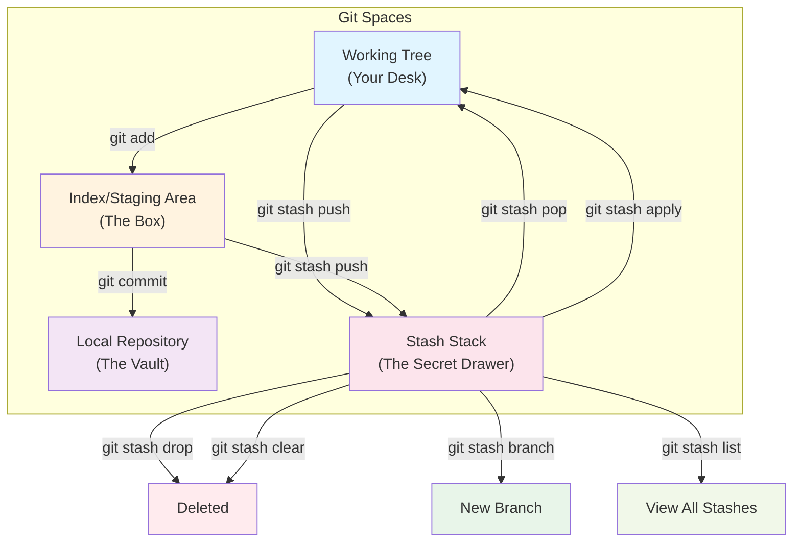
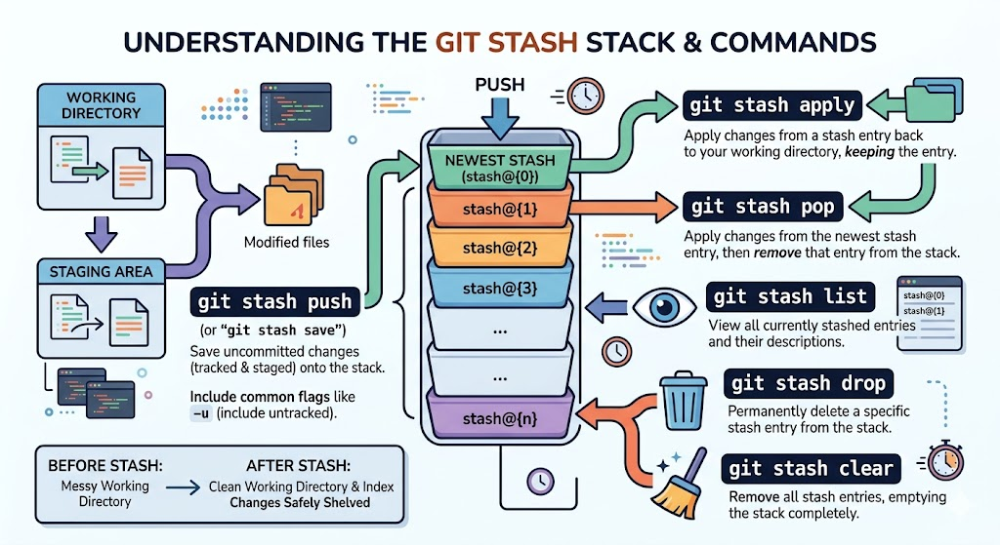

# Git stash
### The Tale of the Emergency Context Switch

Imagine it is 11:30 PM. You are deep inside the backend code of certain project. You are currently on the `feature/leaderboard` branch, writing a complex sorting algorithm for user scores. Your `app.js` is a mess: variables are undefined, half the functions are missing brackets, and the application cannot even run.

Suddenly, your phone rings. It is your Tech Lead.
*"The main production server is failing! Users cannot log in. Drop the leaderboard feature, switch to the `main` branch, and fix the authentication bug right now!"*

You panic. You quickly open your terminal and type:
`git checkout main`

Git immediately blocks you with a fatal error:

> *"error: Your local changes to the following files would be overwritten by checkout: app.js. Please commit your changes or stash them before you switch branches."*

You are trapped. You **cannot** commit this code—it is broken, and a Senior Engineer never commits broken code to the repository history. But you also cannot switch branches without losing your work.

**let's understand why you can't switch to main branch with these unfinished changes**.
Git is designed to protect your work. If you were allowed to switch branches with uncommitted changes, imagine that Git will approve the switch, but when you switch back to your feature branch, all your messy code is gone because Git will search for the last commit on that branch and restore the files to that state. This is a disaster for your work and a nightmare for your mental health.

## Enter the hero of our story: `git stash`.

---

### The Architecture of the Stash

To understand how `git stash` rescues you, you must understand the four physical spaces Git manages on your laptop:

**1. The Working Tree (Your Physical Desk)**
This is what you see in your code editor. It holds all your current, unsaved, and messy files (like your broken `app.js`).

**2. The Index / Staging Area (The Shipping Box)**
This is where files go when you type `git add`. They are packed and waiting to be permanently sealed into a commit.

**3. The Local Repository (The Permanent Vault)**
This is where your `HEAD` pointer sits. It holds your immutable, permanent history of clean commits.

**4. The Stash Stack (The Secret Drawer)**
This is a hidden, temporary storage space (`refs/stash`) designed specifically for unfinished business. It operates as a "Last-In, First-Out" (LIFO) stack.

---

###  Resolving the Crisis (The Workflow)

Here is exactly how you handle the Tech Lead's emergency using these four areas:

**Step 1: Hide the Mess**
Instead of committing the broken code, you type:

```bash
git stash push -m "WIP: leaderboard logic half-finished"
```

*What happens under the hood?* Git grabs everything off your Working Tree (Your Desk) and the Index (The Box), bundles it into a temporary commit, and shoves it into the Stash Stack (The Secret Drawer). Suddenly, your code editor updates, and your desk is perfectly clean. You are reverted to the last safe commit.

**Step 2: Save the Day**
Now that your desk is clean, you can safely switch to the main branch:

```bash
git checkout main
```

You find the bug, fix the issue, commit the hotfix, and push it to production. The Tech Lead is happy. The platform is saved.

**Step 3: Resume Your Work**
You switch back to your feature branch:

```bash
git checkout feature/leaderboard
```

Now, you need your messy code back. You type:

```bash
git stash pop
```

*What happens under the hood?* Git opens the Secret Drawer, pulls out your messy `app.js`, places it exactly back on your Working Tree (Your Desk) where you left it, and then deletes the drawer. You resume coding as if nothing ever happened.

---

## `stash` Command Variations
- `git stash list`: View all stashed changes in the stack.
- `git stash pop`: Apply the most recent stash and remove it from the stack.
- `git stash apply`: Apply the most recent stash without removing it from the stack.
- `git stash drop`: Remove a specific stash from the stack.
- `git stash clear`: Remove all stashes from the stack.





### The Forgotten Stash

**The Scenario:**
Imagine you stashed your `app.js` leaderboard code into the secret drawer, but after you fixed the production bug, you completely forgot about the stash.
You spent the next two weeks writing *new* code on the `feature/leaderboard` branch. You modified `app.js` heavily and made five new commits.

Suddenly, you remember your stash!

If you run `git stash pop` right now, Git will take your two-week-old stashed code and try to forcefully smash it into your newly modified `app.js` file. The result will be a catastrophic, unreadable **Merge Conflict**.

There is a very specific Git Stash command designed for this exact disaster. It takes your old stash, creates a *brand new branch* starting from the exact moment in history when you created the stash, and safely pops the code there, completely avoiding the conflict.
```bash
git stash branch <new-branch-name> stash@{0}
```





What is you already added your edits to staging area but wanted to checkout to another branch?
if you have already staged your changes with `git add`, Git will still prevent you from switching branches because the staged changes are also at risk of being lost. In this case, you can use the same `git stash` command to save both your working directory and the staging area:

```bash
git stash push -m "WIP: leaderboard logic half-finished"
```
This command will stash both your unstaged and staged changes, allowing you to switch branches safely. When you return to your original branch, you cannot just use `git stash pop` to restore edit, as it will only restore the working directory changes and not the staged changes. Instead, you can use:

```bash
git stash pop --index
``` 


