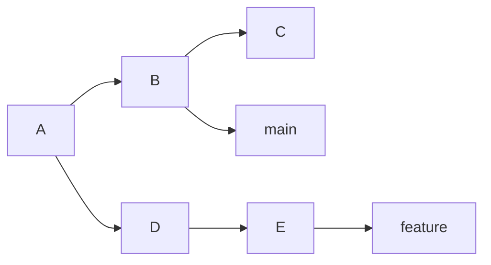
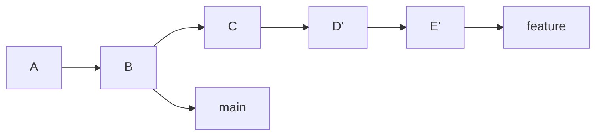
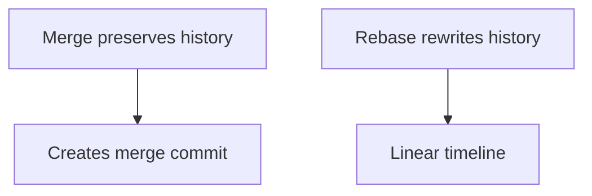

# Git Rebase: A Comprehensive Guide

## What is Git Rebase?

Git rebase is a powerful command that rewrites commit history by moving, combining, or modifying commits onto a new base commit. Unlike merge, rebase creates a linear history.

## Basic Rebase Syntax

```bash
git rebase <base-branch>
```

## Types of Rebase

### 1. Simple Rebase

Move your commits on top of another branch:

```bash
git checkout feature-branch
git rebase main
```

**Before:**


**After:**


### 2. Interactive Rebase

Modify, reorder, or squash commits:

```bash
git rebase -i HEAD~3
```

Commands:
- `pick` - use commit
- `reword` - edit message
- `squash` - combine with previous
- `drop` - remove commit

### Example: Interactive Rebase Session

```text
c-1 --> c-2 --> c-3
```

```bash
pick c-1
squash c-2
pick c-3
```

Result: `c-1` and `c-2` are combined into one commit, followed by `c-3`.
```text
c-1' --> c-3
```

### 3. Rebase onto Another Branch

```bash
git rebase --onto main develop feature
```

## Practical Examples

### Example 1: Clean History Before Pull Request

```bash
git checkout feature-branch
git rebase main
git push -f origin feature-branch
```

### Example 2: Squash Commits

```bash
git rebase -i HEAD~4
# Change pick to squash for commits to combine
```

## Conflicts During Rebase

### Resolving Conflicts

```bash
# Fix conflicts in files
git add <resolved-files>
git rebase --continue

# Or abort
git rebase --abort
```

## Best Practices

✅ **Do:**
- Use rebase for local branches
- Rebase before creating pull requests
- Use interactive rebase to clean history

❌ **Don't:**
- Rebase public/shared branches
- Force push to collaborative branches

## Rebase vs Merge


