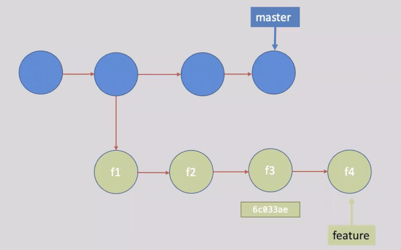
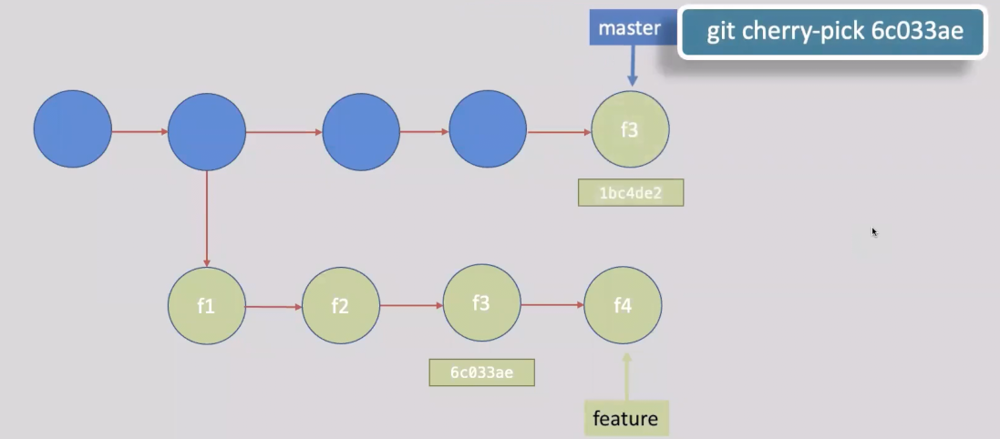

# git cherry-pick

## 1. The Core Concept (The Surgical Strike)
Unlike `git merge` (which takes an entire branch's history), `git cherry-pick` allows you to select **one specific commit** from any branch and apply it to your current branch. It is a surgical tool used to duplicate specific changes without bringing in unwanted, unfinished code.

## 2. The Story (The Project Rescue)
Imagine you are building a project. You are working on a messy, experimental branch called `feature/login`. 

While messing with the logic, you notice a terrible bug in the UI and fix it in a single commit (Hash: `a1b2c3d`). 

The `main` branch urgently needs this UI fix for a demo tomorrow! However, you **cannot** merge the `feature/login` branch into `main` because the code is broken. 
**The Solution:** You switch to `main`, and you `cherry-pick` the commit `a1b2c3d`. The UI fix is securely added to `main`, while the broken code stays behind on the feature branch.

## 3. The Architecture (Under the Hood)
When you cherry-pick a commit, Git does **not** move the original commit. 
1. Git calculates the exact `diff` (the specific lines added/removed) of that commit.
2. It copies that `diff` and applies it to your current working tree.
3. It creates a **brand new commit object** with a completely **new SHA-1 Hash**. 
*Note: The original commit and the cherry-picked commit are now identical twins, but they have different IDs.*

## 4. Essential Commands
- **`git cherry-pick <commit_sha>`**: Apply a single commit to your current branch.
- **`git cherry-pick <sha_A> <sha_B>`**: Apply multiple specific commits in sequence.
- **`git cherry-pick <sha_A>..<sha_C>`**: Apply a range of commits (from A to C).
- **`git cherry-pick -n <commit_sha>`** (No Commit): Applies the code changes to your Staging Area (Index) but does *not* automatically create a commit. This is perfect if you want to review or modify the code before permanently saving it.



```bash
git cherry-pick 6c033ae
```



