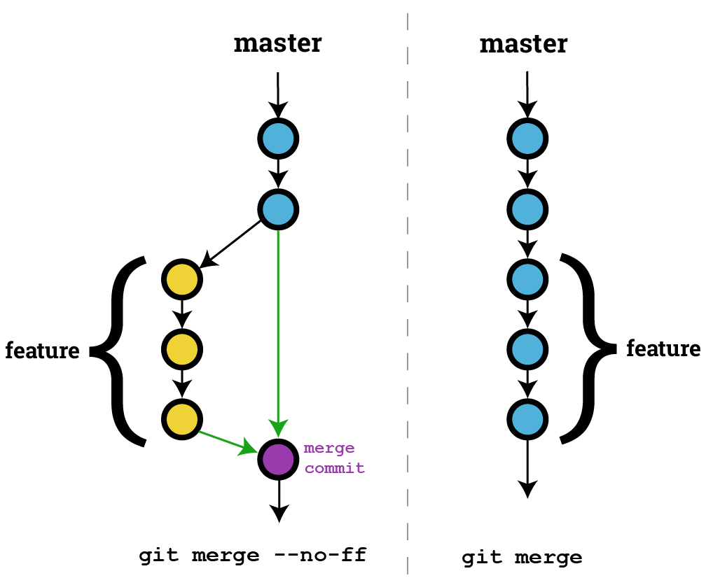
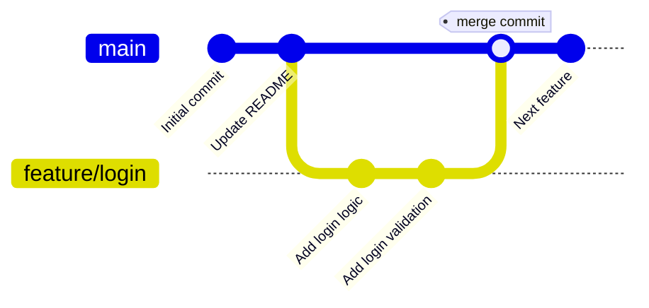
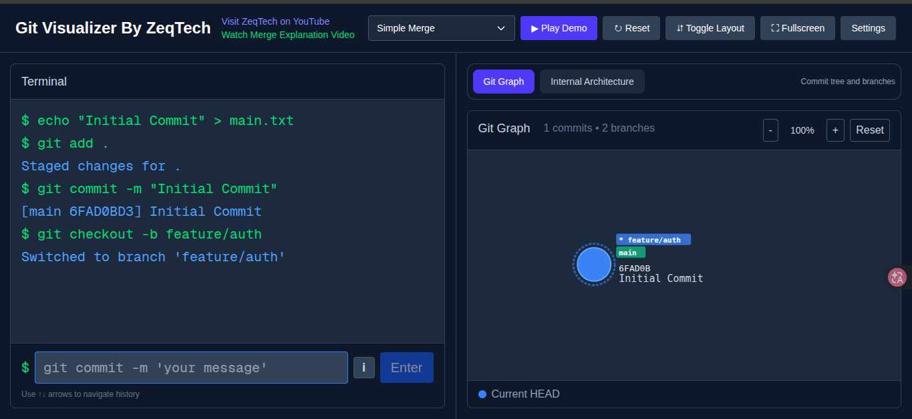
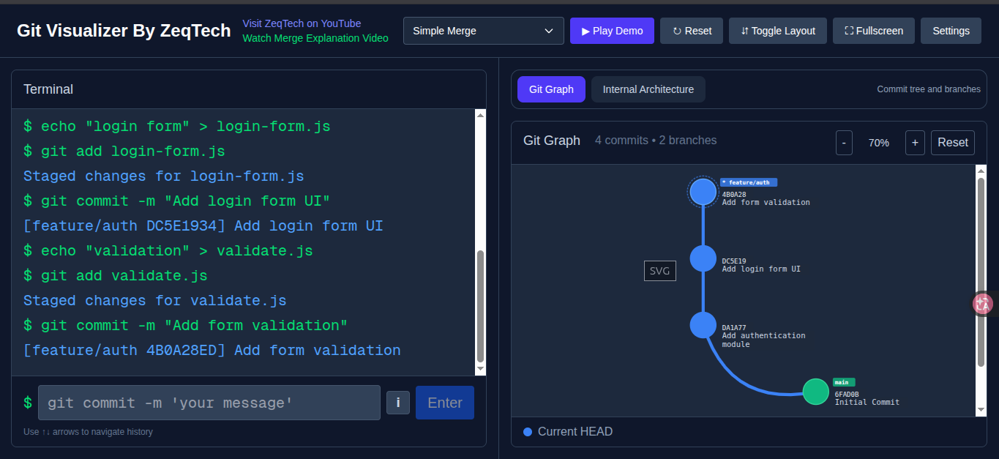
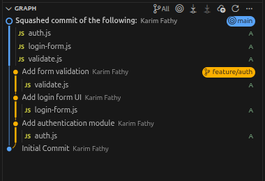

# Merge Options in Git

## 1. git merge --no-ff
The `--no-ff` flag forces Git to create a merge commit even when a fast-forward merge is possible. This preserves the branch history in the commit graph.

## Syntax
```bash
git merge --no-ff <branch-name>
```

## When to Use
- Maintaining explicit branch history
- Tracking feature branches in production
- Creating clear project timelines

## Example
```bash
# Create and switch to feature branch
git checkout -b feature/login

# Make changes and commit
echo "login logic" > login.js
git add login.js
git commit -m "Add login functionality"

# Switch back to main
git checkout main

# Merge with --no-ff to create merge commit
git merge --no-ff feature/login
```

## Output
```
Merge made by the 'recursive' strategy.
 login.js | 1 +
 1 file changed, 1 insertion(+)
```

## Key Differences
- **Without `--no-ff`**: Fast-forwards if possible, no merge commit created
- **With `--no-ff`**: Always creates a merge commit, preserving branch identity




## Tips
- Use in team projects for better history tracking
- Combine with `--no-edit` to accept default merge messages
- Pair with `git log --graph` to visualize branch structure





## 2. git merge --squash <branch-name>

The `--squash` flag combines all commits from a branch into a single commit before merging. This creates a cleaner history by condensing feature branch commits into one.

## Syntax
```bash
git merge --squash <branch-name>
```

## When to Use
- Keeping main branch history clean
- Merging feature branches with many commits
- Simplifying commit logs for releases
- Avoiding cluttered project timelines

## Example
```bash
# Create and switch to feature branch
git checkout -b feature/auth
```


```bash
# Make multiple commits
echo "auth module" > auth.js
git add auth.js
git commit -m "Add authentication module"

echo "login form" > login-form.js
git add login-form.js
git commit -m "Add login form UI"

echo "validation" > validate.js
git add validate.js
git commit -m "Add form validation"
```



```bash
# Switch back to main
git checkout main

# Merge with --squash to combine all commits
git merge --squash feature/auth

# Create a single commit
git commit -m "Add authentication feature"
```



## Output
```
Squash commit -- not updating HEAD
 auth.js | 1 +
 login-form.js | 1 +
 validate.js | 1 +
 3 files changed, 3 insertions(+)
```

Then the branch has to be deleted manually if desired:
```bash
git branch -D feature/auth
``` 

## Key Differences
- **Without `--squash`**: Preserves all individual commits from branch
- **With `--squash`**: Combines all commits into single staging area commit, but it in the branch that we want to merge and requires a manual commit to finalize
- **Vs `--no-ff`**: `--squash` creates cleaner history; `--no-ff` preserves branch commits

## Tips
- Use for feature branches with many work-in-progress commits
- Pair with meaningful commit messages for clarity
- Review changes before committing after 
