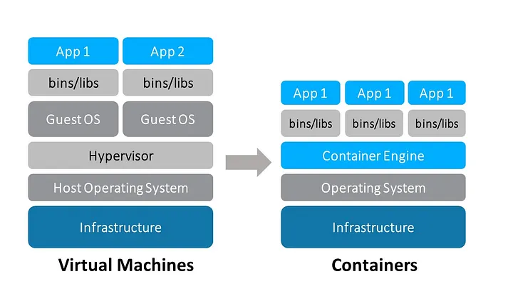

# Docker Story

---

## In the Past (The Traditional Way)

- Each part of a website (database, application code, web server) ran on a separate physical server (Bare Metal).
- Very expensive and wasted a lot of server resources.

---

## First Generation: Virtual Machines (VMs)

- VMs allowed running all parts on a single powerful server.
- Each VM still needed its own complete OS, consuming many resources.
- The Hypervisor (like VMware or VirtualBox) managed these VMs, but it was still resource-heavy.
---

## Second Generation: Containers

- **Docker** emerged, letting us run each part in a small, isolated "box" called a **container**.
- All containers share the same OS kernel, saving huge resources.

## Why Docker is Better than VMs?
- **Lightweight**: Containers share the host OS, so they use fewer resources than VMs.
- **Fast**: Containers start almost instantly, while VMs take minutes to boot.
- **Portable**: Docker containers can run anywhere, from a developer's laptop to a cloud server, solvging the "it works on my machine" problem.

## Difference between Docker and VMs:
- **VMs**: Each VM has its own OS, which makes them heavy and slow to start.
- **Docker**: Containers share the host OS, making them lightweight and fast.

---

## The Modern Architecture: Microservices

- Instead of a single giant container (a "Monolith"), best practice is to break the app into smaller, independent services.

---

## Crucial Clarification: What a Microservice Truly Is

### Horizontal Scaling / High Availability

- Running multiple copies of your web server (like nginx) or database container is called **Horizontal Scaling** or **High Availability**.
- `This is NOT Microservices` — it's an infrastructure decision.

### Microservice Architecture

- You have a **microservice architecture** when you split the Application Container into smaller, independent containers.
- Each handles a specific business function (e.g., a "users service" in one container, "products service" in another).
- This is an **application architecture** decision.

---

## Putting It All Together: Docker Compose

- To manage all these containers (Monolith or Microservices), use **Docker Compose**.
- It creates a private virtual network for communication and defines everything in a single `docker-compose.yml` file.
- Run the entire app with one simple command.

---
