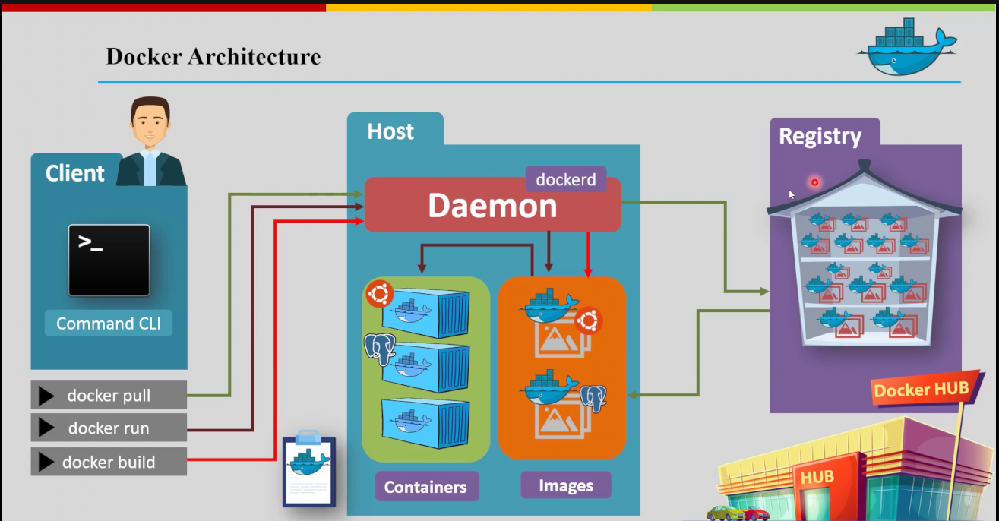
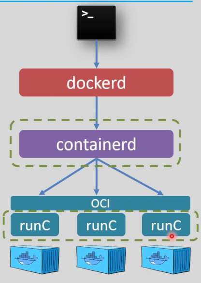
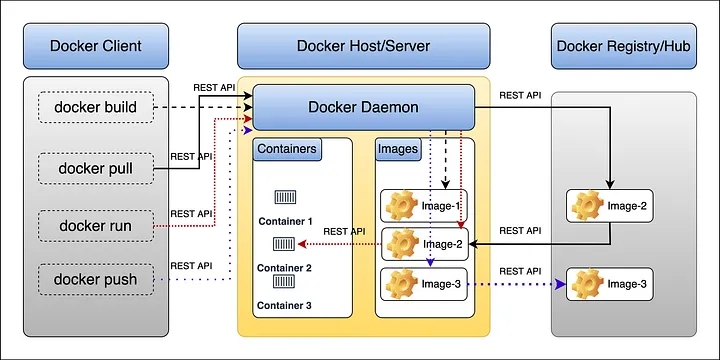
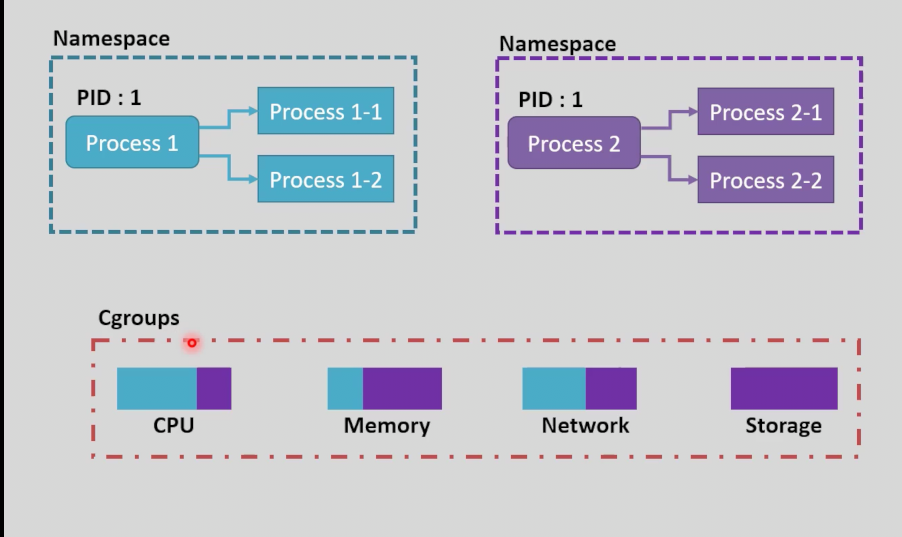

# Docker Architecture
## Table of Contents
- [Docker Architecture Overview](#docker-architecture-overview)
- [Docker Full Architecture](#docker-full-architecture)
- [Architecture Deep Dive](#architecture-deep-dive)
## Docker Architecture Overview


> **Docker Engine** = Docker Client (CLI) + Docker API (Socket) + Docker Server (Host)

> **Docker Desktop** = GUI + Virtual Environment + Docker Engine


> 

# Docker Full Architecture
## 1. Docker Engine:
- The Docker Engine is the core component of Docker that enables the building, running, and managing of Docker containers.
- It consists of the Docker Daemon, the Docker API, and the Docker CLI.
- The Docker Engine can be installed on various operating systems, including Linux, Windows, and macOS.

## 2. Docker Client:
- The Docker Client is the primary interface for users to interact with Docker.
- It accepts commands from the user and communicates with the Docker Daemon to execute those commands.
- The client can be a command-line interface (CLI) or a graphical user interface (GUI).

## 3. Docker Server/Host:
- The Host is responsible for managing Docker objects such as images, containers, networks, and volumes.
- It listens for Docker API requests from the Docker Client and performs the requested actions.
- The daemon can run on the same host as the client or on a remote host.
- ### Contains:
### 1. `Dockerd` (Docker Daemon)
- The Docker Daemon (`dockerd`) is the core service that runs on the host machine and manages Docker networks, volumes and images building.
<div align="center">



</div>
        
### 2. `containerd`:
- containerd is an industry-standard container runtime that manages the lifecycle of containers on a host system.
- It is designed to be embedded into a larger system, such as Docker, and provides a high-level API for managing containers.
- containerd handles tasks such as image transfer (pull, push), container execution, Networking and storage management.

### 3. `OCI` (Open Container intiative):
- the standard interface between the `cotnainerd` and `runc` 

### 4. `runc`:
- runc is a lightweight, portable container runtime that provides the low-level functionality for running containers.
- It is responsible for creating and managing container processes, as well as handling namespaces and cgroups for resource isolation.
- runc is used by containerd to execute containers on the host system.
- runc exited as it finsh its task, for instance: 
    > `docker create <image>`:
- create container then end runc process 
    > `docker start <image>`:
- create and start container then end runc process, and son on.

### 5. `shim`:
- The **shim** is a lightweight process that manages the lifecycle of a container.
- If Dockerd or Containerd stopped for any reason, the shim process will continue to run the container, ensuring that it remains operational. 
- This separation ensures that containers are not tied directly to the daemon's process, improving reliability and fault tolerance.


## 4. Docker Registries:
- Docker registries are repositories for Docker images. They allow users to store and share Docker images.
- The most popular Docker registry is `Docker Hub`, but there are also private registries available for organizations to use.

# Architecture Deep Dive:

## 1. The Unix Socket (`/var/run/docker.sock`)

* **What it is:** 
    - A Unix domain socket used for Inter-Process Communication (IPC) on the same host machine.

* **Contrasted with Network Sockets:**
    - Unlike TCP/IP sockets (like those used in PHP for web requests over an IP and port).
    - A Unix socket uses a physical file path on the hard drive to pass data directly through the OS kernel's memory.
    - This file is typically located at `/var/run/docker.sock`.

* **Why Docker uses it:** 
    - It allows the Docker Client to send REST API requests (JSON data) to the Docker Daemon without the overhead of the `network stack`, making local communication significantly faster and more efficient.
    - try `curl --unix-socket /var/run/docker.sock http://localhost/images/json | jq` to see the raw JSON response from the Docker Daemon, which the Docker CLI then formats into human-readable output.

<div align="center">



</div>

## 2.  Docker Process Flows
- **Pull process:**  
    `Docker CLI ⎯[REST API]→ Docker Daemon (dockerd) → containerd → Docker Registry`
- **Start process:**  
    `Docker CLI ⎯[REST API]→ Docker Daemon (dockerd) → containerd → shim → runc`   
- **Run process:**  
    `Docker CLI ⎯[REST API]→ Docker Daemon (dockerd) → containerd → shim → runc`


## 3. Docker Objects:
- `Images`:
    - Docker images are read-only templates used to create containers. They contain the application and its dependencies.
- `Containers`:
    - Docker containers are runnable instances of Docker images. They are isolated environments that can run applications.
- `Networks`:
    - Docker networks allow containers to communicate with each other and with the outside world.
- `Volumes`:
    - Docker volumes are used to persist data generated by and used by Docker containers.
        

## 4. Permissions and the `docker` Group:
* The Docker Daemon (`dockerd`) runs with `root` privileges. Consequently, the socket file `/var/run/docker.sock` is owned by `root`.
* Adding your user to the Linux `docker` group grants read/write permissions to this socket file.
* `ls -l /var/run/docker.sock` will show that the socket is owned by `root` and has group permissions for `docker`.
* **Security implication:** Access to this socket is practically equivalent to having passwordless `root` access on the host Linux machine.

## 5. Demystifying the Docker CLI
The `docker command-line` tool is merely a frontend JSON parser.
We proved this by bypassing it entirely and interacting with the Daemon's REST API using a standard web request tool:

> `curl --unix-socket /var/run/docker.sock http://localhost/images/json`,
* which returns the raw JSON data of all Docker images.
* The Docker CLI takes this JSON and formats it into the user-friendly tables we see when we run commands like `docker images` or `docker ps`.
* This experiment demonstrates that the CLI simply formats the Daemon's raw JSON responses into human-readable tables.

>`curl --unix-socket /var/run/docker.sock http://localhost/images/json | jq` 
* can be used to pretty-print the JSON output for better readability.

>`curl --unix-socket /var/run/docker.sock http://localhost/containers/json`
* will show the raw JSON data of all running containers.

>`curl --unix-socket /var/run/docker.sock http://localhost/containers/json?all=true`
* will show the raw JSON data of all containers, including stopped ones.

>`curl --unix-socket /var/run/docker.sock http://localhost/volumes/json | jq`
* can be used to pretty-print the JSON output of all volumes for better readability.

>`curl --unix-socket /var/run/docker.sock http://localhost/networks/json | jq`
* can be used to pretty-print the JSON output of all networks for better readability.

>`curl --unix-socket /var/run/docker.sock http://localhost/version`
* will show the raw JSON data of the Docker version information.

>`curl --unix-socket /var/run/docker.sock http://localhost/info`
* will show the raw JSON data of the Docker system information.

and so on for other Docker API endpoints.


## 6. Namespaces & Cgroups: 
* **Namespaces**:
Isolate the Linux Processes
* **Cgroups**:
Identify Process Resources

> Docker uses the idea of Namespaces & Cgroups in Linux 

> Docker Container = Namespace + Cgroup



## 7. CI/CD Architectures: DinD vs. DooD
When running automation tools like Jenkins in a containerized environment, there are two primary approaches:

* **DinD (Docker-in-Docker):** Running an independent Docker Daemon *inside* the Jenkins container. It is resource-heavy and requires bypassing Linux security mechanisms (privileged mode).

* **DooD (Docker-out-of-Docker / Socket Binding):** Mounting the host's `/var/run/docker.sock` as a volume inside the Jenkins container. Jenkins acts purely as a client, commanding the host's Daemon to build/run containers as siblings to Jenkins, not inside it.


## 8. The Production Security Threat: Container Escape
While DooD is efficient for local development, it is extremely dangerous on internet-exposed CI/CD servers.
* **The Exploit:** If a hacker exploits a vulnerability (e.g., an RCE bug in a Jenkins plugin), they can gain a reverse shell inside the Jenkins container without needing a password.
* **The Escape:** Finding the mounted socket, the attacker can run: `docker run -v /:/host-root -it ubuntu bash`.
* **The Result:** The host's Daemon mounts the entire physical server's hard drive into the new container. The attacker now has full `root` access to the host's filesystem, leading to complete server compromise.
* **The Solution:** Use DiD or daemonless, unprivileged build tools like Kaniko or Buildah in production CI/CD pipelines instead of mounting the Docker socket.


## 9. Docker Client-Server remote Communication
- In normal case, the docker `client` and `server` communicate via the unix socket `/var/run/docker.sock` on the same machine.
- But communicating with a remote docker server is possible but need to be secured first, because the port used to communicate with the remote docker server is not encrypted, so if you want to communicate with a remote docker server you need to use `SSH tunneling` or `TLS` to encrypt the communication between the client and the server.
- This method is useful wheen you want to save your local machine resources and use the resources of a remote server to run your containers, or with `CI/CD` pipelines to run the build process on a remote server instead of the local machine. 
- Can you  communicate with a remote Docker Daemon? Lets see...


### Secure Remote Docker Connection (SSH Tunneling & Contexts)

Instead of running containers locally and consuming your machine's resources, you can configure your local Docker CLI (Client) to communicate securely with a remote Docker Daemon (Server) on a cloud machine. We will use **SSH Tunneling** to encrypt the traffic, and **Docker Contexts** to easily switch between local and remote environments.

### Prerequisites
1. **Local Machine:** Docker CLI installed, and an SSH Client.
2. **Remote Cloud Machine:** Docker Engine installed and running.
3. **SSH Access:** You must be able to SSH into the remote machine using an SSH Key (Passwordless authentication is highly recommended).

---

###  Step-by-Step Implementation

### Step 1: Verify SSH Connection
First, make sure your local machine can connect to the cloud server via SSH without any issues.
```bash
# Test the connection from your local terminal
ssh user@<CLOUD_SERVER_IP>
# Type 'exit' to return to your local machine once verified
```

### Step 2: Create a New Docker Context
Docker uses "contexts" to manage different daemon targets. By default, you are using the default context (your local daemon). Let's create a new one for the cloud.
```bash
# Create a context named 'cloud-prod' pointing to the remote SSH server
docker context create cloud-prod --description "Remote Cloud Production Server" --docker "host=ssh://user@<CLOUD_SERVER_IP>"
```
(Note: Replace `user` with your cloud user, e.g., ubuntu or root, and <CLOUD_SERVER_IP> with the actual IP)

### Step 3: List Available Contexts
```bash
docker context ls
```
You should see your newly created context `cloud-prod` in the list.


### Step 4: Switch to the Remote Context
```bash
docker context use cloud-prod
```

### Step 5: Verify the Remote Connection
Run a simple command to verify. The CLI is local, but the execution happens on the cloud!
```bash
docker info

docker ps
```
You should see information about the remote Docker Daemon, including its version, number of containers, images, and other details.

### Revert Back to Local Context
When you're done working with the remote server, you can switch back to your local Docker Daemon:
```bash
docker context use default
```


### Pro-Tip for CI/CD (Jenkins/GitHub Actions)
If you don't want to switch contexts globally, you can pass the host flag inline for a single command or set an environment variable for the session:
```bash
# Environment variable method (useful in CI pipelines)
export DOCKER_HOST="ssh://user@<CLOUD_SERVER_IP>"

# Inline command execution
docker -H ssh://${DOCKER_HOST} run -d nginx
```
- It is like telling Docker: "For this time only, and in this line only, take this command and execute it on the cloud machine." 
- The moment the line finishes, Docker forgets and goes back to looking at its local environment again.
- No permanent change happens