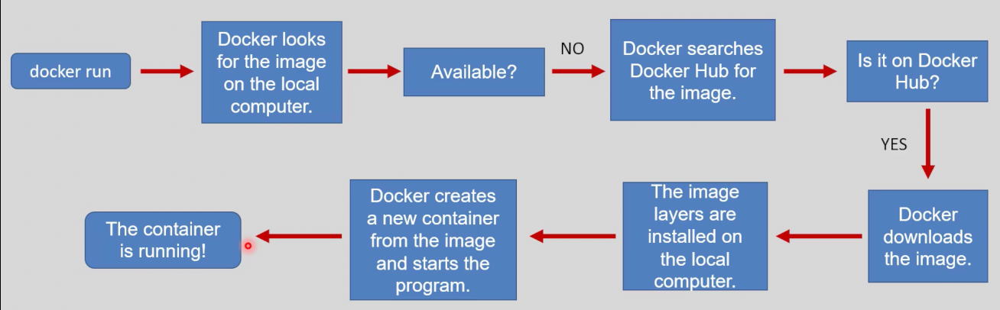

# Docker Basic Commands Cheat Sheet

## Table of Contents

- [Create & Run Containers](#create--run-containers)
- [Listing Containers and Images](#listing-containers-and-images)
- [Removing Containers and Images](#removing-containers-and-images)
- [Docker Inspect](#docker-inspect)
- [Docker Logs](#docker-logs)
- [Docker Commit](#docker-commit)
- [Docker Help](#docker-help)
- [Moving files to/from a container](#moving-filestoFroma-container)
- [Packaging images to a tar file and load it again](#packaging-images-to-a-tar-file-and-load-it-again)
- [Edit container metadata and show image layers](#edit-container-metadata-and-show-image-layers)

---

## Create & Run Containers

- ### **Search for an image:**
    ```sh
    docker search <image_name>
    ```
    - it has a lot of options, you can use `--filter` to filter the results, for example:
    ```sh
    --filter=is-official=true
    --filter=is-automated=true
    --filter=stars=3
    ```
- ### **Pull an image:**
    ```sh
    docker image pull <image_name>
    # or
    docker pull <image_name>
    ```

- ### **Create a container (with interactive terminal):**
    ```bash
    docker container create -it <image_name>
    # or 
    docker create -it <image_name>
    ```
    * **-i**: this flag allowing you to interact with the container but without an interactive terminal.
        - try:
            ```sh
            docker run -i alpine
            ```
            This will allow you to interact with the container, but you won't see the output of the container in real-time, and you won't have a terminal interface to work with.

    * **-t**: this flag allocates a pseudo-TTY, which provides a terminal interface for the container, making it easier to interact with but will not attach you with the container STDIN.
        - try:
            ```sh
            docker run -t alpine
            ```
            This will provide you with a terminal interface to interact with the container, but you won't be able to see the output of the container in real-time, and you won't be able to interact with the container's STDIN.    

    * **-it**: both willl allow you to interact with the container and attach you with the container STDIN, so you can see the output of the container in real-time.

    * **-d**:
    this flag runs the container in detached mode, meaning it runs in the background without attaching to your terminal, allowing you to continue using the terminal for other commands.
        - try:
            ```sh
            docker run -d alpine
            ```
            This will start the container in the background and return the container ID immediately.

- ### **Start and attach to the container:**
    ```sh
    docker container start -ai <container_name>
    # or 
    docker start -ai <container_name>
    ```
    * -a: this flag attaches the terminal to the container's STDOUT and STDERR, allowing you to see the output of the container in real-time.

- ### **All-in-one (create & run interactively):**
    ```sh
    docker container run -it <image_name>
    # or
    docker run -it <image_name>
    ```
    
    > ### docker run = docker pull + docker create + docker start

- ### **Stop a container:**
    ```sh
    docker container stop <container_name>
    # or
    docker stop <container_name>
    ```

- ### **Run in background (detached):**
    ```sh
    docker run -itd <image_name>
    ```

- ### **Execute a command in a running container:**
    ```sh
    docker container exec -it <container_name> bash <command>
    # or
    docker exec -it <container_name> bash <command>
    ```
- ### **Run a command in a new container:**
    ```sh
    docker container run -it <image_name> bash <command>
    # or
    docker run -it <image_name> bash <command>
    ```
- ### **Access all docker run command options:**
    ```sh
    docker run --help
    ```

- ### **Docker System monitoring:**
    ```sh
    docker top <container>
    ```
    - This command provides real-time statistics about the resource usage of running containers, including CPU, memory, network, and disk I/O.
    ```sh
    docker system df
    ```
    - This command provides a summary of the disk space usage by Docker, including images, containers, and volumes.
    ```s
    docker info
    ```
    - This command provides detailed information about the Docker installation, including version, storage driver, and system resources.

> Most OS images have a default shell, so specifying `bash` is often unnecessary.

---

## Listing Containers and Images

- ### **List images:**
    ```sh
    docker image ls
    # or
    docker images
    ```

- ### **List running containers:**
    ```sh
    docker container ls
    # or
    docker ps
    ```

- ### **List all containers:**
    ```sh
    docker container ls -a
    # or
    docker ps -a
    ```

---

## Removing Containers and Images

- ### **Remove an image:**
    ```sh
    docker image rm <image_name>
    # or
    docker rmi <image_name>
    ```

- ### **Remove a container:**
    ```sh
    docker container rm <container_name>
    # or
    docker rm <container_name>
    ```

- ### **Remove all images:**
    ```sh
    docker image rm $(docker images -q)
    ```

- ### **Remove all containers:**
    ```sh
    docker container rm $(docker ps -aq)
    ```

- ### **Remove all stopped containers:**
    ```sh
    docker container prune
    ```

- ### **Remove all unused images:**
    ```sh
    docker image prune
    ```

- ### **Remove all unused containers and images:**
    ```sh
    docker system prune
    ```

---

## Docker Inspect

- Get detailed info about a container or image:
    ```sh
    docker inspect <container_name_or_id>
    docker inspect <image_name_or_id>
    ```

---

## Docker Logs

- View logs of a running or stopped container:
    ```sh
    docker logs <container_name_or_id>
    ```

---

## Docker Commit

- Create a new image from a container's changes:
    ```sh
    docker commit <container_name_or_id> <new_image_name>
    ```

---

## Docker Help

- Get help with Docker commands:
    ```sh
    docker --help
    docker <command> --help
    ```

## Moving files to/from a container
- **Copy files from host to container:**
    ```sh
    # docker cp <host_path> <container_name>:<container_path>
    docker cp /path/to/local/file.txt my_container:/path/in/container/
    ```
- **Copy files from container to host:**
    ```sh
    # docker cp <container_name>:<container_path> <host_path>
    docker cp my_container:/path/in/container/file.txt /path/to/local/
    ```
## Packaing images to a tar file and load it again
- **Save an image to a tar file:**
    ```sh
    docker save -o <output_file.tar> <image_name>
    # Example:
    docker save -o my_image.tar my_image:latest
    # this will make a tar file named my_image.tar in the current directory that contains the my_image:latest image.
    ```
    * to save all imaegs to a tar file, you can use the following command:
    ```sh
    docker save -o all_images.tar $(docker images -q)
    ```

- **Load an image from a tar file:**
    ```sh
    docker load -i <input_file.tar>
    # Example:
    docker load -i my_image.tar
    # this will load the my_image:latest image from the my_image.tar file into your local Docker registry.
    ``` 

## Edit container metadata and show image layers
- **Command to edit container metadata (e.g., changing the restart policy or resource limits):**
    ```sh
    docker rename --name=my_new_container my_container
    docker history my_image
    ```