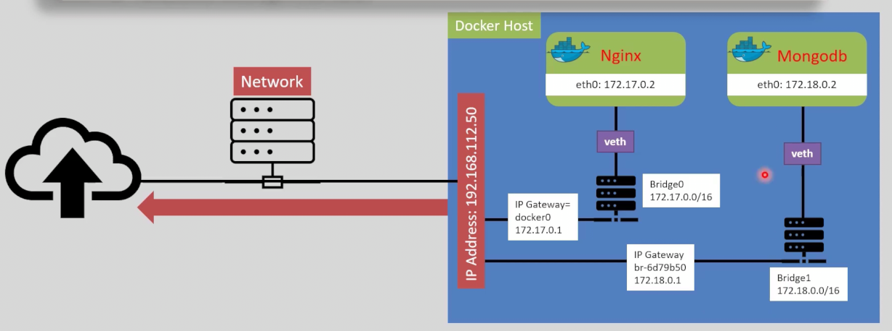
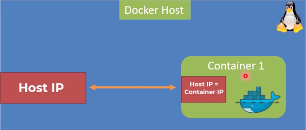
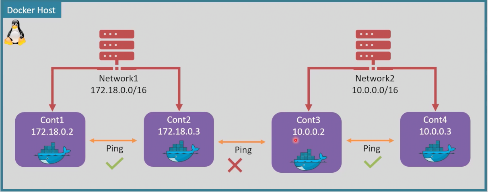
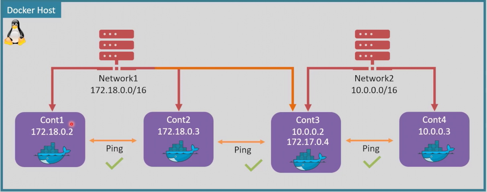
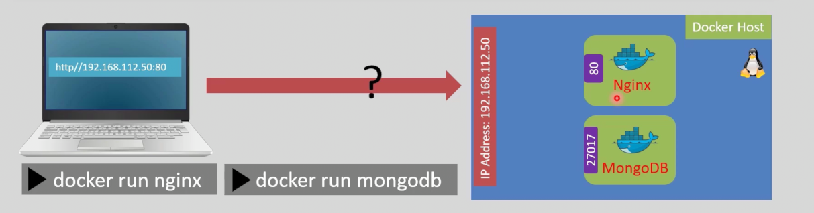
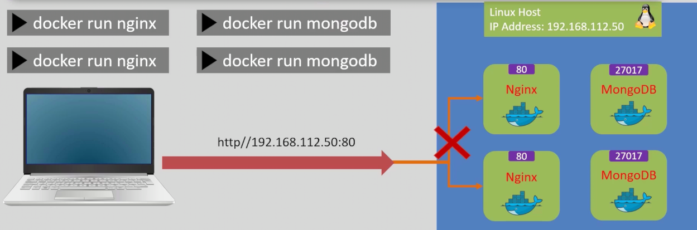
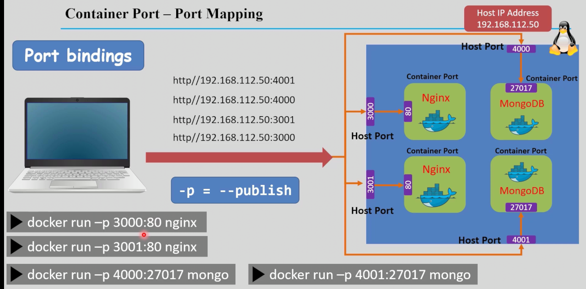
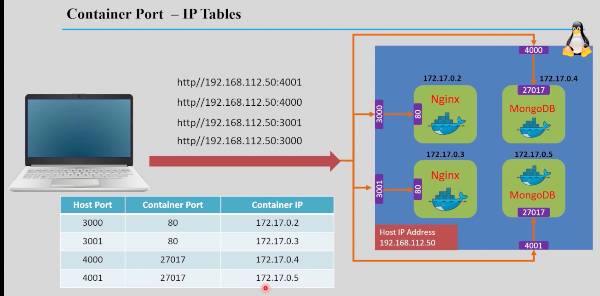

# Docker Networking 

Docker networking lets containers talk to each other, the host, and the outside world.

Mastering Docker networking is key for building scalable and secure containerized apps.

---

## Types of Docker Networks
- **Bridge**: Default network for containers on a single host.
- **Host**: Shares the host’s networking namespace.
- **None**: Disables networking for the container.
- **Overlay**: Connects containers across multiple Docker hosts.
- **Macvlan**: Assigns a MAC address, making the container appear as a physical device.

---
## 1. Bridge Network

The bridge network is Docker's default networking driver for single-host container communication.

Key characteristics include:
- **Default Network**: Docker automatically creates a bridge network named `bridge` upon installation, with all containers connected by default.
- **Container Communication**: Containers within the same bridge network, except the default bridge network, communicate using container names as hostnames, enabling service discovery without explicit IP management.
- **Network Isolation**: Bridge networks provide isolation between containers and the host while enabling container-to-container connectivity.
- **IP Address Range**: Bridge networks operate within the `172.17.0.0/16` range by default, with the `docker0` gateway serving as the default entry point.
- **Virtual Ethernet**: Each container connected to a bridge network gets a virtual Ethernet interface, allowing it to send and receive traffic through the bridge. a virtual Ethernet interface is created on the host side, which is connected to the `docker0` bridge, enabling communication between the host and the containers. also inside the container an ethernet interface is created like `eth0`.

> ###  If you tried to create a new container, it well be connected to the default bridge network, and you can see it by running `docker network inspect bridge`.




- any docker network has a default gateway, which is the `docker0` bridge interface on the host and virtual ethernet `veth` interface on the container side
- you can imagine the `bridge0` as a virtual switch that connects all containers via `veth` interfaces and the host via the `docker0` interface, allowing them to communicate with each other and the outside world.
- inside the container, you can see the `eth0` interface, which is connected to the `veth` interface on the host side, allowing the container to communicate with other containers and the host.

## 2. Host Network:
- The Host network simulate the host network, means, the container will share the same network namespace as the host, so it will have direct access to the host's network interfaces and ports.
- The container will have no IP address, it shares the host's network IP.

- 

## 3. None Network:
- Puts the container in its own network namespace, with no access to the host's network or other containers. This is useful for security isolation.

- The none network creates a completely isolated container with no external network interfaces, designed strictly for secure, offline processing tasks.

- This isolation cann't be broken by any means, the container will have no access to the host's network or other containers, and it will not be able to communicate with the outside world, even it you try to connect it to a network, it will not be able to communicate with the outside world, because it has no network interfaces.
    * Example: 
```sh
    docker run --net=none --name none_container -it alpine sh
    docker network connect bridge none_container
    docker logs none_container
    # you will see that: Error response from daemon: container cannot be connected to multiple networks with one of the networks in private (none) mode

```
## Basic Commands

- **List networks:**
    ```sh
    docker network ls
    ```
- **Inspect a network:**
    ```sh
    docker network inspect <network_name>
    ```
- **Create a network:**
    ```sh
    docker network create <network_name>
    # the default driver is bridge, but you can specify others.
    # the IP address range will be incremented from the last default IP address range
    ```
- **Create a network with specific subnet:**
    ```sh
    docker network create --subnet 192.168.1.0/24 my-bridge
    ```

- **Remove a network:**
    ```sh
    docker network rm <network_name>
    ```
- **Connect a container to a network:**
    ```sh
    docker network connect <network_name> <container_name>
    ```

- **Disconnect a container from a network:**
    ```sh
    docker network disconnect <network_name> <container_name>
    ```
- **Create a container with a specific network:**
    ```sh
    docker run -[d|i|t] --name <container_name> --network <network_name> <image_name>
    ``` 
- **Networking Diagnostic Tools**:
    - Container connectivity testing requires specific network diagnostic utilities: `ping` for ICMP echo requests and `curl` for HTTP/HTTPS protocol testing.
    - Required packages: `iputils-ping` (ICMP utilities), `iproute2` (advanced IP address and routing management), and `curl` (data transfer utility).

    
    Installation and usage:
    ```sh
    # Install required packages
    apt-get update && apt-get install -y iputils-ping iproute2 curl
    
    # Test inter-container connectivity
    docker exec -it <container_name> ping <other_container_name>
    ```
    
    - Network path inspection using `bridge link` command:
    ```sh
    bridge link
    # output: veth596b22f@enp0s31f6: <BROADCAST,MULTICAST,UP,LOWER_UP> mtu 1500 master docker0 state forwarding priority 32 cost 2 
   ```
---


## Example: Custom Bridge Network and Container Communication

Test connectivity between containers using `ping`:

```sh
docker network create --driver bridge --subnet 172.18.0.0/16 Network1
docker network create --driver bridge --subnet 10.0.0.0/16 Network2

docker run -d --name cont_1 --network Network1 nginx
docker run -d --name cont_2 --network Network1 nginx

docker run -d --name cont_3 --network Network2 nginx
docker run -d --name cont_4 --network Network2 nginx

# now you can try to ping from any container to the other in the same network
# but if you try to ping from cont_1 to cont_3 , it will fail because they are in different networks.
```



```sh 
docker network connect Network1 cont_3
docker exec -it cont_2 ping cont_3
# or 
docker exec -it cont_1 sh  
ping cont_3
# now you can ping from cont_3 to any container in Network1.
```

### Ping Results

<div align="center">

| Container Pair      | Result  |
|---------------------|---------|
| cont_1 <--> cont_1  | **Success** |
| cont_1 <--> cont_2  | **Success** |
| cont_1 <--> cont_3  | **Success** |
| cont_1 <--> cont_4  | **Failed**  |
| cont_2 <--> cont_2  | **Success** |
| cont_2 <--> cont_3  | **Success** |
| cont_2 <--> cont_4  | **Failed**  |

</div>

**Note:** Successful pings indicate that the containers can communicate with each other, while failed pings indicate isolation due to being on different networks.

---
### Notes:
* The network creation should be in a separate command
* You can't create a host network or none network, because they are predefined by Docker, but you can create a custom bridge network or overlay network.
```sh
    docker network create --driver host my-host-network #[ERROR] -> Error response from daemon: only one instance of "host" network is allowed

    docker network create --driver none my-none-network #[ERROR] -> Error response from daemon: only one instance of "none" network is allowed
```



### You should see replies, confirming network connectivity!


# Port Mapping

### 1. Port mapping allows you to expose a container's internal port to the host, enabling external access.

### 2. Each container has a default internal port (e.g., Nginx listens on port 80). To access it from the host, you need to map it to a port on the host machine.

### 3. You cannot access the container's internal port directly from the host without port mapping, because containers are isolated environments.


### 4. Even if you open a port inside the container, it won't be accessible from the host unless you explicitly map it to a host port.
```sh
# <Host_Port>:<Container_Port>
docker run -d -p 8080:80 nginx
```


### 5. Multiple containers can listen on the same internal port (e.g., 80) without conflict, but they must be mapped to different host ports to avoid collisions.


### 6. Port mapping can be selected randomly by Docker if you specify only the container port, but it's best practice to explicitly define the host port for clarity and consistency.
```sh
docker run -d -p 80 nginx  # Docker will randomly assign a host port
# the port range is from 49153 to 65535 
# OR 
docker run -d -P nginx  # -P will map all exposed ports to random host ports
# You can check the assigned ports by:
docker port nginx 
```
- How Docker knows the application port while using the `-P` flag? 
    - Docker relies on the `EXPOSE` instruction in the `Dockerfile` to identify which ports the application listens on. When you use `-P`, Docker automatically maps these exposed ports to random available ports on the host machine, allowing external access without manual port specification. 
    - 

### 7. Port mapping is based on IP tables rules that forward traffic from the host port to the container port, allowing external clients to access services running inside containers.


- **What happens?**  
    Port `80` inside the Nginx container is mapped to port `8080` on your host machine.

- **How does it work?**  
    Docker automatically configures `iptables` rules to forward traffic from the host to the container.

- **View current iptables rules:**
    ```sh
    sudo iptables -t nat -n -L
    ```
- **Traffic flow:**  
    ```
    Request → Host (8080) → Nginx Container (80)
    ```

> Now, you can access your Nginx server at: [http://localhost:8080](http://localhost:8080)

---


## Container Communication and DNS Resolution

1. You can reach the containers with its IP address only on the default bridge network, but if you create a custom bridge network, you can reach the containers with its name as well as its IP address. 

2. Docker provides an internal DNS so containers can resolve each other’s names. For example, with containers named `web` and `db`, the `web` container can reach `db` directly:

```bash
# Inside the web container:
ping db
```


### what will happen if I disconnect a container from bridge0 network?
- If you disconnect a container from the `bridge` network, it will lose its network connectivity to other containers and the host. The container will not be able to communicate with any other containers or access the outside world until it is reconnected to a network. It will not automatically connect to another network like `host` or `none`, and it will remain isolated until you explicitly connect it to a new network.

### what will happen if I disconnect a container from 'network1' network? will it be connected to bridge0 network?
- If you disconnect a container from a custom network like `network1`, it will not automatically connect to the default `bridge` network. The container will become isolated and lose all network connectivity until you manually connect it to another network, such as the `bridge` network or any other custom network you have created. Docker does not automatically switch networks for containers; you must explicitly manage their network connections.

---


## Troubleshooting:
1. To get all bridge networks on your system, you can use the following command:
```sh
ip -br address show type bridge
```

2. Then you can check the name of the bridge and its IP address, and then you can check the IP address of the container by running the following command:
```sh
docker network inspect <bridge_id> | grep -ie "IPv4Address" -ie "Name" 
# the network id is the is the same as the bridge name without the 'br-' prefix.
```
3. You get the interface of this bridge by running the following command:
```sh
ip link show master <bridge_name/id>
# The Output will show something like this:
# 4: veth596b22f@if5: <BROADCAST,MULTICAST,UP,LOWER_UP> mtu 1500 master br-4f3e
# 4 -> index of the interface, you can find it by running `ip link show` command
# veth596b22f -> name of the interface
# @if5 -> the interface is connected to the interface with index 5, you can find it from inside the container. 
# docker exec -it <container_name> ip link show 
```
```
bridge -> network -> interface -> veth -> container interface
```


## Further Reading

- [Docker Networking Documentation](https://docs.docker.com/network/)

---