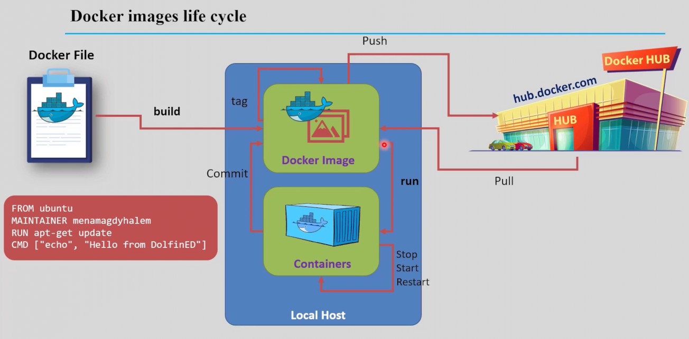
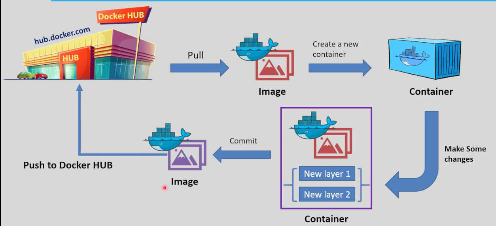
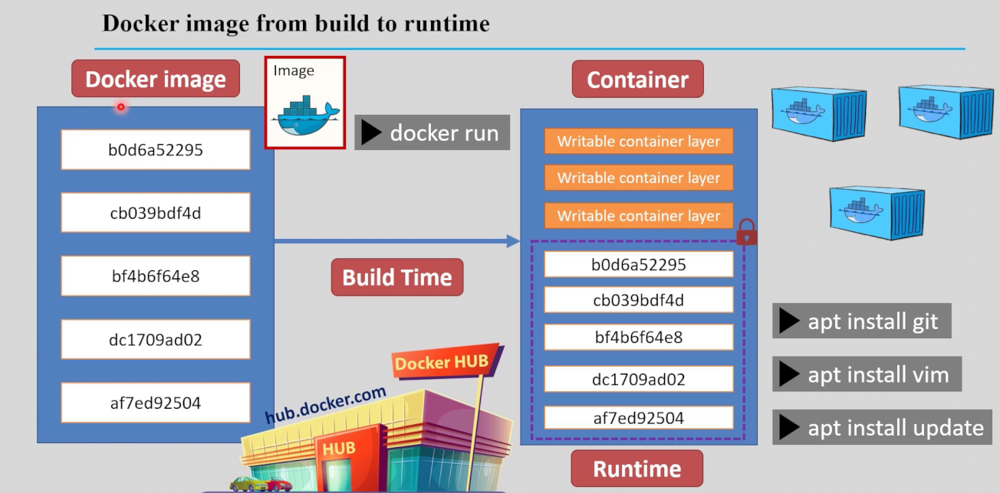
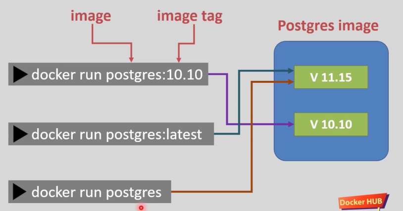

# Docker Images

## What is a Docker Image?
A Docker image is a lightweight, standalone, and executable software package that includes everything needed to run a piece of software: code, runtime, libraries, environment variables, and configuration files.

## Key Concepts

- **Layers:** Images are built in layers. Each instruction in a Dockerfile creates a new layer.
- **Immutability:** Images are immutable; once built, they do not change.
- **Portability:** Images can be shared and run on any system with Docker installed.



## Common Commands

```bash

# Build a Docker image from a Dockerfile
docker build -t my-image .

# Tag an image for a registry
docker tag my-image myusername/my-image:1.0.0

# Push an image to Docker Hub
docker push myusername/my-image:1.0.0


# List local images
docker images

# Pull an image from Docker Hub
docker pull myusername/my-image:1.0.0

# List the layers of an image
docker history myusername/my-image:1.0.0

# Run a container from an image
docker run -it myusername/my-image:1.0.0

# After that the container may has some edits and you want to make an image from it.

# Make an image from a running container
docker commit <container_id> my-new-image

# Remove an image
docker rmi my-image
```



## Push an image to Docker Hub
```bash
docker login  # Authenticate with Docker Hub
docker tag my-image myusername/my-image:latest  # Tag the image
docker push myusername/my-image:latest
```

## The Build time and Run time of an image
- **Build time**: The time it takes to build the image from a Dockerfile.
- **Run time**: The time it takes to start and run a container from the image.




## The Docker tagging 
- **Taggin Images**: mark image as a new release or a new version an so ond.
```bash
docker tag old_image new_image:1.0.1
```
### when pushing to docker hub you have to tag the image the the username of your account.
```bash
docker tag my-image myusername/my-image:latest
```




## Import vs Export vs Commit
- **Commit**: Creates a new image from a container's changes. It captures the current state of the container, including any modifications made to the filesystem.
```bash
docker commit <container_id> my-new-image
```
- **Export**: Exports a container's `filesystem` only  as a tar archive. It does not include the image's history or metadata.
```bash
docker export <container_id> > container.tar
```
- **Import**: Imports a tar archive as a new image. It creates a new image from the exported container's filesystem.
```bash
docker import container.tar my-new-image
```


## Best Practices

- Use official base images when possible.
- Minimize the number of layers.
- Clean up unnecessary files to reduce image size.
- Tag images with meaningful names and versions.

## Further Reading

### - [Best practices for writing Dockerfiles](https://docs.docker.com/develop/develop-images/dockerfile_best-practices/)
