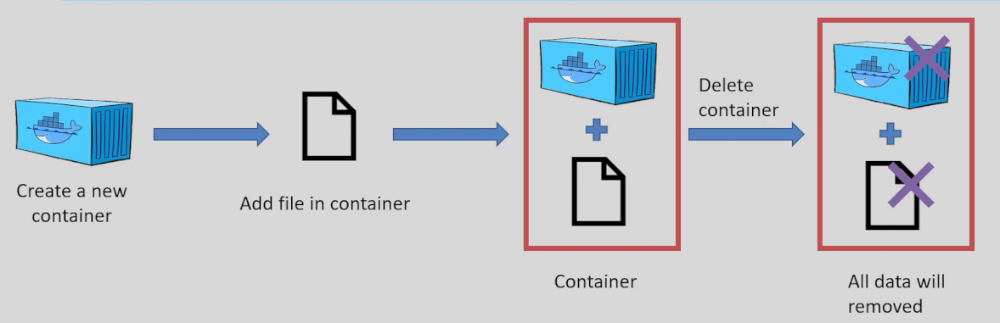
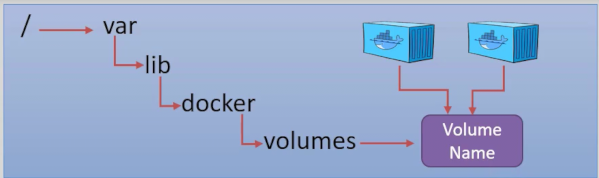
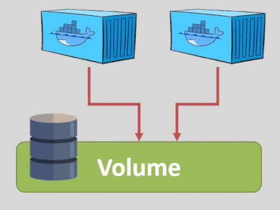

# Docker Volumes

**`Docker volumes`** are used to persist data generated and used by Docker containers.

They allow you to store data outside of the container's filesystem, making it easier to share data between containers and retain data even after a container is removed.

## Why Use Volumes?



- **Persistence:** Data is not lost when the container is deleted.
- **Sharing:** Multiple containers can access the same data.
- **Backup & Restore:** Volumes can be easily backed up and restored.


## Volume Store
Volumes are stored in a part of the host file system which is managed by docker, `/var/lib/docker/volumes`
 

## Creating and Using Volumes

### 1. Create a Volume

```bash
docker volume create my_volume
```

### 2. Use a Volume with a Container

```bash
docker run -d --name my_container -v my_volume:/data nginx
docker run -d --name my_container -v my_volume:/data:ro nginx
```

- This mounts the `my_volume` volume to the `/data` directory inside the container.
- If the directory `/data` does not exists, it will create it. 
- Any data stored in /data it actually stored in the docker host filesystem, that means it is persists.
- `:ro` stands for read only, the cotnainer can only read from the volume and cann't write any data in it. 
- You can connect many containers with a single volume


### 3. List Volumes

```bash
docker volume ls
```

### 4. Inspect a Volume

```bash
docker volume inspect my_volume
```

### 5. Remove a Volume

```bash
docker volume rm my_volume
```

# Try:


```sh
docker volume create alpine_volume
docker volume ls
docker run -it --name alpine_cont_1 -v alpine_volume:/vol_data_cont_1 alpine sh
echo "Hello from alpine_volume, This is alpine_cont_1!" > /vol_data_cont_1/file.txt

exit

docker run -it --name alpine_cont_2 -v alpine_volume:/vol_data_cont_2 alpine sh
cat /vol_data_cont_2/file.txt
#   |__"Hello from alpine_volume, This is alpine_cont_1!"

# You must see the exact same line in both files 
```


## Bind Mounts vs Volumes

- **Volumes:** Managed by Docker, stored in Docker's storage area.
- **Bind Mounts:** Map a specific file or directory on the host to the container.

Example of a bind mount:

```bash
docker run -v /host/path:/container/path nginx
# The Path has to be absolute, shortcut, use $(PWD)/<the directory location>:/container/path 
```

- How to Use the (container2 -> container1 -> volume) Architecture?
```sh
docker run -itd --rm --name container_2 --volume-from container_1 <image_name>
## Best Practices
- Use volumes for persistent or shared data.
- Avoid storing application code in volumes; use images for code.
- Regularly back up important volumes.
```

Learn more: [Docker Volumes Documentation](https://docs.docker.com/storage/volumes/)