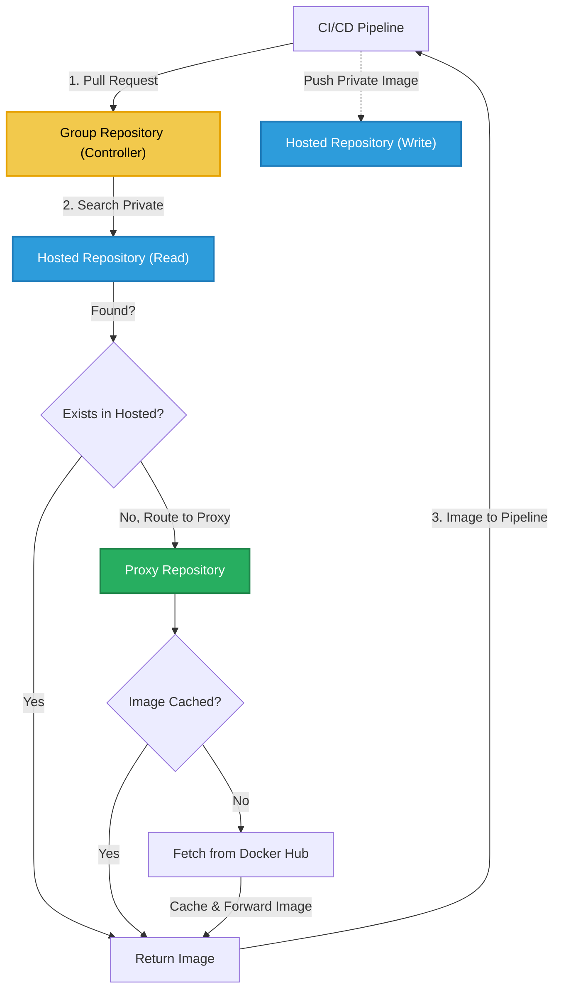
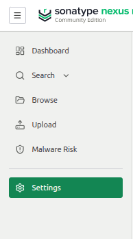
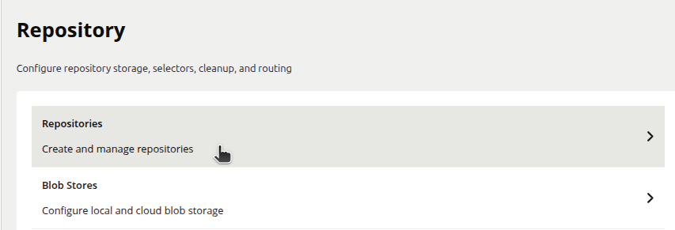
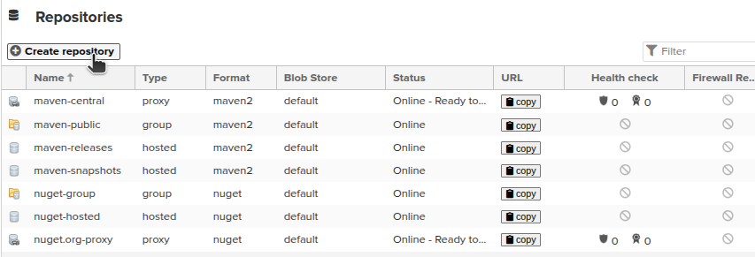
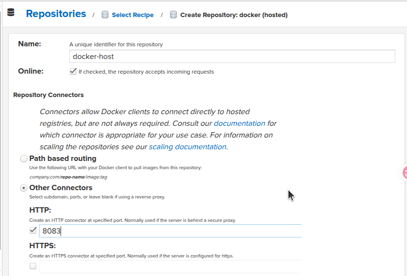
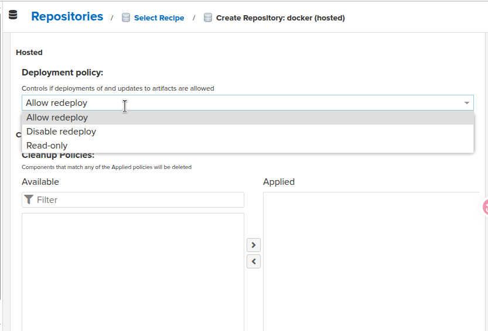
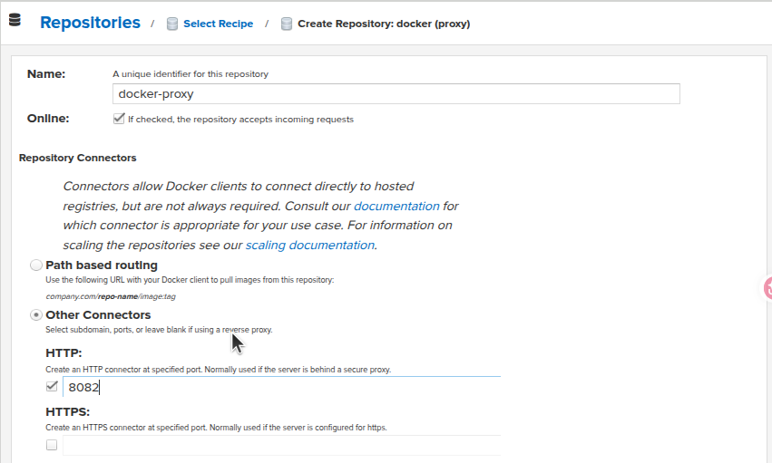
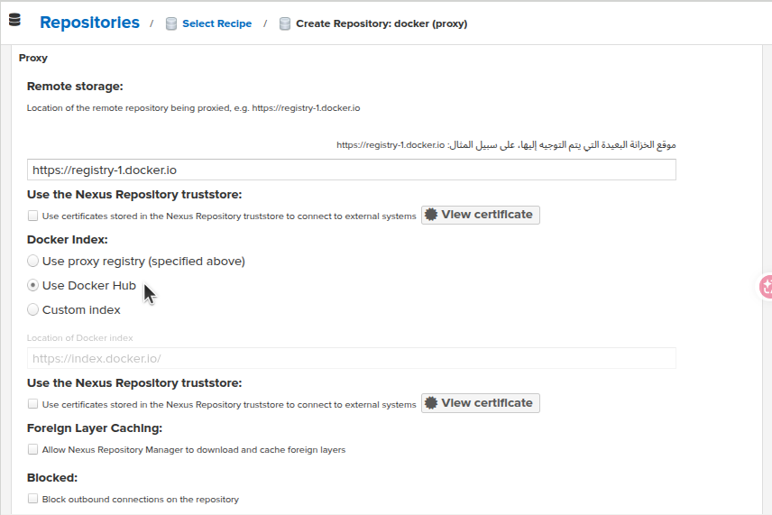
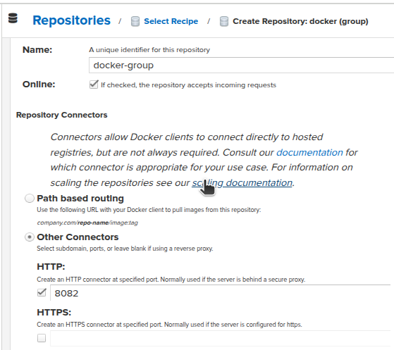
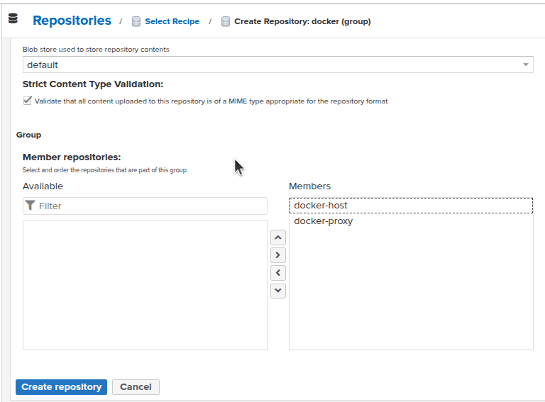

# Docker Artifact Registries

## Table of Contents
- [Types of Docker Registries](#types-of-docker-registries)
- [Nexus Repository Manager as a Docker Registry](#1-nexus-repository-manager-as-a-docker-registry)
    - [Why Nexus Repository Manager?](#why-nexus-repository-manager)
    - [Internal Nexus Architecture](#internal-nexus-architecture)
    - [Top Level Diagram](#top-level-diagram-of-using-nexus-with-docker)
    - [Nexus Setup](#nexus-as-docker-registry-setup)
    - [Configuration Requirements](#is-that-enough-for-nexus-to-work-as-a-docker-registry)
    - [Daemon Configuration](#the-etcdockerdaemonjson-file-should-look-like-this)
- [Amazon ECR](#2-amazon-ecr)


## Types of Docker Registries
- Public Registries
    * Docker Hub
- Private Registries
    * Nexus Repository Manager
    * ECR (Elastic Container Registry)
    * GCR (Google Container Registry)
    * ACR (Azure Container Registry)


# 1. Nexus Repository Manager as a Docker Registry

## Why Nexus Repository Manager?
Nexus Repository Manager is a universal private repository manager that supports multiple formats including Docker images.
in 2020, Docker founds out that it pays more for serving the images pull s and pushes, so they decided to limit the free plan to only 1 private repository and 100 pulls per 6 hours (no logged in users) for only one NAT IP and 200 pulls per 6 hours (logged in users) for only one NAT IP.

imagine a company that has 50 developrs and 10 servers all connected to only one IP by (NAT-Network Address Translation), the 100 pulls per 6 hours will be exhausted in less than 1 hour, so the company will have to pay for the Docker Hub service, which is not a good idea.

adding to that, the company preferd the on-premise solution.

Here comes the Nexus Repository Manager, which is a free and open-source solution that can be installed on your own server and used as a private Docker registry. It allows you to store and manage your Docker images, and it provides features like access control, image versioning, and integration with CI/CD pipelines.

## Internal Nexus Architecture

Nexus Repository Manager uses three repository types to organize traffic and secure code:

**Hosted Repository (The Private Vault)**
- Stores images built by your team (e.g., `myapp:v1`)
- Receives `docker push` operations from CI/CD
- Completely isolated from the internet (100% secure)

**Proxy Repository (The Cache Mirror)**
- Mirrors public images from Docker Hub (e.g., `nginx`, `mysql`)
- Read-only; no direct pushes allowed
- When we execute a docker pull for an external image, it fetches it from the internet and stores it locally as a (Cache) so if we request it again, it doesn't consume bandwidth or hit a rate limit.

**Group Repository (The Unified Hub)**
- Single URL endpoint for servers and CI/CD
- Communicate internally with Proxy and Hosted repositories to fetch images.
- Searches Hosted first, then queries Proxy if needed
- Simplifies client configuration

##  Top Level diagram of using nexus with Docker
- The core idea that is nexus is used as a proxy between the Docker Hub and the CI/CD pipeline, so the pipeline will pull the images from nexus instead of Docker Hub, and if the image is not found in nexus, it will request it from Docker Hub and store it in nexus for future use.



## Nexus as Docker Registry Setup:
- Nexus Repository Manager can be run as a Docker container, and it can be configured to act as a Docker registry.
- Lets Discuss what ports are needed to be opened for the Nexus Repository Manager to work properly as a Docker registry.
    - Nexus has a `web UI` that is necessary for interacting, so it needs an open port 
    - The docker server needs to communicate with the `Group Repository` in Nexus container to pull images, so it needs an open port as well. 
    - While The push process, the docker server communicate directely with `Host Repository` to store the image, so it needs an open port.
- Does Nexus need a volume?
    - of course it needs a volume to store the images, in fact, the basic Idea of nexus is to store stuff, so it absolutelly needs a volume for data persistance.


> The following example shows how to set up Nexus Repository Manager as a Docker registry using Docker Compose:


```yaml
services:
    nexus:
        image: sonatype/nexus3
        container_name: nexus
        hostname: nexus-proxy-machine
        ports:
            - 8081:8081 # UI port
            - 8082:8082 # Group Repository port
            - 8083:8083 # Hosted Repository port
        volumes:
            - nexus-data:/nexus-data
        restart: always
volumes:
    nexus-data:
```

## Is That enough for Nexus to work as a Docker registry?

No, we need to configure Docker to route the requests directelly to Nexus insted on Docker Hub.

Mainly we need a configuration file that activate the mirroring to Nexus insted of Dockerhub, this file is `/etc/docker/daemon.json`.

Lets Discuss what we need and how to implement this file:
### 1. **First, the Nexus container usually is locally hosted**
- so to it acccess it, it only needs the `IP address` and the `Port`, and the connection is made via `http` protocol, so the URL will be like this:
    `http://<nexus-ip>:<nexus-port>`.
- The problem here is that the docker daemon cann't communicate with the `http` protocol, it only can communicate with the `https` protocol.
- so we need to configure the Nexus to use `https` protocol instead of `http`.
- we can do that by using the json configuration block `insecure-registries` in the `/etc/docker/daemon.json` file, and add the Nexus URL to it, so the docker daemon will communicate with the Nexus via `http` protocol.
### 2. **Second, Nexus required credintails to access it.**
- Usually we write coommand like that `docker push <repo_name>/<image_name>:<image_tag>`
```bash
docker push karimfathy/nexus:1.0
```
- but now we need to push to localhost insted of a docker hub, so the command will be like that:
    `docker push <nexus-ip>:<nexus-port>/<image_name>:<image_tag>`

```bash 
docker push localhost:8083/karimfathy/nexus:1.0
```
- docker will see the repository name and understand that it will push to this URL.
- so it will try to authenticate with the Nexus and push the image to it.
- Where to enter the `Nexus credintials`?
    - we can use the `docker login` command to enter the Nexus credintials, so we can push and pull images from it without entering the credintials every time.
    ```bash
    docker login <nexus-ip>:<nexus-group-port>
    ```
    ```bash
    docker login 127.0.0.1:8082
    ```
    - after running this command, it will ask for the username and password, and after entering them, it will store them in the `~/.docker/config.json` file.
    - usually the default `username` is `admin` and the uniquely generated `password` can be found in the `admin.password` file inside the `volume`.
### 3. **Third, Which port should be used inside the `/etc/docker/daemon.json` file?**
- The Nexus has 3 ports, one for the UI, one for the Group Repository and one for the Hosted Repository, so which one should be used inside the `daemon.json` file?
- The answer is the `Group Repository` port, for pull operations, the docker daemon will communicate with the `Group Repository` to pull images, and the `Group Repository` will communicate with the `Hosted Repository` to store the images, so the `Group Repository` port should be used inside the `daemon.json` file.
- why not the `Hosted Repository` port?
- because of fpr push operations, the `Hosted Repository` port is actually locted in the URI of the docker push command `docker push localhost:8083/karimfathy/nexus:1.0`. so we don't need to add it to the `daemon.json` file.

### The `/etc/docker/daemon.json` file should look like this:
```json
{
  // enable experimental features, not used with production, but it is useful for testing and development.
  "experimental": true, 

  // add the Nexus URL to the list of insecure registries to allow the http communication for Group Repository and Hosted Repository
  "insecure-registries": [ 
    "127.0.0.1:8082",   // Group Repository port, the port is configured from the web UI of Nexus
    "127.0.0.1:8083"    // Hosted Repository port, the port is configured from the web UI of Nexus
  ],
  "registry-mirrors": [ // add the Nexus URL to the list of registry mirrors to allow the docker daemon to pull images from Nexus instead of Docker Hub 
    "http://127.0.0.1:8082" // communicate with the Group Repository to pull images, configured from the web UI of Nexus
  ]
}
```
> watch out: the json file doesn't allow comments, so remove the comments before saving the file.
also it need super user permission to edit it, so use `sudo` command to edit it.

### Finally, we need to restart the docker daemon to apply the changes.
```bash
sudo systemctl restart docker
```


### Setting Up Nexus Repository Manager as a Docker Registry from Web UI

1. Open the Nexus web UI in your browser (`http://localhost:8081`).
2. Log in with the default credentials:
    - **Username:** `admin`
    - **Password:** Retrieved via `docker exec nexus cat /nexus-data/admin.password`
3. Change the password to a secure one when prompted.
4. Enable anonymous access to make docker ask nexus first, but it is preferd to disable it for security resons 
5. Navigate to **Settings** → **Create Repository** and select the repository type (`docker (hosted)` or `docker (proxy)`).

    
    > Access the repository configuration panel from the Settings menu.

    
    > Select repository creation options.

    
    > Choose the repository type and configuration.

6. Configure **Group**, **Hosted**, and **Proxy** repositories:

    #### Creating Hosted Repository
    
    > Enter the repository name and port for hosted images.

    **Deployment Policy Configuration:**
    - **Allow Redeploy:** Permits overwriting images with the same tag
    - **Disable Redeploy:** Prevents duplicate tag deployments

    
    > Select the appropriate deployment policy for your use case.

    #### Creating Proxy Repository
    - no need to set any port, as the proxy repository will be accessed through the group repository port.
    
    > Configure proxy repository name and settings.

    **Remote Storage URL:** `https://registry-1.docker.io/` (Docker Hub mirror)

    
    > Set the remote storage URL to cache Docker Hub images.

    #### Creating Group Repository
    
    > Enter the group repository name and port.

    **Group Members Order:** Configure to search **Hosted first**, then **Proxy**.
    

    
    > Arrange repositories in priority order for image lookup.
    **Don't forget to allow the annoymous docker pull access for the group repository and proxy repository, so the docker daemon will ask nexus first before going to docker hub.**


### For docker push:
you need to tag the image with the Nexus repository URL and port, then push it using the `docker push` command. For example:
```bash
docker tag myapp:latest localhost:8083/myapp:latest
docker push localhost:8083/myapp
```

### For docker pull:
you can pull images from the Nexus group repository:
```bash
docker pull myapp:latest
```


## 2. Amazon ECR

Amazon Elastic Container Registry (ECR) is AWS's managed Docker container registry service offering:
- Fully managed service with no infrastructure to maintain
- Integrated with AWS services and IAM for authentication
- High availability and scalability
- Pay-per-use pricing model
- Support for image scanning and lifecycle policies

### How to use Amazon ECR:
1. Create an ECR repository in the AWS Management Console or using the AWS CLI.
```bash
aws ecr create-repository --repository-name my-ecr-repo --region us-east-1
``` 
2. Authenticate Docker to your ECR registry using the AWS CLI
```bash
aws ecr get-login-password --region us-east-1 | docker login --username AWS --password-stdin <aws_account_id>.dkr.ecr.us-east-1.amazonaws.com
```
3. Tag your Docker image with the ECR repository URI
```bash
docker tag myapp:latest <aws_account_id>.dkr.ecr.us-east-1.amazonaws.com/my-ecr-repo:latest
```
4. Push the image to ECR
```bash
docker push <aws_account_id>.dkr.ecr.us-east-1.amazonaws.com/my-ecr-repo:latest
```
