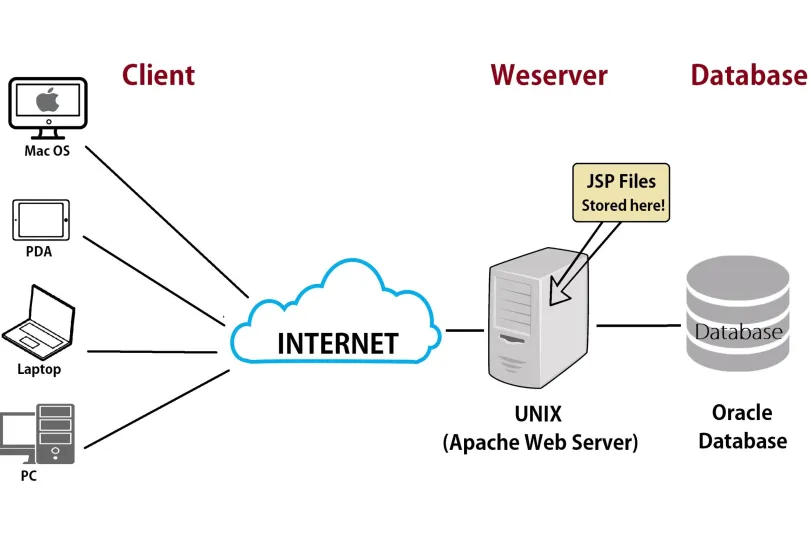
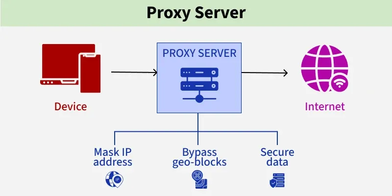
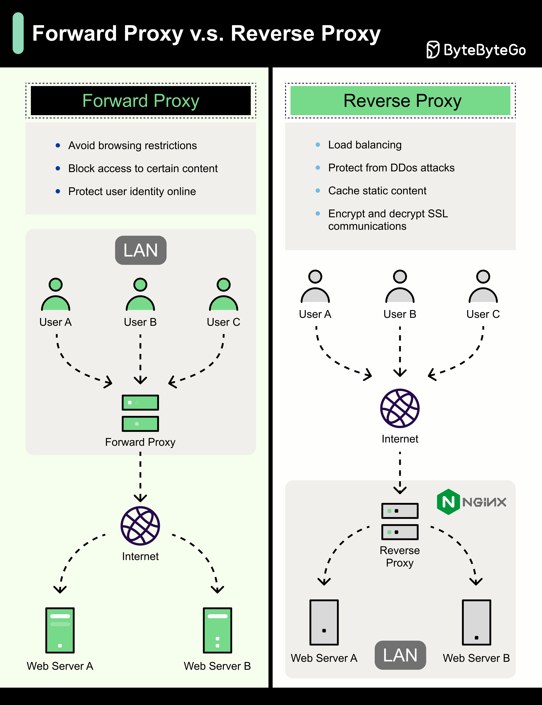

# NGINX

# Basic Concepts:

## Table of Contents
- [What is Web Server?](#what-is-web-server)
- [What is Proxy?](#what-is-proxy)
- [Difference Between Forward and Reverse Proxy?](#difference-between-forward-and-reverse-proxy)
- [What is NGINX?](#what-is-nginx)
- [Why Use NGINX?](#why-use-nginx)
- [NGINX for serving static content vs dynamic content](#nginx-for-serving-static-content-vs-dynamic-content)
- [NGINX configuration files](#nginx-configuration-files)

## What is Web Server?
Web servers are software applications that handle HTTP requests and responses. They serve web pages to clients (usually web browsers) over the internet. NGINX is a popular web server known for its high performance, scalability, and low resource consumption.

<div align="center">



</div>

## What is Proxy?
A proxy is a server that acts on behalf of another server. It receives requests from clients and forwards them to the target server.

<div align="center">



</div>

## Difference Between Forward and Reverse Proxy?
- **Forward proxy**: is used by clients to access resources on the internet, typically for the purpose of anonymity or filtering. eg., VPNs and web proxies.
- **Reverse proxy**: is used by servers to forward requests from clients to other servers, typically for load balancing or caching. eg., NGINX and Apache HTTP Server.

<div align="center">



</div>

in general, a forward proxy replaces the client, while a reverse proxy replaces the server. A forward proxy is used by clients to access resources on the internet, while a reverse proxy is used by servers to forward requests from clients to other servers.

## What is NGINX?
NGINX (pronounced "engine-x") is a high-performance web server and reverse proxy server. It is known for its ability to handle a large number of concurrent connections with low memory usage. NGINX can also be used as a load balancer, HTTP cache, and mail proxy.

## Why Use NGINX?
- **High performance**: NGINX mainly developed to handle the `C10k` problem, which refers to the challenge of handling 10,000 concurrent connections.
- **Low resource consumption**: NGINX uses an event-driven architecture that allows it to handle many connections with minimal resources.
- **Scalability**: NGINX can easily scale to handle increasing traffic by adding more servers to the pool.
- **Flexibility**: NGINX can be configured to serve static content, proxy requests to other servers, and perform load balancing.
- **Open-source**: NGINX is open-source software, which means it is free to use and can be modified to suit specific needs.
- **Security**: NGINX provides various security features to protect against common web attacks.
- **Caching**: NGINX can cache content to improve response times and reduce the load on backend servers.
- **Reverse proxy**: NGINX can act as a reverse proxy, forwarding requests from clients to other servers and providing additional features such as SSL termination and request routing.
- **Load balancing**: NGINX can distribute incoming traffic across multiple servers to improve performance and availability.


## NGINX for serving static content vs dynamic content:
NGINX plays two main roles in the architecture depending on the data type.
- If the request is for `"static"` files (like HTML, CSS, images, or Front-end files like React), it acts as a `Web Server` and we use the `root directive` to fetch them directly from the disk and deliver them to the user quickly.

- But if the request requires `"dynamic processing"` (like a Java or PHP application), it acts as a `Reverse Proxy` and we use the `proxy_pass` directive to forward the request to the backend container, which processes the data and returns it.

- In the best project designs, we combine both methods in one server: NGINX serves the static files to save time, and passes the heavy, dynamic work to the backend to reduce the load on it and achieve maximum performance.

nginx blocks (main contexts, Event context, HTTP context, Server Context, Location Context, Upstream Context, Mail Context) and their content.
what is context, directive, module and handler.


## NGINX configuration files:
### 1. **/etc/nginx/nginx.conf**: The main configuration file for NGINX, typically located in `/etc/nginx/`. It contains global settings and directives that apply to the entire server.
* This file contains contexts like `main`, `events`, and `http`. It also includes other configuration files from the `conf.d/` and `sites-enabled/` directories.
* Example of `nginx.conf` file almost all the time looks like this:
```nginx
user  nginx;
worker_processes  auto;
pid        /run/nginx.pid;

error_log  /var/log/nginx/error.log notice;

events {
    worker_connections  1024;
}

http {
    include       /etc/nginx/mime.types;
    default_type  application/octet-stream;

    log_format  main  '$remote_addr - $remote_user [$time_local] "$request" '
                      '$status $body_bytes_sent "$http_referer" '
                      '"$http_user_agent" "$http_x_forwarded_for"';

    access_log  /var/log/nginx/access.log  main;
    sendfile        on;
    #tcp_nopush     on;
    keepalive_timeout  65;
    #gzip  on;
    include /etc/nginx/conf.d/*.conf;
}
```
- This example can be used as a template for your own NGINX configuration file, but you may need to modify it to suit your specific needs.
- For example, you may want to change the `user` directive to run NGINX as a different user like `www-data`, or you may need to change the `worker_processes` directive to a specific number based on your server's CPU cores.

### 1. First lets talk about the `main` context:
- The `main` context is the top-level context in the NGINX configuration file. It contains global settings that apply to the entire server, such as the `user` and `group` that NGINX runs as, `the number of worker processes`, and the location of the `PID file`.

- The `main` context also includes other contexts, such as `events` and `http`, which contain additional settings and directives.

- example of `main` context:
```nginx
user  nginx;
worker_processes  auto;
pid        /run/nginx.pid;
error_log  /var/log/nginx/error.log notice;
```
   - The `user` directive specifies a system user and group that has least privileges that NGINX will run as.
        - for Ubuntu, the default user is `www-data`, and for CentOS, the default user is `nginx`.
   - The `worker_processes` directive specifies the number of worker processes that NGINX will spawn to handle incoming requests. Setting it to `auto` allows NGINX to automatically determine the optimal number of worker processes based on the available CPU cores.
   - The `pid` directive specifies the location of the PID file, which contains the process ID of the NGINX master process. This file is used to manage the NGINX process, such as stopping or restarting it.
   - The `error_log` directive specifies the location of the error log file and the logging level. In this example, the error log is set to `/var/log/nginx/error.log`, and the logging level is set to `notice`, which means that only important messages will be logged, this directive was specified in the `main` context to record any errors that occur during the startup of NGINX or while processing requests not even for single application, but for the whole server.

### 2. `Events` Context
Controls connection processing:
```nginx
events {
    worker_connections  4096;  # Max connections per worker
    use                 epoll; # Efficient event notification method
    multi_accept        on;    # Accept multiple connections at once
}
```
   - The `worker_connections` directive specifies the maximum number of simultaneous connections that each worker process can handle. In this example, it is set to `4096`, which means that each worker process can handle up to 4096 concurrent connections.
   - The `use` directive specifies the event notification method that NGINX will use to handle incoming connections. In this example, it is set to `epoll`, which is a scalable I/O event notification mechanism available on Linux systems.
    - The `multi_accept` directive specifies whether each worker process should accept multiple connections at once. In this example, it is set to `on`, which means that each worker process will accept multiple connections in a single event loop iteration, improving performance under high load.


### 3. `HTTP` Context
Core web server configuration:
```nginx
http {
    include       mime.types; # Include MIME types for file extensions
    default_type  application/octet-stream; # Default MIME type for unknown file types

    # Performance optimizations
    sendfile        on;
    tcp_nopush      on;
    tcp_nodelay     on;

    # Timeouts
    keepalive_timeout  65; # Keep-alive timeout
    client_body_timeout 60; # Timeout for reading client request body
    client_header_timeout 60; # Timeout for reading client request header
    send_timeout 60; # Timeout for sending response to client

    # Buffer sizes
    client_max_body_size 10M; # Maximum allowed size of the client request body
    client_body_buffer_size 128k; # Buffer size for reading client request body
    client_header_buffer_size 1k; # Buffer size for reading client request header
    large_client_header_buffers 4 8k; # Buffer sizes for handling large client headers

    # Logging
    log_format main '$remote_addr - $remote_user [$time_local] "$request" '
                    '$status $body_bytes_sent "$http_referer" '
                    '"$http_user_agent" "$http_x_forwarded_for"';
    access_log /var/log/nginx/access.log main; # Log format and location for access logs
}
```


