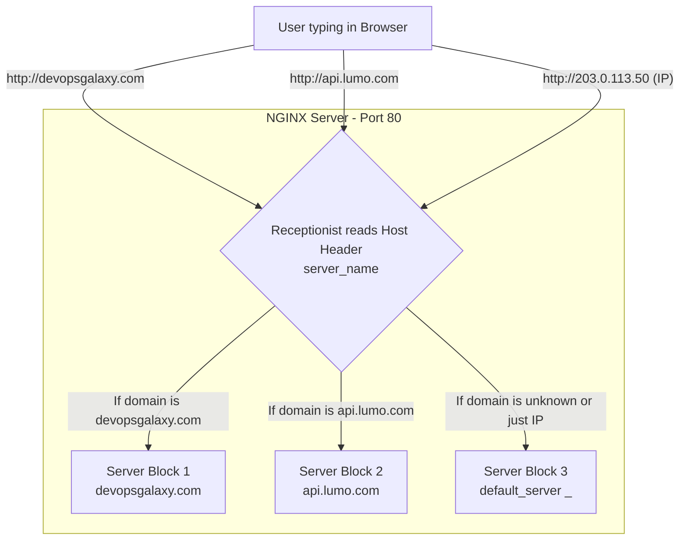

# NGINX: Server Blocks


## ` Server Blocks`
Server blocks are a way to host multiple websites on a single NGINX server. Each server block can have its own configuration, including domain name, root directory, and other settings. This allows you to serve different websites from the same server, each with its own unique configuration.

Lets Discuss the `server` context and its directives.

- `listen` tells NGINX to listen for incoming HTTP requests on port 80.
    ```nginx
    server {
        listen 80;
    }
    ```

- `listen` with ip address tells NGINX to listen for incoming HTTP requests on a specific IP address and port.
    ```nginx
    server {
        listen 192.168.1.100:80;
    }
    ```

- `server_name` specifies the domain name or IP address that this server block will respond to. You can use wildcards to match multiple subdomains.
    ```nginx
    server {
        listen 80;
        server_name example.com www.example.com;
    }
    ```
    * means: requested domain name in the browser must match the `server_name` directive in order for NGINX to use this server block to handle the request.
    * use the header `Host` in the HTTP request to determine which server block to use. 
    * When a user types a URL into their browser, the browser sends an HTTP request to the server, including the `Host` header that contains the domain name of the requested website.
    * NGINX reads this header and compares it to the `server_name` directives in its configuration files to determine which server block should handle the request.
    * This allows NGINX to serve different websites from the same server and port based on the requested domain name.


- `root` specifies the root directory for the website. This is where NGINX will look for the files to serve when a request is made to this server block.
    ```nginx
    server {
        listen 80;
        server_name example.com www.example.com;
        root /var/www/example.com;
    }
    ```
    * Imagine we wrote `root /var/www/html;` inside the settings, and the user requested this link in the browser: `http://devops-galaxy.me/assets/css/style.css`.
    * NGINX performs a literal addition equation: (The path written in the root) + (The URI requested by the user).
    * The path in the settings (root): `/var/www/html`. The URI (the part after the domain in the link): `/assets/css/style.css`.
    * The result is that NGINX will append them together, and will go look in the Linux system for this absolute path: `/var/www/html/assets/css/style.css`.

    * As for the Permissions issue: If NGINX goes to this path and actually finds the file, but the user running `NGINX` (like `www-data` or `nginx`) does not have Read permission for this file, the server will respond to the browser with a very famous error which is `403 Forbidden`.

   * You must differentiate between this and the `404 Not Found` error; `404` means the file doesn't exist on the hard drive at all, but `403` means the file is there but I, as NGINX, am "forbidden from touching it.


- `index` specifies the default file to serve when a request is made to the root directory. This is typically an HTML file, such as `index.html`.
    ```nginx
    server {
        listen 80;
        server_name example.com www.example.com;
        root /var/www/example.com;
        index index.html index.htm index.php;
    }
    ```
    * `index` directive can take multiple file names as arguments.
    * NGINX will look for these files in the order they are specified and serve the first one it finds.
    * If none of the specified files are found, NGINX will return a `403 Forbidden` or `404 Not Found` error, depending on the situation.

- `error_page` specifies the error page to display when a specific HTTP error occurs. You can use this directive to customize the error pages for your website.
    ```nginx
    server {
        listen 80;
        server_name example.com www.example.com;
        root /var/www/example.com;
        error_page 404 /404.html;
    }
    ``` 
    * The `error_page` directive can be used to specify `custom error` pages for different HTTP error codes.
    * For example, you can create a custom `404.html` page and specify it in the `error_page` directive. When a user requests a page that does not exist, NGINX will serve the custom `404.html` page instead of the default error page.
    * look at the path specified: `/404.html`. This is a relative path, which means that NGINX will look for the `404.html` file in the root directory specified by the `root` directive. In this case, it will look for the file at `/var/www/example.com/404.html`.

