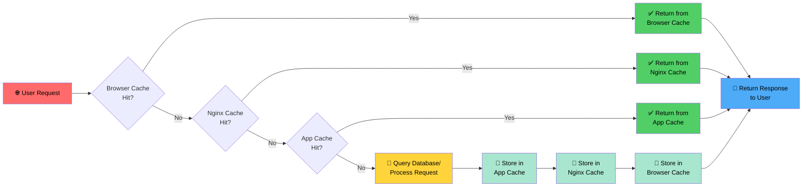

# Caching
Caching is a technique used to store copies of files or data in a temporary storage location, known as a cache, so that future requests for that data can be served faster. In the context of web servers like Nginx, caching can significantly improve the performance and speed of your website by reducing the load on your server and decreasing the time it takes to deliver content to users.

## Caching Levels

### 1. Browser Level

By setting appropriate HTTP headers, such as `Cache-Control`, `Expires`, and `ETag`, you can instruct the browser to cache certain resources for a specified period of time. This allows the browser to serve cached content for subsequent requests, reducing the need to fetch the same resources from the server again.

**Example:** Set `Cache-Control: max-age=3600` to cache resources for one hour.

```nginx
location /images/ {
    expires 1h;
    add_header Cache-Control "public";
}
```

### 2. Nginx Level

Nginx can be configured to cache responses from upstream servers or static content using the `proxy_cache` directive for backend servers or the `fastcgi_cache` directive for FastCGI servers. This reduces backend load and improves response times.

```nginx
http {
    proxy_cache_path /var/cache/nginx levels=1:2 keys_zone=my_cache:10m inactive=60m use_temp_path=off;
    
    server {
        location / {
            proxy_cache my_cache;
            proxy_pass http://backend_server;
            proxy_cache_valid 200 302 10m;
            proxy_cache_valid 404 1m;
        }
    }
}
```

### 3. Application Level

Caching can be implemented at the application level using caching libraries. For example, Python applications can use Flask-Caching or Django's caching framework to cache database queries, API responses, and rendered templates.


