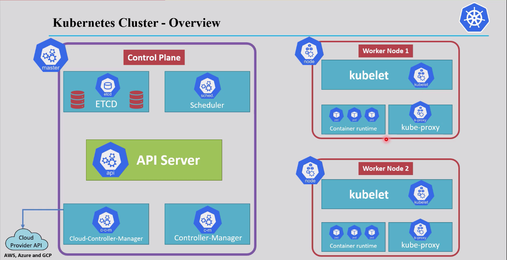
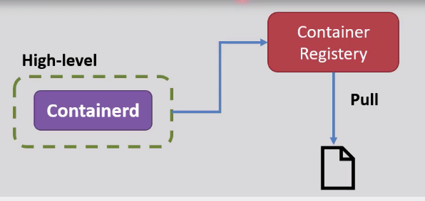
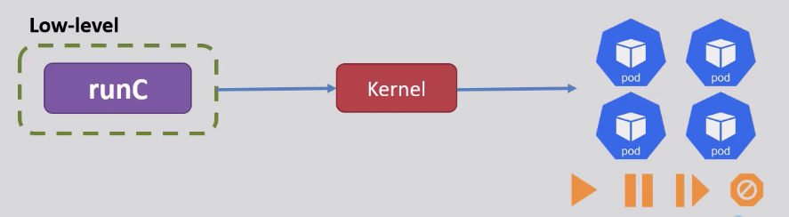
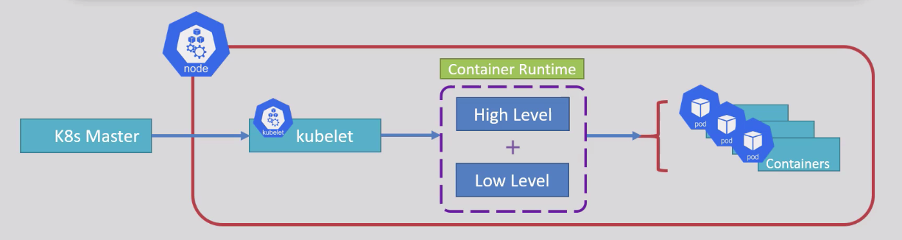
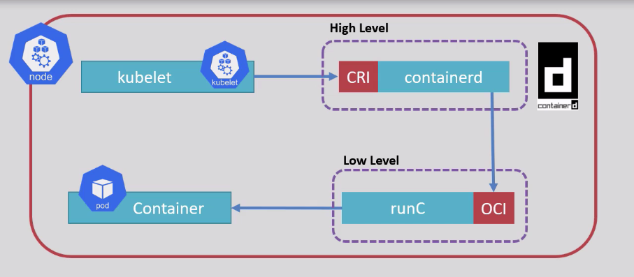
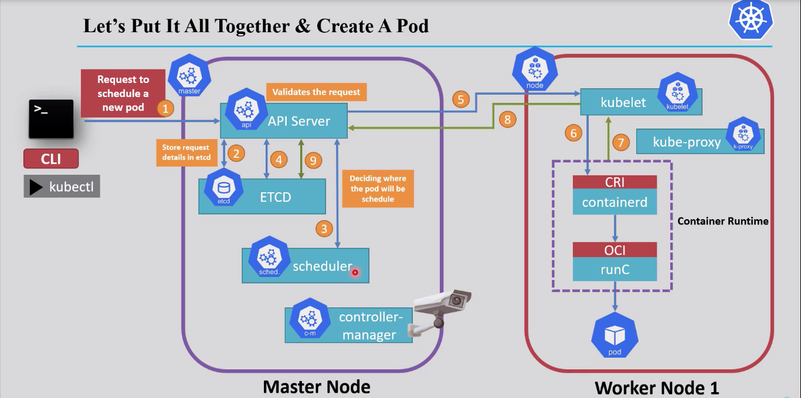
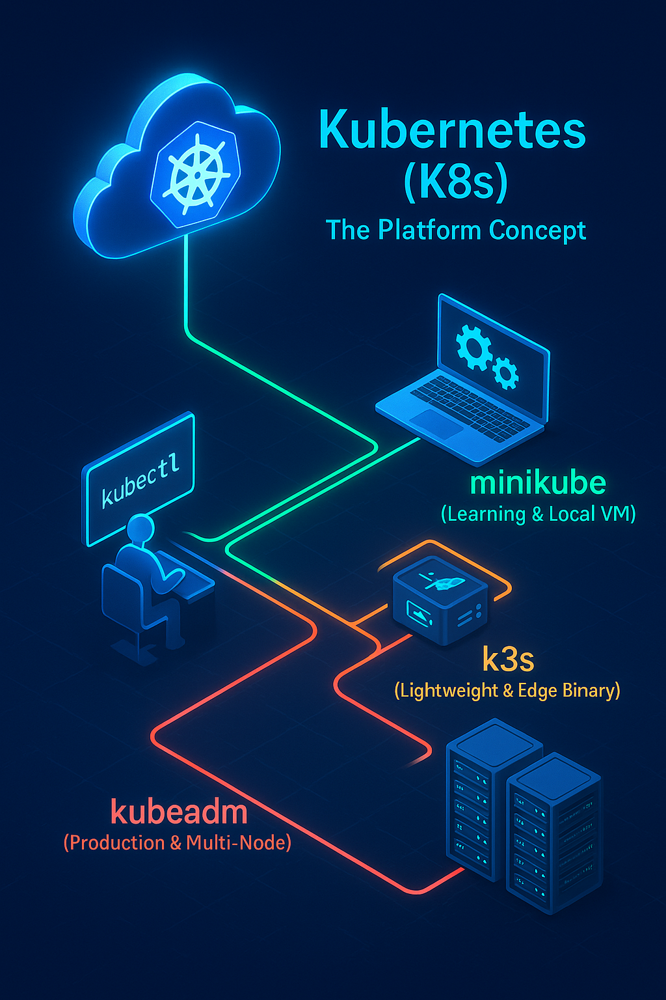
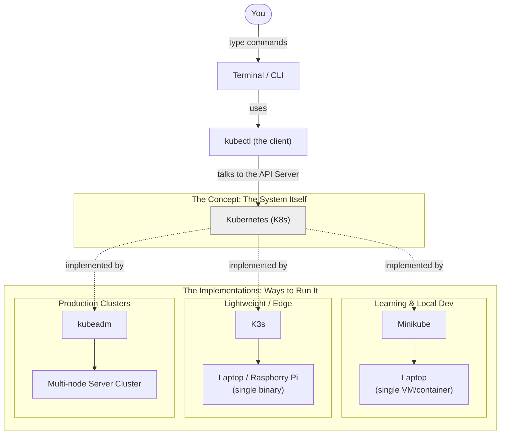

# Kubernetes Architecture

## Table of Contents
- [Overview](#overview)
- [1. K8s Features](#1-k8s-features)
- [2. Architecture Overview](#2-architecture-overview)
  - [2.1 Master Node (Control Plane)](#21-master-node-control-plane)
  - [2.2 Worker Node](#22-worker-node)
- [3. Container Runtime Deep Dive](#3-container-runtime-deep-dive)
- [4. Scenario: Creating a New Pod](#4-scenario-creating-a-new-pod)
- [5. Kubernetes vs. Minikube vs. Kubeadm vs. K3s](#5-kubernetes-vs-minikube-vs-kubeadm-vs-k3s)

---

## Overview

**Kubernetes (K8s)** is an open-source **container orchestration platform** that automates deploying, scaling, and managing containerized applications. "K8s" is simply short for Kubernetes — 8 stands for the 8 letters between the "K" and the "s".

## 1. K8s Features

- **Automatic Bin Packing** — schedules containers based on resource requirements, fitting them onto nodes as efficiently as possible.
- **Service Discovery & Load Balancing** — Pods get their own IP, and a single DNS name can load-balance traffic across a group of them.
- **Storage Orchestration** — automatically mounts the storage system of your choice (local, cloud provider, network storage).
- **Self-healing** — restarts failed containers, replaces Pods, and kills ones that don't respond to health checks.
- **Automated Rollouts & Rollbacks** — changes to the application are rolled out progressively, and reverted automatically if something goes wrong.

---

## 2. Architecture Overview

A Kubernetes cluster is split into two planes: the **Master Node (Control Plane)**, which makes the decisions, and one or more **Worker Nodes**, which actually run the application containers.

### 2.1 Master Node (Control Plane)

| Component | Responsibility |
|---|---|
| **API Server** | The single entry point for all communication inside the cluster. Every request (from `kubectl`, controllers, or kubelets) passes through it, gets validated (authentication, authorization, admission control), and — if valid — the resulting desired state is persisted to `etcd`. |
| **Scheduler** | Decides **which worker node** a newly created Pod should run on, based on resource availability, constraints, and affinity rules. It only makes the decision — it doesn't run anything itself. |
| **etcd** | A distributed key-value store holding the cluster's entire state: the desired state, configuration data, and cluster metadata. |
| **Controller Manager** | Runs the control loops that continuously compare the **current state** to the **desired state** stored in `etcd`, and takes action to reconcile any difference. |
| **Cloud Controller Manager** | Integrates with the cloud provider's API to manage cloud-specific resources (e.g. load balancers, cloud storage volumes). |

### 2.2 Worker Node

| Component | Responsibility |
|---|---|
| **Kubelet** | The node agent — runs on every worker node, watches the Pods assigned to it, monitors their health, and reports status back to the API Server. |
| **Kube-proxy** | A networking component on every node that maintains the network rules allowing traffic to reach the right Pods, whether that traffic comes from inside or outside the cluster. |
| **Container Runtime** | The software that actually runs the containers (e.g. Docker, containerd, CRI-O) — covered in detail below. |

---

## 3. Container Runtime Deep Dive

The Container Runtime is responsible for the full container lifecycle — pulling images, starting/stopping containers, and managing them based on instructions received from the kubelet (via gRPC/API calls). It's split into two layers that work together:

| Layer | Examples | What it actually does |
|---|---|---|
| **High-Level Runtime** | containerd (default in K8s), Docker, CRI-O | Exposes the API (gRPC) that the kubelet talks to; downloads and unpacks container images |
| **Low-Level Runtime** | runC (default in K8s), crun, rkt, lxc | Talks directly to the OS to actually start the container: sets up cgroups, namespaces, and mount points |

**High-Level Runtime:**

**Low-Level Runtime:**

> To successfully run a container inside a Pod, **both** layers are required — the high-level runtime alone can't start a container, and the low-level runtime alone has no image to work with.

As the container runtime landscape grew, the community standardized the interfaces between these layers:
- **CRI (Container Runtime Interface):** the standard interface between the **kubelet** and any **High-Level Runtime**.
- **OCI (Open Container Initiative):** the standard interface for **Low-Level Runtimes**.

---

## 4. Scenario: Creating a New Pod

Here's the full journey of a single `kubectl` command to create a Pod, from the API Server all the way down to a running container:

---

## 5. Kubernetes vs. Minikube vs. Kubeadm vs. K3s

  

These four names get mixed up constantly — the cleanest way to think about them is **3 categories**, not 4 competing things:

| Category | What it is | Example(s) |
|---|---|---|
| **The System** | The concept, the engine, the platform itself | Kubernetes |
| **The Controller Tool** | The client/interface used to operate Kubernetes via API calls | `kubectl` |
| **The Distros & Installers** | Different ways to actually stand up and run a real Kubernetes cluster — they differ in purpose, size, and intended use case | Minikube, K3s, kubeadm |

### Difference between the Distro/Flavor & Installers 
- **Distro/Flavor** — a complete, ready-to-run Kubernetes distribution (e.g. Minikube, K3s) that includes everything needed to run a cluster.
- **Installer** — a tool that helps you set up a Kubernetes cluster (e.g. kubeadm) but doesn't include the actual Kubernetes binaries themselves.

- **Minikube** — a single-node local cluster, meant for learning and quick experimentation on your own laptop.
- **K3s** — a lightweight, single-binary Kubernetes distribution, great for edge devices, IoT, or resource-constrained environments.
- **kubeadm** — a bootstrapping tool for standing up real, multi-node, production-grade clusters.