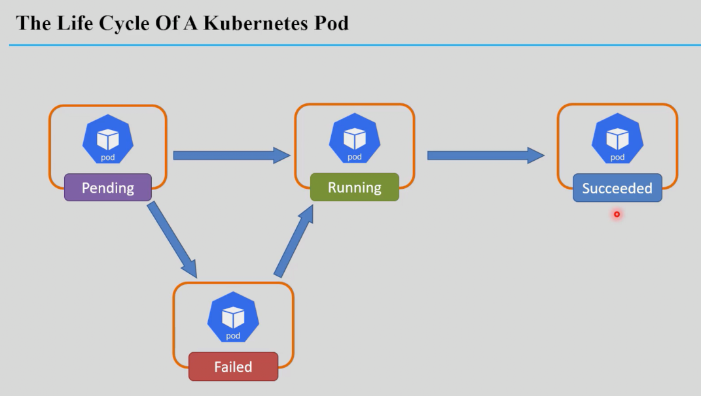
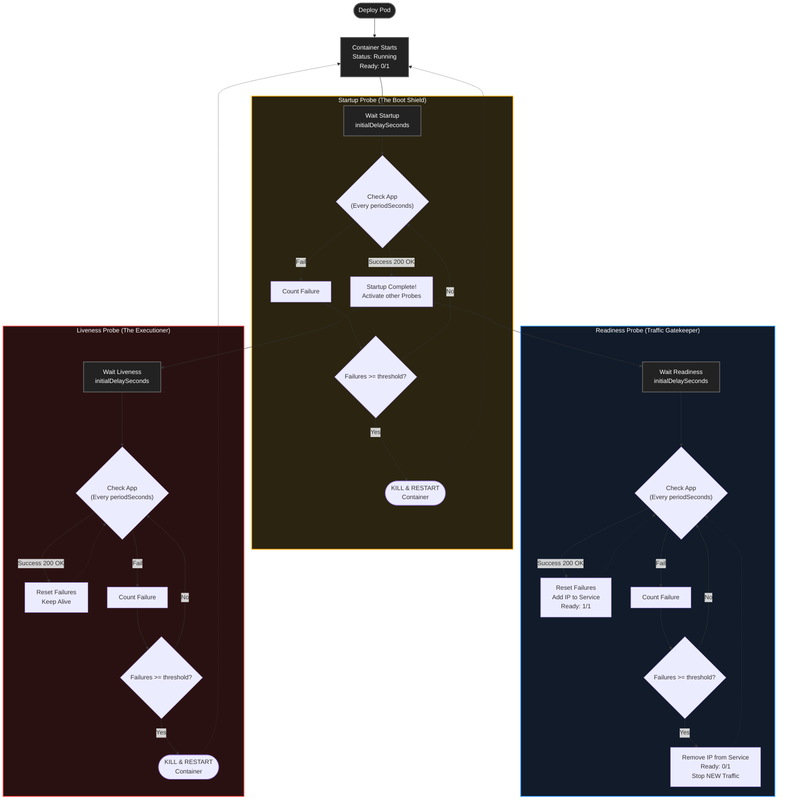
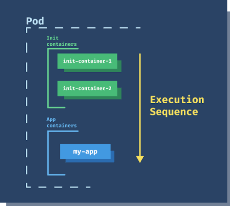
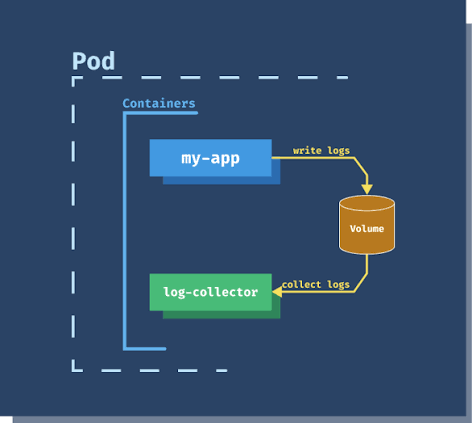
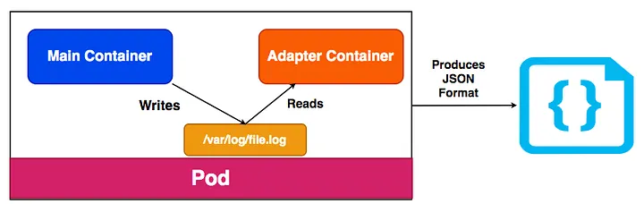
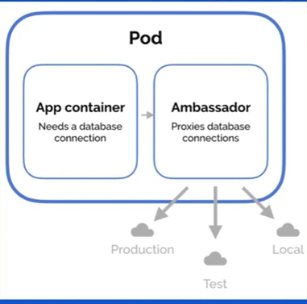

<div align="center">

</div>

# Pods in K8s

## Table of Contents
- [Overview](#overview)
- [1. Pod Lifecycle](#1-pod-lifecycle)
- [2. Probes: Liveness, Readiness & Startup](#2-probes-liveness-readiness--startup)
- [3. Pod Commands](#3-pod-commands)
- [4. Important Note: `imagePullPolicy`](#4-important-note-imagepullpolicy)
- [5. Multi-container Pods](#5-multi-container-pods)
- [6. Multi-container Design Patterns](#6-multi-container-design-patterns)
  - [Init Container Pattern](#61-init-container-pattern)
  - [Sidecar Container Pattern](#62-sidecar-container-pattern)
  - [Adapter Container Pattern](#63-adapter-container-pattern)
  - [Ambassador Container Pattern](#64-ambassador-container-pattern)

---

## Overview

- A **Pod** is the smallest deployable unit in Kubernetes — a single instance of a running process in the cluster.
- A Pod can contain **one or more containers**, which share the same network namespace, storage volumes, and other resources.
- Pods are **ephemeral** — created, destroyed, and recreated dynamically by the control plane to match the desired state in your config.
- Pods are rarely managed directly in real workloads — they're usually created and managed for you by higher-level objects like **Deployments**, **ReplicaSets**, and **StatefulSets**.

---

## 1. Pod Lifecycle

A Pod moves through several distinct phases over its life: **Pending**, **Running**, **Succeeded**, **Failed**, and **Unknown**.



**Watching a Pod's status:**
```bash
kubectl get pods -w
# or
kubectl events --for pod/<pod-name> --watch
# or
kubectl describe pod <pod-name>
```

| Phase | What's happening |
|---|---|
| **Pending** | The scheduler is still finding a suitable node, and/or the kubelet is still pulling images and creating containers. The Pod exists in the API but isn't running yet. |
| **Running** | The Pod has been assigned to a node, and the kubelet has successfully created and started all its containers. *(Note: "Running" doesn't necessarily mean the app inside is actually healthy or ready to serve traffic — that's exactly what probes, below, are for.)* |
| **Succeeded** | All containers terminated successfully and won't be restarted. Normal for one-off/batch workloads (e.g. `Jobs`) — not something you'd expect from a long-running web server Pod. |
| **Failed** | At least one container terminated in failure, and the Pod won't be restarted (typically when `restartPolicy: Never`). |
| **Unknown** | The Pod's state can't be determined — usually means the node it's on is unreachable. |

---

## 2. Probes: Liveness, Readiness & Startup

Reaching the **Running** phase only means the container's process started — it says nothing about whether the application *inside* it is actually working correctly, or ready to receive traffic. Probes are how the kubelet actively checks that, instead of just trusting the process is alive.

| Probe | Question it answers | What happens on failure |
|---|---|---|
| **`startupProbe`** | "Has this slow-starting app finished initializing yet?" | Until it succeeds, `livenessProbe`/`readinessProbe` are **disabled** — protects apps with a long boot time from being killed prematurely by an impatient liveness check |
| **`readinessProbe`** | "Is this container ready to receive traffic *right now*?" | The Pod is **removed from any Service's endpoints** — traffic stops being routed to it. The container is **not** restarted, it's just temporarily taken out of rotation |
| **`livenessProbe`** | "Is this container stuck/deadlocked and needs a restart?" | The kubelet **kills and restarts** the container (per the Pod's `restartPolicy`) |

**Note on In-Flight Requests:** When a `readinessProbe` fails and the Pod is removed from the Service endpoints, this only prevents *new* traffic from being routed to the Pod. Existing active connections (in-flight requests, such as a user downloading a large PDF) are not immediately dropped; the container continues processing them unless it crashes or the `livenessProbe` triggers a hard restart.

### How a Probe Actually Checks

Every probe type uses one of these mechanisms to decide pass/fail:

| Mechanism | How it checks |
|---|---|
| `httpGet` | Sends an HTTP GET to a path/port — any response in the `200–399` range counts as success |
| `tcpSocket` | Just tries to open a TCP connection to a port — success if the connection opens |
| `exec` | Runs a command inside the container — success if it exits with code `0` |
| `grpc` | Calls a gRPC health-checking endpoint inside the container |

**Best Practice for Spring Boot (Actuator vs. Exec):** Avoid using `exec` commands for health checks if possible, as running a shell command inside the container consumes unnecessary CPU overhead. Modern applications should expose dedicated HTTP health endpoints. For example, Spring Boot Actuator provides `/actuator/health/liveness` (ideal for startup and liveness probes as it checks JVM/context state without relying on the database) and `/actuator/health/readiness` (ideal for readiness probes as it validates external connections like databases).

### Common Tuning Fields

| Field | Meaning |
|---|---|
| `initialDelaySeconds` | Wait this long after the container starts before running the first check |
| `periodSeconds` | How often to repeat the check |
| `timeoutSeconds` | How long to wait for a response before counting it as a failure |
| `failureThreshold` | How many consecutive failures before taking action (restart / remove from endpoints) |
| `successThreshold` | How many consecutive successes needed to mark it healthy again |

**Understanding Counter Resets:** The `failureThreshold` tracks *consecutive* failures. If a probe fails twice but succeeds on the third attempt (returning a 200 OK), the failure counter is immediately reset to zero.

### Best Practices: Preventing Race Conditions & Polling Misalignment

Because `readinessProbe` and `livenessProbe` run continuously in parallel as infinite loops after boot, you must mathematically ensure that Readiness acts (cuts traffic) *before* Liveness acts (kills the container).

1.  **Zero Initial Delay with Startup Probes:** If you use a `startupProbe` as a boot shield, set `initialDelaySeconds: 0` for both readiness and liveness. The startup probe already guaranteed the app is fully booted, so the other probes should start guarding the container immediately.
2.  **Equal Period Seconds:** Set `periodSeconds` to the exact same value for both probes (e.g., 5 seconds). This prevents "polling misalignment," a race condition where one probe detects an issue significantly earlier simply because its timer fired first.
3.  **Staggered Failure Thresholds:** To ensure readiness acts first, configure a lower `failureThreshold` for readiness (e.g., 2) and a higher one for liveness (e.g., 5). This gives the application a grace period to recover without traffic before it is executed.
4.  **The Millisecond Collision:** If both probes exhaust their thresholds at the exact same millisecond, Kubernetes handles the actions asynchronously. The liveness probe's restart command takes precedence; the restarted container enters a `NotReady` state natively, resolving the conflict safely.

### CI/CD Pipeline Validation (Fail Fast)

To prevent deployment failures due to syntax errors (e.g., misspelling `containers` as `contaienrs`), integrate YAML validation into your CI/CD pipeline before applying the manifests to the cluster:
*   **`yamllint`:** Validates basic YAML syntax, indentation, and formatting.
*   **`kubeconform`:** Validates the YAML structure against the official Kubernetes OpenAPI schema for your specific cluster version, ensuring all fields are legally recognized by the Kubernetes API.

**Example — Spring Petclinic Deployment with Startup, Readiness, and Liveness:**
```yaml
apiVersion: apps/v1
kind: Deployment
metadata:
  name: petclinic-app
  namespace: petclinic-ns
spec: 
  replicas: 2
  selector:
    matchLabels:
      app: petclinic
  template:
    metadata:
      labels:
        app: petclinic
    spec:
      containers:
        - name: petclinic-container
          image: karimfathi1/spring-petclinic:latest
          imagePullPolicy: IfNotPresent
          ports:
          - containerPort: 8080
            protocol: TCP
          
          startupProbe:
            httpGet:
              path: /actuator/health/liveness
              port: 8080   
            initialDelaySeconds: 5
            periodSeconds: 5
            failureThreshold: 30
            successThreshold: 1

          readinessProbe:
            httpGet:
              path: /actuator/health/readiness
              port: 8080
            initialDelaySeconds: 0
            periodSeconds: 5
            failureThreshold: 2

          livenessProbe:
            httpGet:
              path: /actuator/health/liveness
              port: 8080
            initialDelaySeconds: 0
            periodSeconds: 5
            failureThreshold: 3
```

> Watching this Pod with `kubectl get pods -w`, the **READY** column (`1/1`) reflects the **readiness** probe, while a rising **RESTARTS** count reflects the **liveness** probe kicking in.


---

## 3. Pod Commands

- to get the list of pods
  ```bash
  kubectl get pods
  kubectl get pods -w # to watch the status of pods
  kubectl get pods -o wide # to get more details
  kubectl get pods -o yaml # to get the YAML output
  kubectl get pods -o json # to get the JSON output
  ```
- to apply a YAML file to create pods or other resources
  ```bash
  kubectl apply -f <file-name>.yaml
  ```
- to run a pod with a specific image
  ```bash
  kubectl run <pod-name> --image=<image-name>
  ```

- to delete a pod
  ```bash
  kubectl delete pod <pod-name>
  ```

- to describe a pod
  ```bash
  kubectl describe pod <pod-name>
  ```

- to get the logs of a pod
  ```bash
  kubectl logs <pod-name>
  kubectl logs <pod-name> -c <container-name> # if the pod has multiple containers, you can specify the container name to get its logs
  ```
  > **Note:** If the pod has more than one container, it will exec into a random container unless you specify one with `-c`.

- to connect to a pod's shell
  ```bash
  kubectl exec -it <pod-name> -- /bin/sh
  kubectl exec -it <pod-name> -- /bin/bash # if the pod has bash
  ```

  ```bash
  kubectl exec -it <pod-name> -c <container-name> -- /bin/bash # if the pod has bash
  ```

- to edit a pod's configuration
  ```bash
  kubectl edit pod <pod-name>
  ```
  > **Note:** The `edit` command is not only for pods; it can be used for any Kubernetes resource (Deployments, Services, ConfigMaps, etc.).
  > 
  > However, a running **Pod** is mostly **immutable**. You cannot edit most of its core fields (like `env`, `ports`, `probes`, or `volumeMounts`). 
  > The API server will only allow you to edit a few specific fields on an active pod, such as:
  > - `spec.containers[*].image` (Image name & tag)
  > - `spec.initContainers[*].image`
  > - `metadata` (Labels & Annotations)
  > - `spec.activeDeadlineSeconds`
  > - `spec.tolerations` (additions only)


- to delete all pods in a namespace
  ```bash
  kubectl delete pods --all -n <namespace-name>
  ```

- to delete all pods in all namespaces
  ```bash
  kubectl delete pods --all --all-namespaces
  ```

---

## 4. Important Note: `imagePullPolicy`

`imagePullPolicy` tells the kubelet **when** it should pull a container's image. It has three possible values:

| Value | Behavior | When it's the default |
|---|---|---|
| `Always` | Always pulls from the registry, even if the image already exists on the node | Automatic default when the image tag is `latest` or **omitted entirely** |
| `IfNotPresent` | Only pulls if the image isn't already present on the node | Automatic default for any **other, specific** tag |
| `Never` | Never pulls — only uses whatever's already on the node | Never a default — must be set explicitly |

```yaml
apiVersion: v1
kind: Pod
metadata:
  name: my-pod
spec:
  containers:
    - name: my-container
      image: my-image:latest
      imagePullPolicy: IfNotPresent
```

---

## 5. Multi-container Pods

A multi-container Pod contains more than one container. These containers share:
- the same network namespace (they can reach each other over `localhost`, that means they vave the exact same IP address but differ in listening port)
- storage volumes (If createing an `emptyDir` volume for instance, they can read and write from the exact location)
- and other Pod-level resources

---

## 6. Multi-container Design Patterns

> ⚠️ **Important distinction:** of the four patterns below, only the **Init Container** is an actual, dedicated Kubernetes field (`initContainers`) with special built-in behavior (runs first, sequentially, must succeed before app containers start). **Sidecar, Adapter, and Ambassador are design patterns, not special API fields** — all three are implemented using the exact same `containers:` list as your main app. The difference between them is purely about *the role each container plays*, not any distinct YAML syntax.
>
> *(As of Kubernetes 1.28+, there's also an optional "native sidecar" feature — an `initContainers` entry with `restartPolicy: Always` set on it — which starts before the app container and keeps running alongside it. That's a newer, opt-in mechanism; the classic sidecar pattern below, using the plain `containers` list, still works everywhere and is what you'll see most often.)*

### 6.1 Init Container Pattern

- Runs **before** the main application containers, used for setup tasks: preparing the environment, downloading dependencies, configuring the app.
- Defined under the dedicated `initContainers` field — runs **to completion** before any main container starts.
- If it fails, the kubelet retries it (per `restartPolicy`) until it succeeds — the Pod won't move on to its main containers otherwise.
- With multiple init containers, they run **sequentially** — each one must finish before the next starts.

> In this example, the init container writes a file to a shared volume and exits; the main container then serves that same file.

```yaml
apiVersion: v1
kind: Pod
metadata:
  name: my-pod
spec:
  initContainers: # <-- init containers are defined here
    - name: init-container
      image: busybox
      command: ['sh', '-c', 'echo "<h1>Hello, Karim!</h1>" > /var/www/html/index.html && sleep 5']
      volumeMounts:
        - name: shared-vol
          mountPath: /var/www/html
    # more init containers can be defined here

  # main containers are defined here
  containers:
    - name: main-container
      image: nginx
      ports:
        - containerPort: 80
      volumeMounts:
        - name: shared-vol
          mountPath: /usr/share/nginx/html

  volumes:
    - name: shared-vol
      emptyDir: {}
```

> ⚠️ **Mount paths must match where the file is actually written.** The init container writes to `/var/www/html/index.html`, so `mountPath` must be `/var/www/html` (the file's parent directory) — not some other path — otherwise the file never actually lands inside the shared volume, and the main container has nothing to serve.

```bash
$ kubectl get pods -w

NAME     READY   STATUS            RESTARTS   AGE
my-pod   0/1     Init:0/1          0          3s
my-pod   0/1     PodInitializing   0          6s
my-pod   1/1     Running           0          7s
```



See [Init-Container Pattern - YAML Code Implementation](../k8s_yaml_files/01_pods.yaml#multi-containers-pod-1-init-container) for more details.

### 6.2 Sidecar Container Pattern

- A secondary container that runs **alongside** the main container, providing supporting functionality — logging, monitoring, proxying, etc.
- Defined as just another entry in the regular `containers:` list, running concurrently with the main container.

> In this example, the sidecar tails a log file that the main container continuously writes to.

```yaml
apiVersion: v1
kind: Pod
metadata:
  name: sidecar-pod
spec:
  containers:
    - name: main-container
      image: busybox
      imagePullPolicy: IfNotPresent
      command: ["/bin/sh", "-c", "while true; do echo $(date -u) >> /var/app.log && sleep 5; done"]
      volumeMounts:
        - name: shared-vol
          mountPath: /var/

    - name: sidecar-container
      image: alpine
      imagePullPolicy: IfNotPresent
      command: ["/bin/sh", "-c", "tail -f /var/app.log"]
      volumeMounts:
        - name: shared-vol
          mountPath: /var/

  volumes:
    - name: shared-vol
      emptyDir: {}
```



See [Sidecar Container Pattern - YAML Code Implementation](../k8s_yaml_files/01_pods.yaml#multi-container-pod-2-sidecar-container) for more details.

### 6.3 Adapter Container Pattern

- Also a secondary container in the same `containers:` list — but its specific job is to **transform the main container's output** into a standardized format (e.g. converting a plain log file into structured JSON that a monitoring system expects).

> In this example, the main container writes plain-text logs to a shared file; the adapter reads that same file and re-exposes it as JSON.

```yaml
apiVersion: v1
kind: Pod
metadata:
  name: adapter-pod
spec:
  containers:
    - name: main-container
      image: busybox
      command: ["/bin/sh", "-c", "while true; do echo 'plain text log line' >> /var/log/file.log && sleep 5; done"]
      volumeMounts:
        - name: shared-vol
          mountPath: /var/log

    - name: adapter-container
      image: alpine
      command: ["/bin/sh", "-c", "tail -f /var/log/file.log"] # in practice: reformat each line into JSON
      volumeMounts:
        - name: shared-vol
          mountPath: /var/log

  volumes:
    - name: shared-vol
      emptyDir: {}
```



See [Adapter Container Pattern - YAML Code Implementation](../k8s_yaml_files/01_pods.yaml#multi-container-pod-3-adapter-container) for more details.

### 6.4 Ambassador Container Pattern

- A secondary container that **proxies requests** from the main container out to an external service (a database, an external API, etc.) — so the main app can always talk to `localhost`, while the ambassador handles the real, possibly-changing destination.

> In this example, the app container always connects to a database on `localhost`; the ambassador is what actually knows how to reach production, test, or local database instances.

```yaml
apiVersion: v1
kind: Pod
metadata:
  name: ambassador-pod
spec:
  containers:
    - name: app-container
      image: my-app # connects to a database at localhost:5432
      env:
        - name: DB_HOST
          value: "localhost"

    - name: ambassador-container
      image: my-db-proxy # proxies localhost:5432 to the real database endpoint for this environment
      ports:
        - containerPort: 5432
```



<style>
body {font-size: 16px; line-height: 1.6;}
</style>